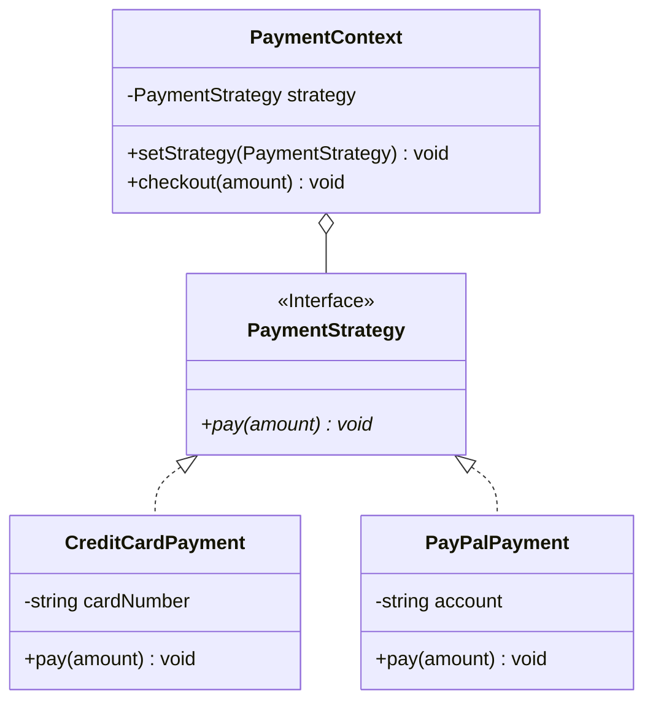

# Class Diagram Guidelines (`classDiagram`)

**Scope**: this file covers Mermaid's `classDiagram` syntax — use it for OOP type/class relationships
(inheritance, composition, aggregation, association, dependency, interface realization), not for a general
architecture diagram where "class" would really mean "service" (that's still a flowchart).

## Core Syntax

```
classDiagram
    class Animal {
        -string name
        #int age
        +makeSound() void
        +getName() string
    }
    class Dog {
        +bark() void
    }
    Animal <|-- Dog
```

- **Members** are distinguished by parentheses: `methodName()` is a method, `attributeName` (no
  parens) is a field.
- **Visibility markers** (prefix): `+` public, `-` private, `#` protected, `~` package/internal.
- **Method classifiers** (suffix, after the parens): `*` abstract, `$` static.
- **Return types** go after the closing paren, separated by a space: `getName() string`.
- **Generics**: enclose in tildes — `List~int~`, `Map~String, int~`.
- **Annotations**: `<<Interface>>`, `<<Abstract>>`, `<<Enumeration>>`, `<<Service>>` above a class's members.

## Relationship Types — the Real "Shape Vocabulary" for This Diagram Type

Just like a flowchart's node shape tells the reader what *kind* of thing a node is before they read the
label, a class diagram's relationship arrow tells the reader what *kind* of relationship two classes have
— picking the wrong one is a real, common factual error, not just a style nitpick:

| Ask | Relationship | Syntax | Example |
|---|---|---|---|
| Does this class extend/implement a base class or interface? | Inheritance | `<\|--` | `Animal <\|-- Dog` |
| Does the parent fully own the child's lifecycle — the child can't outlive the parent? | Composition | `*--` | `House *-- Room` (rooms don't exist without the house) |
| Does the parent hold a reference to something with an independent lifecycle? | Aggregation | `o--` | `Team o-- Player` (a player exists whether or not they're on this team) |
| Is this a general directional "uses/points to" relationship, weaker than ownership? | Association | `-->` | `Order --> Customer` |
| Does one class merely *depend on* another transiently (a method parameter, a local variable) without holding a lasting reference? | Dependency | `..>` | `OrderService ..> EmailValidator` |
| Does a class implement an interface? | Realization | `..\|>` | `PaymentProcessor ..\|> Payable` |
| Is it just an undirected link with no other semantic? | Link | `--` or `..` | rarely the right choice — one of the above almost always fits better |

**Composition vs. aggregation is the single most-confused pair**: the test is lifecycle ownership, not
"is this a has-a relationship" (both are). If deleting/destroying the parent should cascade to destroying
the child, it's composition (`*--`, filled diamond). If the child persists independently of the parent, it's
aggregation (`o--`, hollow diamond).

**Cardinality**: quoted before/after the relevant end of a relationship — `"1"`, `"0..1"`, `"1..*"`, `"*"`,
`"0..n"`. Example: `Team "1" o-- "0..*" Player`.

## What Transfers From the Flowchart Rules, and What Doesn't

| Flowchart rule | Applies to `classDiagram`? |
|---|---|
| Node Shape Vocabulary | **No** — every class is the same box shape; the relationship *arrow* is where the equivalent semantic distinction lives (see table above) |
| Color via `style`/`classDef`/`:::` | **Yes** — useful for grouping classes by layer or module using this skill's existing palette |
| One emoji per element | **Atypical, same reasoning as ER diagrams** — class names are conventionally plain type identifiers; don't force it |
| Diagram Explanation | **Yes**, especially to explain *why* a relationship is composition vs. aggregation, which is rarely obvious from the diagram alone |
| Link Indexing / `linkStyle` | **No** — no equivalent |

## Worked Example: Strategy Pattern



> **Design Rationale**: `PaymentContext` holds a `PaymentStrategy` via **aggregation** (`o--`), not
> composition — the strategy object's lifecycle is independent of the context (the same `CreditCardPayment`
> instance could be reused across multiple contexts, or swapped out at runtime via `setStrategy()`).
> `CreditCardPayment` and `PayPalPayment` **realize** (`<|..`, dashed) the `PaymentStrategy` interface
> rather than inherit from it — realization is specifically for implementing an interface's contract, not
> extending a concrete base class. The whole point of this pattern is that `PaymentContext` never depends
> on a concrete payment type, only the interface — swapping strategies requires no change to
> `PaymentContext` itself.

## Validate the Same Way

```bash
node scripts/validate_diagrams.js --markdown path/to/doc.md
```
