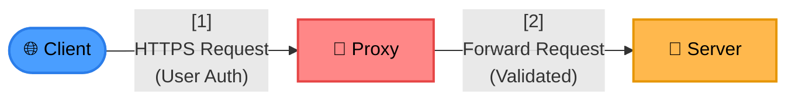
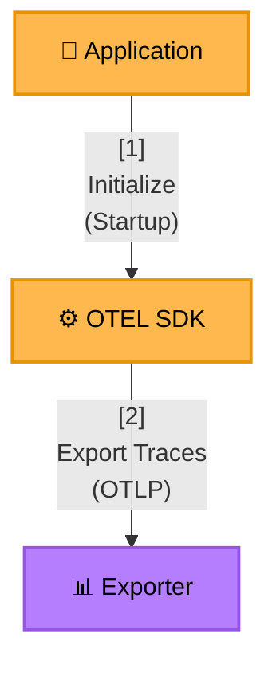

# Diagram Explanations

### Purpose

Every non-trivial diagram should include a contextual explanation below it, formatted as a quote block with numbered steps. This provides:
- **Narrative flow**: Walk readers through the diagram logically
- **Context**: Explain why connections exist, not just what they are
- **Key insights**: Highlight important design decisions or patterns

### Format

Use a quote block (`>`) with a bold heading and numbered list:

```markdown
> **[Heading]**:
> 1. **[Step Name]**: Description of what happens and why
> 2. **[Step Name]**: Description of what happens and why
> ...
>
> **[Additional Notes]**: Important context, caveats, or design rationale
```

### Heading Templates

**For Flow/Sequence Diagrams:**
- `> **Data Flow**:` - Overall data movement through system
- `> **Key Steps**:` - Sequential process breakdown
- `> **Bootstrap Flow**:` - Initialization/startup sequence
- `> **Cleanup Steps**:` - Termination/shutdown sequence

**For Architecture Diagrams:**
- `> **Component Interactions**:` - How services communicate
- `> **Service Responsibilities**:` - What each component does
- `> **Design Rationale**:` - Why this architecture was chosen

### Example 1: Flow Explanation



> **Data Flow**:
> 1. **Client Request**: User initiates connection from browser
> 2. **Proxy Intercept**: Proxy validates authentication and decrypts token
> 3. **Server Forward**: Proxy forwards validated request to backend server
>
> **Security Note**: Proxy ensures only authenticated requests reach the server.

### Example 2: Architecture Explanation



> **Bootstrap Flow**:
> 1. **Application Start**: Node.js loads main application file
> 2. **SDK Initialization**: OTEL SDK registers instrumentations before app code runs
> 3. **Exporter Setup**: Traces exported via OTLP to observability backend
>
> **Key Design**: Preload mechanism ensures instrumentation is active before any application code executes.

### Guidelines

1. **Bold step names**: Use `**Step Name**:` format for clarity
2. **Explain why**: Don't just describe what - explain purpose and rationale
3. **Keep concise**: 3-7 steps for most diagrams, ~1-2 sentences per step
4. **Add notes section**: Use second paragraph for caveats, alternatives, or key insights
5. **Match diagram**: Explanation order should follow visual flow (top-to-bottom, left-to-right)

### When to Include

**Always:**
- Sequence diagrams (connection flows, request/response cycles)
- Complex architecture diagrams (>5 services or multiple tiers)
- Bootstrap/initialization flows
- Any diagram with non-obvious relationships

**Optional:**
- Simple 2-3 node diagrams where relationships are self-evident
- Diagrams that immediately follow detailed prose explanation

---

