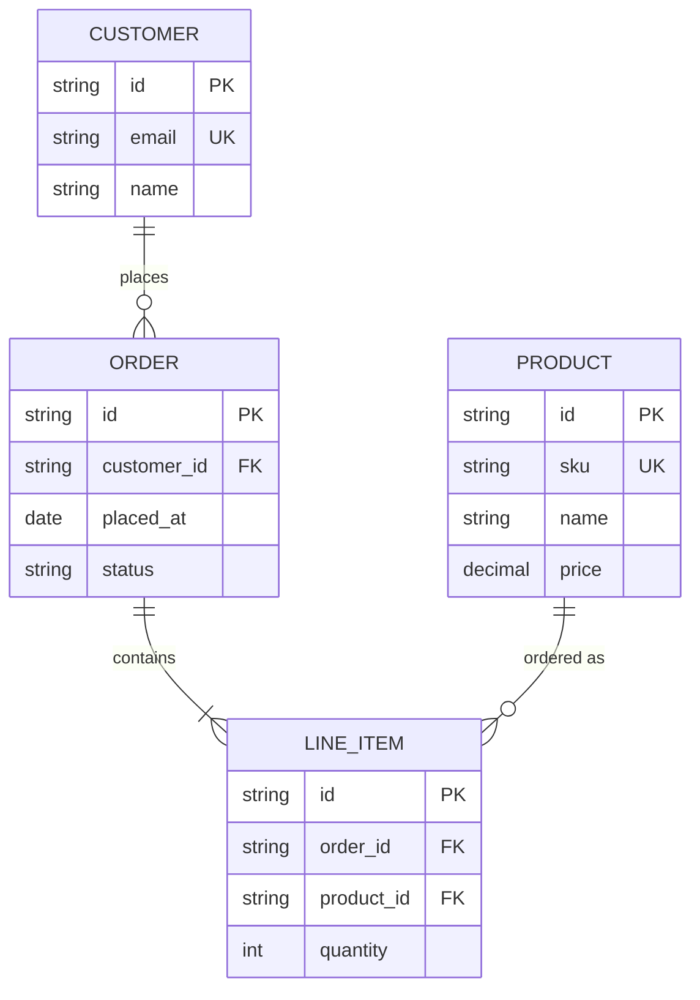

# Entity-Relationship Diagram Guidelines (`erDiagram`)

**Scope**: this file covers Mermaid's `erDiagram` syntax — use it when the content is genuinely about the
shape of data (entities, attributes, and how they relate, with real cardinality), not an architecture
diagram with boxes that happen to represent tables. A flowchart box labeled "Database" is an architecture
concern; an `erDiagram` describing that database's actual tables and foreign keys is a data-model concern
— they answer different questions and shouldn't be conflated.

## Core Syntax

```
erDiagram
    CUSTOMER ||--o{ ORDER : places
    ORDER ||--|{ LINE_ITEM : contains
    CUSTOMER {
        string id PK
        string email
        string name
    }
    ORDER {
        string id PK
        string customer_id FK
        date placed_at
    }
```

## Cardinality — the Entire Point of This Diagram Type

Cardinality is a two-character marker on **each side** of the relationship line (outer character = the
maximum, inner character = the minimum on that side), read as crow's-foot notation:

| Marker | Meaning |
|---|---|
| `\|o` | Zero or one |
| `\|\|` | Exactly one |
| `}o` | Zero or more |
| `}\|` | One or more |

A relationship line combines one marker from each side, e.g. `CUSTOMER ||--o{ ORDER` reads: one customer
relates to zero-or-more orders. **Getting this backwards is the single most common real mistake** —
always read it as "the marker closest to an entity describes that entity's own multiplicity in the
relationship," not the entity on the other side.

- **Solid line (`--`)**: identifying relationship — the child entity's existence depends on the parent
  (e.g. `LINE_ITEM` doesn't meaningfully exist without an `ORDER`).
- **Dashed line (`..`)**: non-identifying relationship — a looser association where the child can exist
  independently (e.g. a nullable foreign key to an optional category).

## Attributes

```
ENTITY {
    string id PK
    string parent_id FK
    string email UK
    string nickname "optional display name"
}
```

- Type comes first, then the attribute name (`type name`, not `name type`).
- Keys: `PK` (primary), `FK` (foreign), `UK` (unique) — comma-separate if an attribute is more than one.
- A trailing double-quoted string is a comment, not part of the type/name.
- Attributes are optional — a bare `ENTITY ||--o{ OTHER : verb` with no `{ }` block is valid if you only
  need to show the relationship, not the full schema.

## What Transfers From the Flowchart Rules, and What Doesn't

| Flowchart rule | Applies to `erDiagram`? |
|---|---|
| Node Shape Vocabulary | **No** — every entity is the same box; there's no shape decision to make, cardinality notation carries the semantic weight a shape choice would in a flowchart |
| Color via `style`/`classDef`/`:::` | **Yes** — useful for distinguishing entity categories (e.g. core domain entities vs. lookup/reference tables) using this skill's existing palette |
| One emoji per element | **Atypical** — entity names in ER diagrams are conventionally plain schema identifiers (`CUSTOMER`, not "👤 CUSTOMER"); don't force emoji here just for consistency with flowcharts, it reads as noise against a schema-style diagram |
| Diagram Explanation | **Yes** — for any schema with more than a couple of entities, especially to explain *why* a relationship is identifying vs. non-identifying |
| Link Indexing / `linkStyle` | **No** — no equivalent; relationships are self-documenting via their label and cardinality |

## Worked Example



> **Design Rationale**: `CUSTOMER ||--o{ ORDER` says a customer can have zero-to-many orders, but every
> order requires exactly one customer (the `||` on the customer side) — modeling it the other way
> (`o|--o{`, optional customer) would incorrectly suggest orders can exist without any customer at all.
> `ORDER ||--|{ LINE_ITEM` uses a solid identifying line and a "one or more" marker on the line-item side,
> reflecting that an order without any line items isn't a meaningful order. `PRODUCT ||--o{ LINE_ITEM` is
> deliberately non-identifying in spirit even though drawn solid here for simplicity — a real schema might
> use a dashed line if line items should be allowed to reference a since-discontinued product.

## Validate the Same Way

```bash
node scripts/validate_diagrams.js --markdown path/to/doc.md
```
