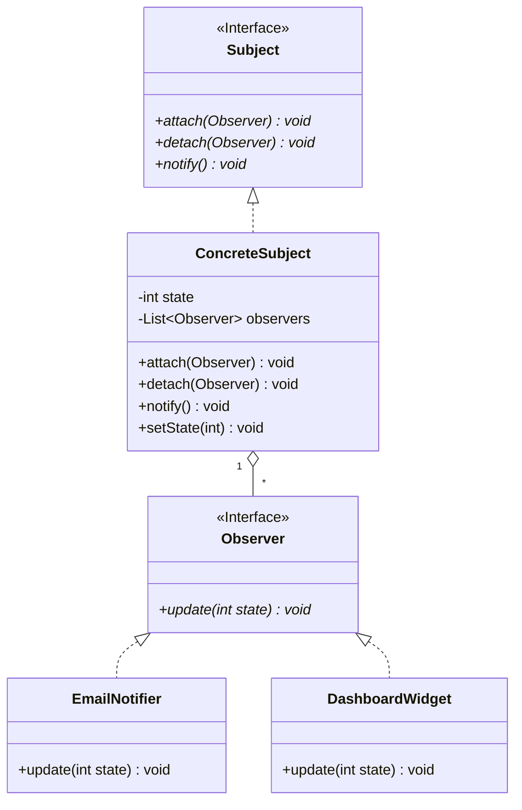

# Class Example: Observer Pattern

A different relationship shape than the guidance file's canonical Strategy example: one subject holding
*many* observers (real one-to-many cardinality), notifying all of them on a state change, rather than
holding a single interchangeable strategy.

> **Design Rationale**: `ConcreteSubject` holds its observers via **aggregation** (`o--`), with an explicit
> `"1" o-- "*"` cardinality — the subject doesn't own the observers' lifecycle (an `EmailNotifier` or
> `DashboardWidget` can exist and be reused independently of any particular subject), but it does hold a
> real collection of *many* of them, unlike Strategy's single interchangeable dependency. `setState()`
> triggers `notify()`, which calls `update()` on every attached observer — the subject never needs to know
> which concrete observer types are attached, only that they satisfy the `Observer` interface. This is the
> real mechanism behind most publish/subscribe and reactive-UI update systems: a one-to-many dependency
> where the "one" broadcasts without knowing who's listening.
