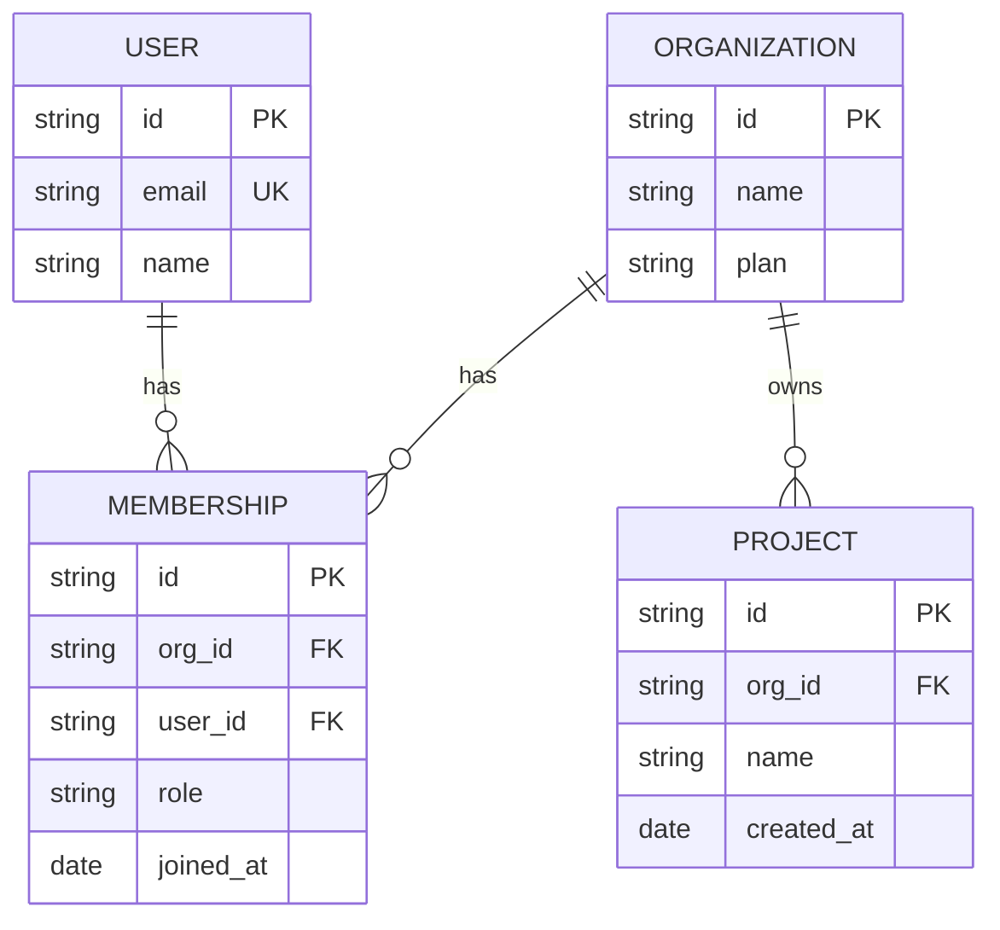

# ER Example: Multi-Tenant SaaS Schema (Many-to-Many via Join Table)

A different structural case than the guidance file's canonical example (which only shows one-to-many):
users and organizations relate many-to-many through a `MEMBERSHIP` join entity that itself carries data
(a role) — not just a bare join table.

> **Design Rationale**: `USER` and `ORGANIZATION` are genuinely many-to-many — one user can belong to
> several organizations, and one organization has many users — but that relationship isn't modeled as a
> direct many-to-many line (Mermaid's `erDiagram` doesn't have one). Instead, `MEMBERSHIP` is a real
> entity in its own right, with its own primary key and its own attribute (`role`) that wouldn't have
> anywhere to live on a bare join table — this is the correct pattern whenever the *relationship itself*
> carries data, not just a foreign-key pair. `PROJECT` stays a simple one-to-many off `ORGANIZATION`
> because projects don't have their own membership concept in this schema.
