# Example: Mixed-Shape Infra Scenario (Flagship)

**Demonstrates**: the full Node Shape Vocabulary in practice — this is the benchmark diagram this section's
shape system was extracted from. Three parallel lanes (live traffic, a deploy health gate, and an alerting
pipeline), left-to-right, each node's shape chosen by role rather than defaulted to a rectangle: hexagon for
the edge router, flag for the load balancer, rectangle for compute, parallelogram for an inbound artifact,
rhombus for the two genuine decisions, rounded for outcome states, cylinder for the message topic, subroutine
for the serverless notifier, and stadium for everything outside the system's control.

```mermaid
graph LR
    subgraph Traffic["🌐 Live Traffic Path"]
        direction LR
        Browser(["🌐 Customer Traffic"])
        CF{{"☁️ CDN<br/>(Edge Routing)"}}
        ALB>"🔀 Load Balancer<br/>(Path Routing)"]
        Services["🔧 App Services<br/>(Compute)"]
    end

    subgraph Deploy["📦 Deploy Health Gate"]
        direction LR
        NewCode[/"📦 New Deploy<br/>(Build Artifact)"/]
        HealthGate{"✅ New Version<br/>Healthy?"}
        Live("✅ Goes Live")
        Discarded("🗑️ Discarded<br/>(Old Stays Live)")
    end

    subgraph Alerting["📊 Alerting Pipeline"]
        direction LR
        RuntimeCheck{"⚠️ Errors / Health<br/>Degraded?"}
        Topic[("📢 Alert Topic")]
        Notifier[["⚡ Notifier<br/>(Function)"]]
        ChatOps(["💬 ChatOps Alert"])
        Email(["📧 Email<br/>(Secondary)"])
    end

    %% Link 0: Customer traffic in
    Browser -->|"[1]<br/>HTTPS Request"| CF
    %% Link 1: CDN to load balancer
    CF -->|"[2]<br/>Route by Path"| ALB
    %% Link 2: Load balancer to services
    ALB -->|"[3]<br/>Forward"| Services

    %% Link 3: New deploy enters the health gate
    NewCode -->|"[4]<br/>Deploy"| HealthGate
    %% Link 4: Health gate passes
    HealthGate -->|"[5]<br/>Yes"| Live
    %% Link 5: Health gate fails
    HealthGate -->|"[6]<br/>No"| Discarded
    %% Link 6: Live version becomes the running service
    Live -.->|"[7]<br/>Becomes"| Services

    %% Link 7: Services report continuous health, deploy-independent
    Services -->|"[8]<br/>Continuous<br/>Health Signal"| RuntimeCheck
    %% Link 8: A discarded bad deploy is also reflected
    Discarded -.->|"[9]<br/>Reflected In"| RuntimeCheck
    %% Link 9: Runtime check triggers an alert
    RuntimeCheck -.->|"[10]<br/>On Change"| Topic
    %% Link 10: Topic fans out
    Topic -.->|"[11]<br/>Fan-Out"| Notifier
    %% Link 11: Notifier to ChatOps
    Notifier -.->|"[12]"| ChatOps
    %% Link 12: Notifier to Email
    Notifier -.->|"[13]"| Email

    style Browser fill:#4A9EFF,stroke:#2B7DE9,stroke-width:2px,color:#000
    style CF fill:#FF9F43,stroke:#E88422,stroke-width:2px,color:#000
    style ALB fill:#FF9F43,stroke:#E88422,stroke-width:2px,color:#000
    style Services fill:#FFB84D,stroke:#E69500,stroke-width:2px,color:#000
    style NewCode fill:#96E6B3,stroke:#51CF66,stroke-width:2px,color:#000
    style HealthGate fill:#B47EFF,stroke:#9654E8,stroke-width:2px,color:#000
    style Live fill:#96E6B3,stroke:#51CF66,stroke-width:2px,color:#000
    style Discarded fill:#FF6B6B,stroke:#E64545,stroke-width:2px,color:#000
    style RuntimeCheck fill:#B47EFF,stroke:#9654E8,stroke-width:2px,color:#000
    style Topic fill:#FF6B6B,stroke:#E64545,stroke-width:2px,color:#000
    style Notifier fill:#91C7FF,stroke:#4A9EFF,stroke-width:2px,color:#000
    style ChatOps fill:#4A9EFF,stroke:#2B7DE9,stroke-width:2px,color:#000
    style Email fill:#D0D0D0,stroke:#A0A0A0,stroke-width:2px,color:#000

    %% Link Index:
    %% 0: Browser -> CDN (HTTPS)
    %% 1: CDN -> Load Balancer (path-based routing)
    %% 2: Load Balancer -> Services (forward to target)
    %% 3: New Deploy -> Health Gate (every deploy passes through this first)
    %% 4: Health Gate -> Live (healthy version cuts over)
    %% 5: Health Gate -> Discarded (broken version never receives traffic)
    %% 6: Live -> Services (the new version becomes what's actually running)
    %% 7: Services -> Runtime Check (continuous, deploy-independent health/error signal)
    %% 8: Discarded -> Runtime Check (a rejected deploy is still visible as a signal)
    %% 9: Runtime Check -> Alert Topic (only fires on a state change, not constantly)
    %% 10: Alert Topic -> Notifier (fan-out point for adding more channels later)
    %% 11: Notifier -> ChatOps (primary channel)
    %% 12: Notifier -> Email (secondary channel)

    linkStyle 0 stroke:#4A9EFF,stroke-width:3px
    linkStyle 1 stroke:#FF9F43,stroke-width:3px
    linkStyle 2 stroke:#FF9F43,stroke-width:3px
    linkStyle 3 stroke:#96E6B3,stroke-width:2px
    linkStyle 4 stroke:#96E6B3,stroke-width:2px
    linkStyle 5 stroke:#FF6B6B,stroke-width:2px
    linkStyle 6 stroke:#96E6B3,stroke-width:2px
    linkStyle 7 stroke:#FFB84D,stroke-width:2px
    linkStyle 8 stroke:#FF6B6B,stroke-width:2px
    linkStyle 9 stroke:#B47EFF,stroke-width:2px
    linkStyle 10 stroke:#FF6B6B,stroke-width:2px
    linkStyle 11 stroke:#91C7FF,stroke-width:2px
    linkStyle 12 stroke:#91C7FF,stroke-width:2px
```

> **Reading the Diagram**:
> 1. **Live Traffic Lane**: Ordinary requests flow CDN → Load Balancer → Services — this path never changes regardless of what's happening in the other two lanes.
> 2. **Deploy Health Gate Lane**: Every new deploy passes through a real decision point first — the mechanism that discards broken code automatically before it ever reaches live services.
> 3. **Alerting Pipeline Lane**: Services report health continuously, independent of whether a deploy just happened — a service that passes its deploy check but degrades hours later is still caught.
> 4. **Shared Fan-Out**: A state change — from either a rejected deploy or an ongoing runtime issue — triggers the same alert pipeline into every configured channel.
>
> **Shape Notes**: CDN (hexagon) and Load Balancer (flag) share a color family but not a shape — both are "networking," but one edges/routes and the other distributes, and the shapes say so at a glance. The two rhombuses are the *only* genuine decisions in the diagram; everything else that looks like it could be a decision (Live, Discarded) is actually a resulting state, drawn rounded, not diamond. Notice the topic (cylinder) and the notifier (subroutine) are visually distinct from each other and from the compute rectangle, even though a first draft might reach for the same box shape for all three "backend-ish" pieces.

