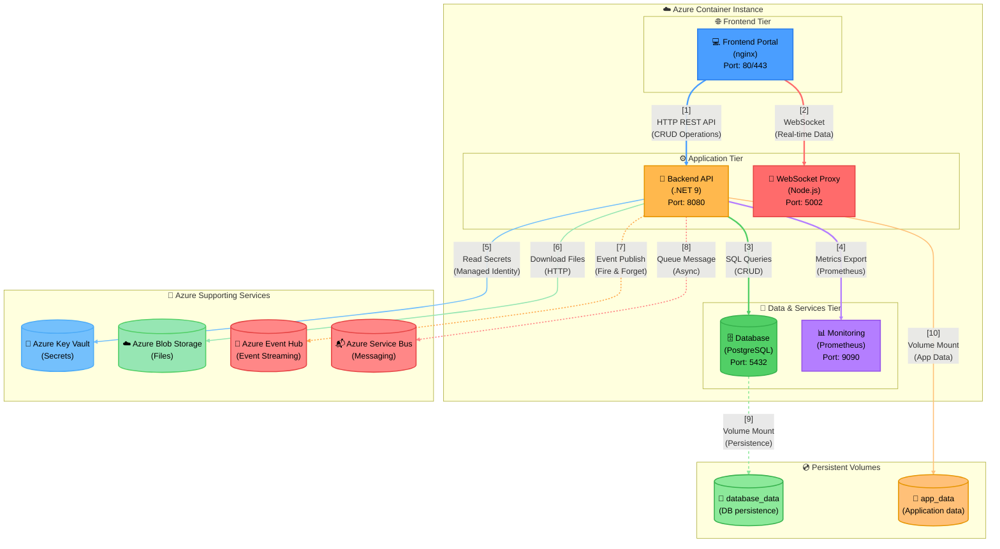

# Example: Multi-Tier Web Application

**Demonstrates**: Bracket notation `[N]`, synchronous solid arrows, asynchronous dotted arrows, hierarchical subgraphs, proper color palette, link indexing, and Cylinder for every genuine data store (database, secrets vault, blob storage, event/message queues, persistent volumes) rather than defaulting them to Rectangle alongside the compute services.

> **Data Flow**:
> 1. **Frontend Requests**: User interacts with web portal, sending HTTP REST requests for CRUD operations and establishing WebSocket for real-time updates
> 2. **Backend Processing**: API server queries PostgreSQL database for data operations and exports performance metrics to Prometheus
> 3. **Azure Integration**: Backend retrieves secrets from Key Vault using Managed Identity and downloads files from Blob Storage
> 4. **Event-Driven Operations**: Backend publishes events to Event Hub and queues messages to Service Bus asynchronously (non-blocking)
> 5. **Persistent Storage**: Database and backend mount volumes for data persistence and application state
>
> **Architecture Notes**: Three-tier design with clear separation between presentation (Frontend), business logic (Backend/Proxy), and data services (Database/Monitor). Azure services provide secure secrets management, file storage, and event streaming. Asynchronous dotted arrows show fire-and-forget operations that don't block the main request flow.

---

