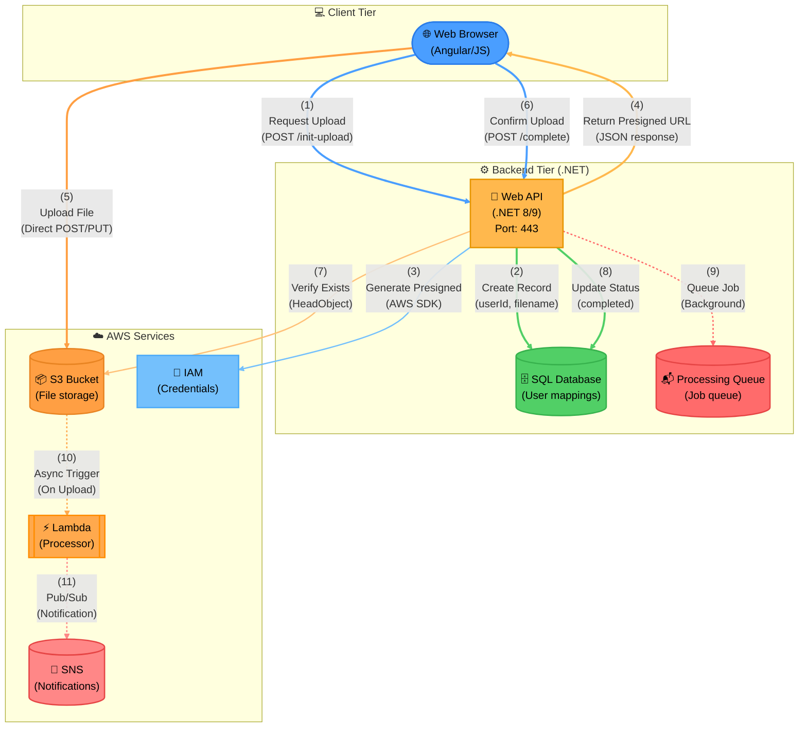

# Example: Direct S3 Upload with Async Processing

**Demonstrates**: Parentheses notation `(N)` with proper spacing, presigned URL pattern, async processing triggers, event-driven workflows, Stadium for the external browser, Cylinder for every real data store (SQL database, job queue, S3 bucket, SNS topic), and Subroutine for the Lambda function (a named, invoked callable unit) rather than a plain Rectangle for all four.

> **Direct S3 Upload Flow**:
> 1. **Initiate Upload**: Browser requests upload permissions via REST API
> 2. **Create Mapping**: API creates user-file mapping record in database for tracking
> 3. **Generate Credentials**: API requests presigned URL from AWS IAM for temporary S3 access
> 4. **Return URL**: API returns presigned URL to browser enabling direct upload
> 5. **Direct Upload**: Browser uploads file directly to S3 using presigned URL (bypassing backend)
> 6. **Confirm Upload**: Browser notifies API that upload completed
> 7. **Verify Upload**: API verifies file exists in S3 bucket using HeadObject call
> 8. **Update Status**: API marks upload as completed in database
>
> **Async Processing Flow**:
> 9. **Queue Job**: API queues async job for background processing (non-blocking)
> 10. **Event Trigger**: S3 automatically triggers Lambda function when file uploaded (event-driven)
> 11. **Publish Notification**: Lambda publishes notification to SNS for pub/sub subscribers
>
> **Design Pattern**: This demonstrates the presigned URL pattern for large file uploads, reducing backend load by enabling direct client-to-S3 communication. The backend only handles coordination and verification, not data transfer. Async processing (dotted arrows) shows event-driven workflows that don't block the upload flow.

---

