# Concept: ASP.NET Core / Kestrel Middleware Pipeline Ordering

Language/framework mechanics, not infra architecture — synthetic, but matches ASP.NET Core's actual
documented middleware order. A representative subset (exception handling → static files → routing →
authentication → authorization → endpoint), not every middleware a real app registers.

```mermaid
flowchart LR
    Client(["🌐 HTTP Client"])
    Kestrel{{"🛡️ Kestrel<br/>(raw connection handling)"}}
    ExcHandler["⚙️ Exception Handling<br/>Middleware"]
    StaticFiles{"❓ Static File<br/>Exists?"}
    FileServed("✅ File Served<br/>(200, short-circuits)")
    Routing["⚙️ Routing<br/>(matches an endpoint)"]
    AuthN["⚙️ Authentication<br/>(establishes identity)"]
    AuthZ{"❓ Authorized?"}
    Denied("🚫 401 / 403 Response<br/>(short-circuits)")
    Endpoint[["🎯 Matched Endpoint<br/>(Controller / Minimal API)"]]

    %% Link 0: Raw HTTP connection arrives
    Client -->|"[1]<br/>HTTP Request"| Kestrel
    %% Link 1: Kestrel invokes the first registered middleware
    Kestrel -->|"[2]<br/>next()"| ExcHandler
    %% Link 2: Exception handler wraps everything after it, then calls next
    ExcHandler -->|"[3]<br/>next()"| StaticFiles
    %% Link 3: Not a static file -- continue down the chain
    StaticFiles -->|"[4]<br/>No → next()"| Routing
    %% Link 4: Routing determines the endpoint, then calls next
    Routing -->|"[5]<br/>next()"| AuthN
    %% Link 5: Authentication establishes who the caller is, then calls next
    AuthN -->|"[6]<br/>next()"| AuthZ
    %% Link 6: Authorized -- proceed to invoke the actual endpoint
    AuthZ -->|"[7]<br/>Yes → next()"| Endpoint

    %% Link 7: Static file request short-circuits -- never reaches routing/auth/endpoint
    StaticFiles -->|"Yes<br/>(short-circuit)"| FileServed
    %% Link 8: Unauthorized request short-circuits -- never reaches the endpoint
    AuthZ -->|"No<br/>(short-circuit)"| Denied

    %% Link 9: Endpoint finishes, execution unwinds back up
    Endpoint -->|"return"| AuthZ
    %% Link 10: Denied also unwinds from the same point AuthZ would have
    Denied -->|"return"| AuthN
    %% Link 11: Authorized path unwinds through AuthN too
    AuthZ -->|"return"| AuthN
    %% Link 12: Unwinds through Routing
    AuthN -->|"return"| Routing
    %% Link 13: Unwinds through StaticFiles' own frame
    Routing -->|"return"| StaticFiles
    %% Link 14: Static-file short-circuit unwinds from here directly
    FileServed -->|"return"| ExcHandler
    %% Link 15: Normal path also unwinds through the exception handler
    StaticFiles -->|"return"| ExcHandler
    %% Link 16: Exception handler's own post-next() code runs, then Kestrel
    ExcHandler -->|"return"| Kestrel
    %% Link 17: Kestrel writes the final HTTP response
    Kestrel -->|"return"| Client

    style Client fill:#4A9EFF,stroke:#2B7DE9,stroke-width:2px,color:#000
    style Kestrel fill:#FF8787,stroke:#E64545,stroke-width:2px,color:#000
    style ExcHandler fill:#FFB84D,stroke:#E69500,stroke-width:2px,color:#000
    style StaticFiles fill:#B47EFF,stroke:#9654E8,stroke-width:2px,color:#000
    style FileServed fill:#8CE99A,stroke:#2F9E44,stroke-width:2px,color:#000
    style Routing fill:#FFB84D,stroke:#E69500,stroke-width:2px,color:#000
    style AuthN fill:#FFB84D,stroke:#E69500,stroke-width:2px,color:#000
    style AuthZ fill:#B47EFF,stroke:#9654E8,stroke-width:2px,color:#000
    style Denied fill:#FF6B6B,stroke:#E64545,stroke-width:2px,color:#000
    style Endpoint fill:#FFB84D,stroke:#E69500,stroke-width:2px,color:#000

    %% Link Index:
    %% 0: Client -> Kestrel (raw HTTP)
    %% 1: Kestrel -> ExceptionHandler (next)
    %% 2: ExceptionHandler -> StaticFiles (next)
    %% 3: StaticFiles -> Routing (no match, next)
    %% 4: Routing -> Authentication (next)
    %% 5: Authentication -> Authorization (next)
    %% 6: Authorization -> Endpoint (authorized, next)
    %% 7: StaticFiles -> FileServed (short-circuit)
    %% 8: Authorization -> Denied (short-circuit)
    %% 9: Endpoint -> Authorization (return, unwind)
    %% 10: Denied -> Authentication (return, unwind)
    %% 11: Authorization -> Authentication (return, unwind)
    %% 12: Authentication -> Routing (return, unwind)
    %% 13: Routing -> StaticFiles (return, unwind)
    %% 14: FileServed -> ExceptionHandler (return, unwind)
    %% 15: StaticFiles -> ExceptionHandler (return, unwind)
    %% 16: ExceptionHandler -> Kestrel (return, unwind)
    %% 17: Kestrel -> Client (final response)

    linkStyle 0 stroke:#74C0FC,stroke-width:3px
    linkStyle 1 stroke:#74C0FC,stroke-width:3px
    linkStyle 2 stroke:#74C0FC,stroke-width:3px
    linkStyle 3 stroke:#74C0FC,stroke-width:3px
    linkStyle 4 stroke:#74C0FC,stroke-width:3px
    linkStyle 5 stroke:#74C0FC,stroke-width:3px
    linkStyle 6 stroke:#74C0FC,stroke-width:3px
    linkStyle 7 stroke:#FF8787,stroke-width:2px
    linkStyle 8 stroke:#FF8787,stroke-width:2px
    linkStyle 9 stroke:#8CE99A,stroke-width:2px
    linkStyle 10 stroke:#8CE99A,stroke-width:2px
    linkStyle 11 stroke:#8CE99A,stroke-width:2px
    linkStyle 12 stroke:#8CE99A,stroke-width:2px
    linkStyle 13 stroke:#8CE99A,stroke-width:2px
    linkStyle 14 stroke:#8CE99A,stroke-width:2px
    linkStyle 15 stroke:#8CE99A,stroke-width:2px
    linkStyle 16 stroke:#8CE99A,stroke-width:2px
    linkStyle 17 stroke:#8CE99A,stroke-width:2px
```

> **Key Steps**:
> 1. **Kestrel Is the Real Edge**: Kestrel — drawn Hexagon, same shape family as any edge/routing layer
>    — receives the raw connection before any ASP.NET Core middleware exists conceptually; it's what
>    invokes the first middleware in the configured chain.
> 2. **Registration Order = Execution Order**: The chain shown (exception handling → static files →
>    routing → authentication → authorization → endpoint) is not arbitrary — it's `app.Use...()` call
>    order in `Program.cs`, and that order is exactly the order middleware runs in on the way *in*.
> 3. **Short-Circuiting Skips the Rest of the Chain, Not the Whole Pipeline**: When the static-file
>    middleware finds a match, it never calls `next()` — routing, authentication, and authorization
>    never run for that request. But middleware registered *before* it (exception handling) still gets
>    its post-`next()` code executed as the call stack unwinds, because it *did* call `next()` to reach
>    the point where the short-circuit happened.
> 4. **The Onion Unwinds in Reverse**: Once the endpoint finishes, control returns back up through
>    authorization, authentication, routing, and exception-handling in the *exact reverse* of the order
>    they were entered — this is why a `try/catch` in exception-handling middleware placed *first* can
>    still catch an exception thrown by *any* middleware after it, including the endpoint itself.
>
> **Design Rationale**: Ordering rules in the real framework exist for real reasons visible in this
> diagram — authentication must run before authorization (you can't check permissions for an identity
> you haven't established yet), and exception handling must be registered first so its "catch" wraps
> everything that could fail. Static files are typically placed early purely for performance — serving a
> cached asset shouldn't pay the cost of routing, auth, and the rest of the pipeline.
