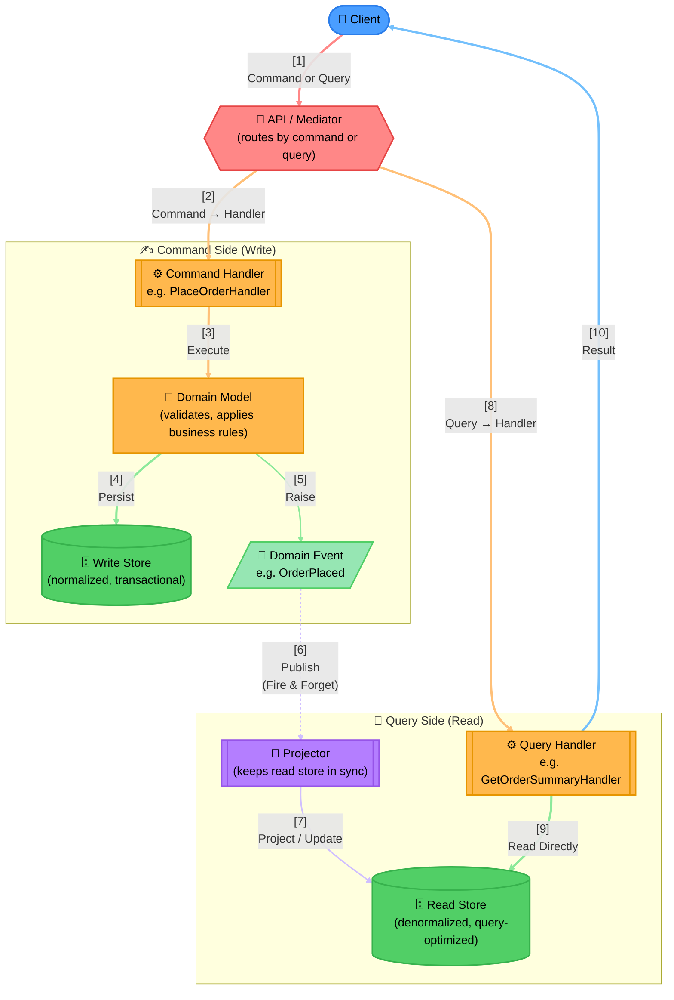

# Concept: CQRS (Command Query Responsibility Segregation)

A pure software-architecture pattern, not infrastructure — synthetic, but accurate to how CQRS is
actually implemented in practice.

> **Component Interactions**:
> 1. **One Entry Point, Two Paths**: The dispatcher (often a mediator) routes a command or a query to
>    its own dedicated handler — the two paths never cross past this point.
> 2. **Commands Go Through the Domain, Queries Don't**: A command always runs through domain logic that
>    can reject it (validation, business rules); a query handler reads straight from the read store with
>    no domain logic in the way, which is exactly why it's typically much simpler and faster.
> 3. **Two Stores on Purpose**: The write store is normalized and transactional, optimized for
>    correctness under concurrent writes. The read store is a separate, denormalized projection,
>    optimized for exactly the queries the application actually needs — they are drawn as two distinct
>    Cylinders deliberately, not one shared database serving both jobs.
> 4. **The Read Store Can Lag**: The domain event that keeps the read store in sync is published
>    fire-and-forget (the one dashed edge in this diagram) — the read store is *eventually* consistent
>    with the write store, not immediately. A client that queries immediately after issuing a command may
>    briefly see stale data; real systems handle this with optimistic UI updates, version stamps, or by
>    simply accepting the lag where it doesn't matter.
>
> **Design Rationale**: CQRS is worth the complexity of two models specifically when read and write
> workloads have very different shapes (e.g., a small number of complex writes vs. a huge number of simple
> reads) — for simple CRUD with symmetric read/write needs, a single shared model is usually simpler and
> CQRS would be over-engineering.
