# Concept: IaC Plan/Apply Lifecycle & State Reconciliation

A dynamic angle on IaC — the plan/apply reconciliation loop, not static module structure (see
[Retrofitting Existing Diagrams](../../retrofitting.md) for that angle). Synthetic, but accurate to how
Terraform and similar declarative IaC tools actually work.

```mermaid
flowchart LR
    Config[/"📄 HCL Config<br/>(desired state, as code)"/]
    Core["⚙️ IaC Core<br/>(builds dependency graph, diffs)"]
    StateFile[("🗄️ State File<br/>(last-known resource state)")]
    CloudAPI(["☁️ Cloud Provider API<br/>(actual live reality)"])
    ManualChange(["🧑 Manual Out-of-Band Change<br/>(e.g. console edit, external)"])
    Plan("📋 Execution Plan<br/>(add / change / destroy)")
    Review{"❓ Human Approves?"}
    Apply["🚀 Apply<br/>(executes changes via provider)"]
    Abort("🛑 Aborted<br/>(no changes made)")

    %% Link 0: Desired-state config enters the core engine
    Config -->|"[1]<br/>Parse"| Core
    %% Link 1: Core reads the last-known state to know what it manages
    Core -->|"[2]<br/>Read Known State"| StateFile
    %% Link 2: Core refreshes against the real provider to see current reality
    Core -->|"[3]<br/>Refresh"| CloudAPI
    %% Link 3: Someone changed real infrastructure without going through this tool at all
    ManualChange -.->|"[4]<br/>Out-of-Band<br/>(bypasses IaC entirely)"| CloudAPI
    %% Link 4: The state file's belief feeds into the plan
    StateFile -->|"[5]<br/>Compare"| Plan
    %% Link 5: The refreshed real-world reality also feeds into the plan
    CloudAPI -->|"[6]<br/>Compare"| Plan
    %% Link 6: The computed plan is presented for approval
    Plan -->|"[7]<br/>Present"| Review
    %% Link 7: Approved -- execute the plan
    Review -->|"[8]<br/>Yes"| Apply
    %% Link 8: Rejected -- nothing happens
    Review -->|"[9]<br/>No"| Abort
    %% Link 9: Apply mutates real infrastructure through the provider
    Apply -->|"[10]<br/>Execute"| CloudAPI
    %% Link 10: Apply persists the new known state
    Apply -->|"[11]<br/>Persist"| StateFile

    style Config fill:#96E6B3,stroke:#51CF66,stroke-width:2px,color:#000
    style Core fill:#FFB84D,stroke:#E69500,stroke-width:2px,color:#000
    style StateFile fill:#51CF66,stroke:#37B24D,stroke-width:2px,color:#000
    style CloudAPI fill:#91C7FF,stroke:#4A9EFF,stroke-width:2px,color:#000
    style ManualChange fill:#D0D0D0,stroke:#A0A0A0,stroke-width:2px,color:#000
    style Plan fill:#FFD43B,stroke:#F08C00,stroke-width:2px,color:#000
    style Review fill:#B47EFF,stroke:#9654E8,stroke-width:2px,color:#000
    style Apply fill:#FFB84D,stroke:#E69500,stroke-width:2px,color:#000
    style Abort fill:#FF6B6B,stroke:#E64545,stroke-width:2px,color:#000

    %% Link Index:
    %% 0: Config -> Core (parse)
    %% 1: Core -> State File (read known state)
    %% 2: Core -> Cloud API (refresh, read real state)
    %% 3: Manual Change -> Cloud API (out-of-band, async/unrelated)
    %% 4: State File -> Plan (compare)
    %% 5: Cloud API -> Plan (compare)
    %% 6: Plan -> Review (present)
    %% 7: Review -> Apply (approved)
    %% 8: Review -> Abort (rejected)
    %% 9: Apply -> Cloud API (execute changes)
    %% 10: Apply -> State File (persist new state)

    linkStyle 0 stroke:#8CE99A,stroke-width:3px
    linkStyle 1 stroke:#FFC078,stroke-width:2px
    linkStyle 2 stroke:#FFC078,stroke-width:2px
    linkStyle 3 stroke:#A0A0A0,stroke-width:2px,stroke-dasharray:3 3
    linkStyle 4 stroke:#8CE99A,stroke-width:2px
    linkStyle 5 stroke:#B8DBFF,stroke-width:2px
    linkStyle 6 stroke:#FFE066,stroke-width:3px
    linkStyle 7 stroke:#D0BFFF,stroke-width:3px
    linkStyle 8 stroke:#D0BFFF,stroke-width:2px
    linkStyle 9 stroke:#FFC078,stroke-width:3px
    linkStyle 10 stroke:#FFC078,stroke-width:2px
```

> **Data Flow**:
> 1. **Three Sources, Not Two**: A plan isn't just "config vs. state file" — it's config vs. state file
>    *vs.* what the provider says is actually running. Skipping the refresh step (comparing only config
>    to the state file) is exactly how drift goes unnoticed.
> 2. **The State File Is Not Reality**: The state file is this tool's *belief* about what exists — a
>    Cylinder, persisted data — genuinely distinct from the Cloud API, which is what's actually running.
>    They usually agree; the diagram exists specifically to show the case where they don't.
> 3. **Out-of-Band Changes Are Invisible Until the Next Refresh**: A manual console edit doesn't notify
>    this tool — it silently changes reality (the dashed edge) and won't be detected until the next plan's
>    refresh step compares the state file against the now-different provider response.
> 4. **A Rejected Plan Is a No-Op, Not a Rollback**: Declining at the review gate means nothing was ever
>    executed — there's no "undo" here because nothing happened yet; this is different from the
>    apply-then-rollback pattern seen in deployment pipelines.
>
> **Design Rationale**: Keeping the state file as its own persisted artifact (rather than always trusting
> a live query) is what makes planning fast and offline-capable — but it's also exactly what makes drift
> possible, since the file can silently fall out of sync with reality between runs.
