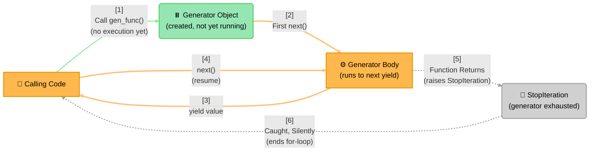
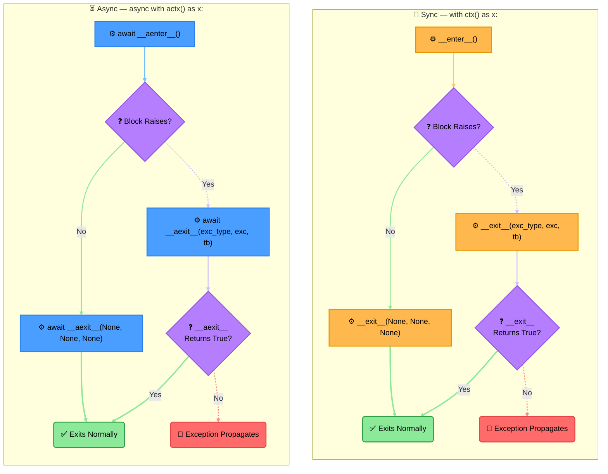
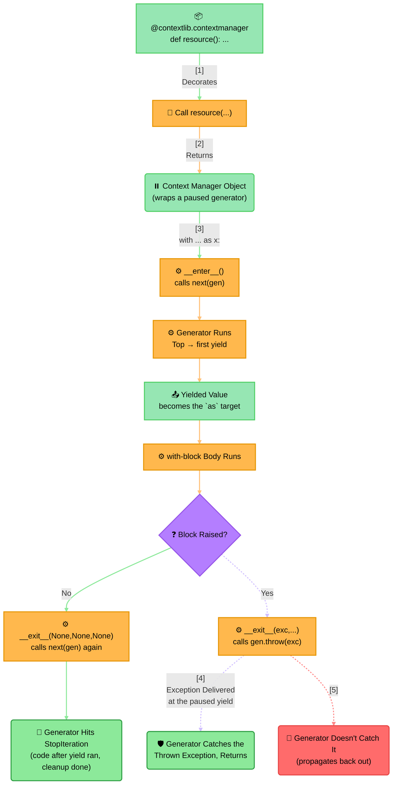

# Concept: Python Generators, Iterators, and Context Managers (Sync + Async)

Language-runtime mechanics, not architecture — synthetic, but factually accurate to CPython's actual
behavior.

## Diagram 1: Generator/Iterator Execution Lifecycle

> **Key Steps**:
> 1. **Calling Creates, It Doesn't Run**: Calling a generator function doesn't execute any of its body —
>    it just produces a generator object, paused before the first line. This is why the object is drawn
>    Rounded (a resulting state) rather than Rectangle (active compute) — nothing is computing yet.
> 2. **Each `next()` Resumes, Not Restarts**: The generator body runs from wherever it last paused at a
>    `yield`, not from the top — local variables, loop counters, and open resources are all still exactly
>    where they were.
> 3. **Exhaustion Is an Exception, Not a Value**: There's no sentinel "last value" — the generator body
>    simply returning (falling off the end, or hitting a bare `return`) is what raises `StopIteration`.
>    That's why this edge is dashed: it's a different *kind* of control transfer (exception-based) than
>    the solid `yield` edges, which are ordinary value returns.
>
> **Design Note**: A `for` loop over a generator is exactly this diagram running in a loop, with the
> `StopIteration` catch built in silently — that's *why* `for` loops can consume a generator without any
> visible exception handling in user code.

## Diagram 2: Context Manager Protocol — `with` vs. `async with`

> **Design Rationale**: The single most-missed fact about context managers is that `__exit__` (or
> `__aexit__`) runs on **every** path out of the block, exception or not — both lanes above converge
> through an exit call before reaching either terminal state, there's no path that skips it. The second
> most-missed fact: `__exit__`'s **return value** decides whether an exception escapes — returning a
> truthy value suppresses it, anything else (including returning nothing, i.e. `None`) lets it propagate.
> The sync and async lanes are structurally identical on purpose — `async with` doesn't change the
> protocol's logic at all, it only adds an `await` at the two points where the runtime might otherwise
> block (acquiring and releasing whatever resource is being managed, e.g. a network connection or an
> async lock).

## Diagram 3: How `@contextmanager` Bridges Generators and Context Managers

> **Design Rationale**: `@contextlib.contextmanager` is not magic — it's a thin wrapper that literally
> drives the underlying generator with `next()` and `.throw()`. The code *before* the generator's `yield`
> becomes `__enter__`; the code *after* the `yield` becomes `__exit__`. Critically, when the `with`-block
> raises, that exception is delivered by **throwing it into the generator at the exact point of the
> paused `yield`** — which is why wrapping a `try/finally` (or `try/except`) *around* the `yield` inside
> the generator is the correct, idiomatic way to guarantee cleanup runs on both the happy path and the
> error path. `contextlib.asynccontextmanager` follows the identical logic for `async def` generator
> functions, using `.athrow()` instead of `.throw()` and awaiting each step.
