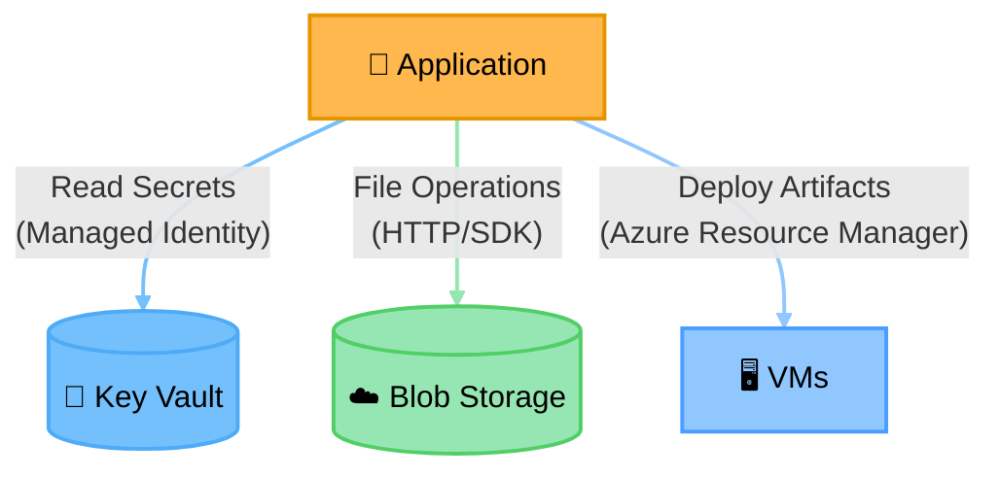

# Pattern: Cloud Service Integration

One app service calling three distinct cloud services — the minimal template for "app talks to several
managed services." Key Vault and Blob Storage are both Cylinders (they hold data at rest — secrets,
files); VMs stay Rectangle (compute the app deploys onto/manages, not a store). Link
indexing/explanation optional here per the skill's own "simple, self-evident" exception.

