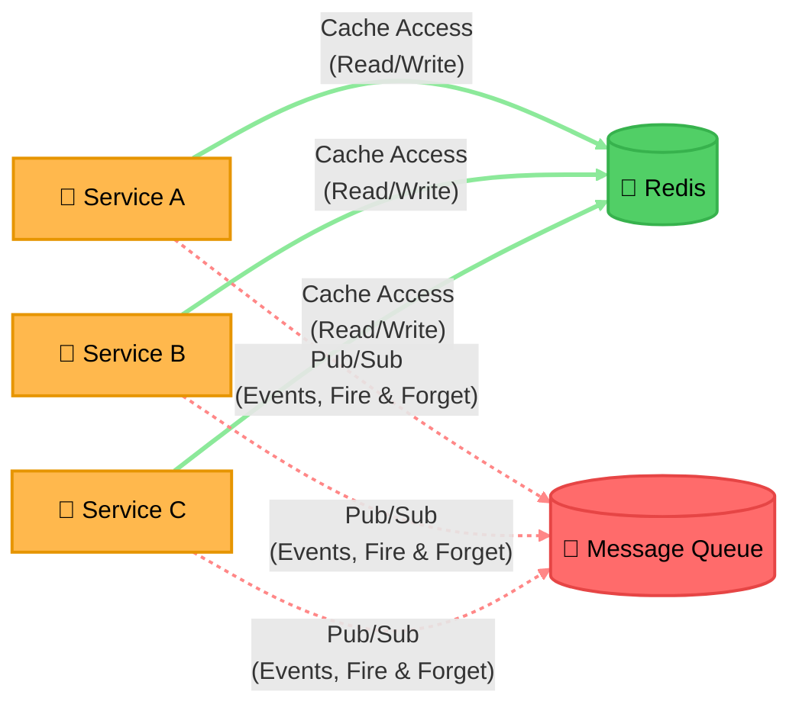

# Pattern: Microservices with Shared Services

Three services sharing one cache and one message queue — the minimal template for "several services, two
shared dependencies." Both shared dependencies are Cylinders (data at rest); the services themselves stay
Rectangle (they're compute, doing work). Link indexing/explanation optional here per the skill's own
"simple, self-evident" exception — see [architecture-mixed-shape-infra.md](architecture-mixed-shape-infra.md)
for the full worked format on a larger diagram.

