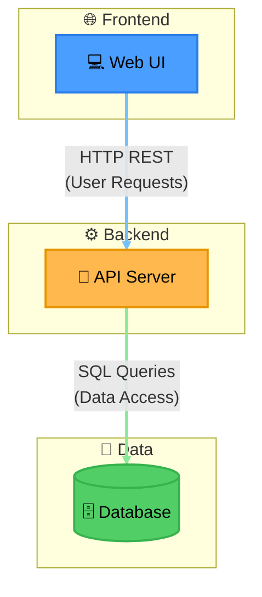

# Pattern: Three-Tier Architecture

The smallest correct starting point for a 3-tier app — useful as a template to extend, not as a
destination. Note `DB` is a Cylinder, not a Rectangle: even in a 2-node backend/data pair, a real data
store always gets Cylinder, no exceptions for "the diagram is small." Link indexing and a diagram
explanation are genuinely optional here (2-3 nodes, self-evident relationship, per the skill's own
exception) — for the full worked format, see the flagship example in
[architecture-mixed-shape-infra.md](architecture-mixed-shape-infra.md).

