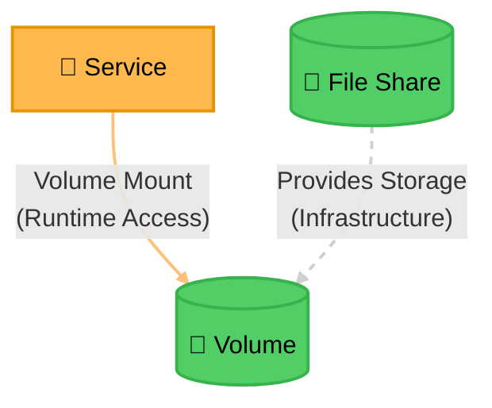

# Pattern: Volume Mounts

The minimal template for "direct dependency vs. infrastructure provisioning" on the same diagram — a
service actively using a volume (solid) vs. a file share merely provisioning that volume's storage
(dashed). Both Volume and File Share are Cylinders (data at rest); Service stays Rectangle (compute).

