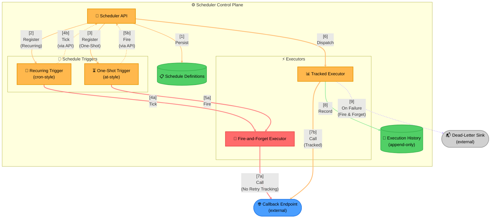

# Example: Job Scheduler With Dual Execution Paths

A job scheduler offering untracked vs. tracked execution paths — generalized from a real production system.

> **Key Steps**:
> 1. **Registration**: The API persists the schedule definition once and registers it with the
>    appropriate trigger — recurring or one-shot — these are two separate stores (Schedule Definitions
>    vs. Execution History), not one generic "data" cylinder, because they hold fundamentally different
>    things: config vs. a historical record.
> 2. **Two Paths From Every Trigger**: Every trigger can fire down either the untracked path (direct,
>    solid, no bookkeeping) or route back through the API into the tracked path (dashed — it's a
>    secondary, managed detour, not the trigger's primary action).
> 3. **Untracked = Fewer Guarantees**: The untracked executor calls the external callback directly with
>    no retry tracking — that's the trade-off callers accept for lower latency and simplicity.
> 4. **Tracked = Recorded and Recoverable**: The tracked executor records every outcome and, on failure,
>    fires an async, fire-and-forget hand-off to a dead-letter sink for later inspection or retry.
>
> **Design Rationale**: Offering both paths lets callers choose their own reliability/latency trade-off
> per job, rather than forcing every job through the overhead of tracked execution when a best-effort
> fire-and-forget call is good enough.
