# Example: Durable Event-Sourcing Command Loop

A durable-execution command loop — generalized from a real production architecture.

```mermaid
flowchart LR
    Command[/"📥 Command<br/>(inbound request)"/]
    Applier["⚙️ Mutation Applier"]
    EventLog[("📜 Event Log<br/>(append-only, durable)")]
    Queue[("📬 Work Queue")]
    Worker["🔧 Worker"]
    Context("🧭 Resolved Context<br/>(per-request config snapshot)")
    Model(["🤖 Model / Tool Provider<br/>(external)"])
    Observers(["👀 Observers<br/>(external subscribers)"])

    %% Link 0: Command enters the system
    Command -->|"[1]<br/>Submit"| Applier
    %% Link 1: Applier appends the accepted command to the durable log
    Applier -->|"[2]<br/>Append"| EventLog
    %% Link 2: Applier enqueues the resulting work
    Applier -->|"[3]<br/>Enqueue"| Queue
    %% Link 3: Worker dequeues and picks up the job
    Queue -->|"[4]<br/>Dequeue"| Worker
    %% Link 4: Worker resolves the context it needs to act
    Worker -->|"[5]<br/>Resolve"| Context
    %% Link 5: Worker invokes the external model/tool layer
    Worker -->|"[6]<br/>Invoke"| Model
    %% Link 6: Worker appends resulting events back to the log
    Worker -->|"[7]<br/>Append Result"| EventLog
    %% Link 7: The log fans out to observers, async
    EventLog -.->|"[8]<br/>Notify<br/>(Fire & Forget)"| Observers

    style Command fill:#96E6B3,stroke:#51CF66,stroke-width:2px,color:#000
    style Applier fill:#FFB84D,stroke:#E69500,stroke-width:2px,color:#000
    style EventLog fill:#51CF66,stroke:#37B24D,stroke-width:2px,color:#000
    style Queue fill:#51CF66,stroke:#37B24D,stroke-width:2px,color:#000
    style Worker fill:#FFB84D,stroke:#E69500,stroke-width:2px,color:#000
    style Context fill:#96E6B3,stroke:#51CF66,stroke-width:2px,color:#000
    style Model fill:#4A9EFF,stroke:#2B7DE9,stroke-width:2px,color:#000
    style Observers fill:#4A9EFF,stroke:#2B7DE9,stroke-width:2px,color:#000

    %% Link Index:
    %% 0: Command -> Applier (submit)
    %% 1: Applier -> Event Log (append accepted command)
    %% 2: Applier -> Queue (enqueue work)
    %% 3: Queue -> Worker (dequeue)
    %% 4: Worker -> Context (resolve per-request config)
    %% 5: Worker -> Model (invoke external tool/model)
    %% 6: Worker -> Event Log (append result)
    %% 7: Event Log -> Observers (async notify)

    linkStyle 0 stroke:#8CE99A,stroke-width:3px
    linkStyle 1 stroke:#FFC078,stroke-width:3px
    linkStyle 2 stroke:#FFC078,stroke-width:3px
    linkStyle 3 stroke:#8CE99A,stroke-width:3px
    linkStyle 4 stroke:#FFC078,stroke-width:2px
    linkStyle 5 stroke:#FFC078,stroke-width:3px
    linkStyle 6 stroke:#FFC078,stroke-width:3px
    linkStyle 7 stroke:#74C0FC,stroke-width:2px,stroke-dasharray:3 3
```

> **Data Flow**:
> 1. **Command Arrives**: An inbound command is a parallelogram — data entering the process, not a
>    processing step itself.
> 2. **Apply and Persist**: The Mutation Applier appends the accepted command to the durable log
>    *before* anything else happens — the log is the source of truth, not a side effect.
> 3. **Enqueue and Dequeue**: The applier also enqueues the resulting work; a worker later dequeues it.
>    The log and the queue are both Cylinders (both hold data at rest) but they're genuinely different
>    concepts — one is permanent history, the other is transient work-in-progress — so don't let "both
>    are queues-ish" tempt you into merging them into one node.
> 4. **Resolve, Then Act**: The worker resolves whatever per-request context it needs (Rounded — a
>    computed snapshot, not a store) before invoking the external model/tool layer (Stadium — outside
>    this system's control).
> 5. **Close the Loop, Then Notify**: The worker appends its result back to the same durable log, and
>    only then does the log fan out to external observers — asynchronously, fire-and-forget, hence the
>    dashed arrow distinguishing it from every solid, synchronous step before it.
>
> **Design Rationale**: This shape mirrors any system that needs to survive a crash mid-operation and
> resume exactly where it left off — the log is authoritative, everything else (the queue, the worker's
> in-memory state) is disposable and reconstructable by replaying the log.
