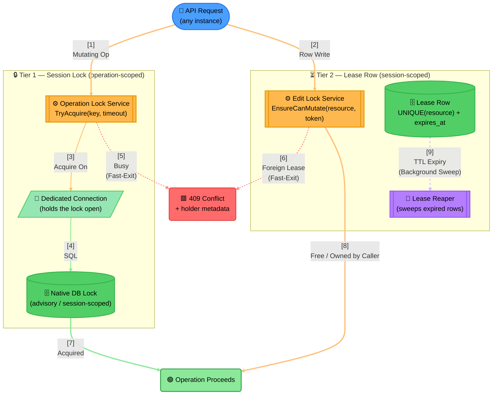

# Example: Two-Tier Distributed Locking

Distributed locking with two different lock lifetimes — generalized from a real production system.

> **Component Interactions**:
> 1. **Two Callers, Two Tiers**: The same incoming request path splits into two independent lock
>    services depending on what kind of operation it is — a fast, operation-scoped mutex (Tier 1) or a
>    longer-lived, human-editing-scoped lease (Tier 2). They are never substitutes for each other.
> 2. **Tier 1 — Connection-Held Mutex**: The session lock lives on a dedicated connection (a real
>    resource, hence Parallelogram) and is released automatically the instant that connection dies —
>    it cannot be orphaned by a crash.
> 3. **Tier 2 — TTL Lease**: The lease row has an expiry and is swept by a background reaper — this one
>    *can* be abandoned (a client that never releases it), which is exactly why the reaper exists.
> 4. **Fast-Exit, Not Queue**: Both tiers respond to contention with an immediate `409`, never a queue —
>    that's a deliberate design choice, not an accident, and it's why both fast-exit edges are dashed:
>    they're the "someone else already has this" signal, not the main synchronous flow.
>
> **Design Rationale**: Locking at the data source instead of an external coordinator means there's no
> separate lock-manager service to keep available — the database's own lock primitives (or a lease row
> it stores) are the single source of truth for who currently holds what.
