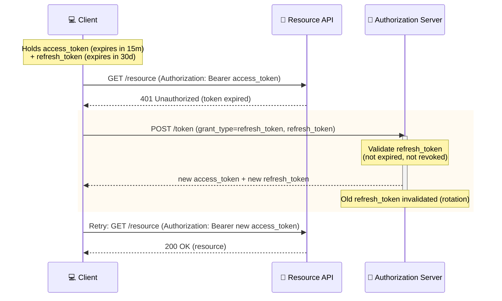

# Sequence Example: Access + Refresh Token Flow (with Rotation)

What happens *after* login, once a client already holds tokens — the short-lived access token expires,
gets silently refreshed using the long-lived refresh token, without forcing the user to re-authenticate.
Includes refresh token rotation, a real security best practice, not just the basic exchange.

> **Key Steps**:
> 1. **Short-Lived by Design**: The access token's short lifetime limits the damage window if it's ever
>    leaked (a log file, a browser extension, a compromised CDN) — it's disposable on purpose.
> 2. **Silent Refresh**: The 401 triggers an automatic token refresh the user never sees — no re-login,
>    as long as the refresh token itself is still valid.
> 3. **Rotation Closes a Real Gap**: Issuing a *new* refresh token on every use and invalidating the old
>    one means a stolen-but-unused refresh token becomes worthless the moment the legitimate client uses
>    its copy first — without rotation, a leaked refresh token stays valid for its entire lifetime
>    regardless of legitimate use.
> 4. **Retry, Not Fail**: The client's job on a 401 is to attempt exactly one refresh-and-retry, not to
>    surface the error to the user immediately — only a failed *refresh* (expired or revoked refresh
>    token) should force a real re-login.
>
> **Design Note**: If two requests hit a 401 concurrently, a naive client can trigger two simultaneous
> refresh calls — with rotation enabled, the second one arrives with an already-invalidated refresh token
> and fails. Real clients de-duplicate concurrent refresh attempts behind a single in-flight promise/lock.
