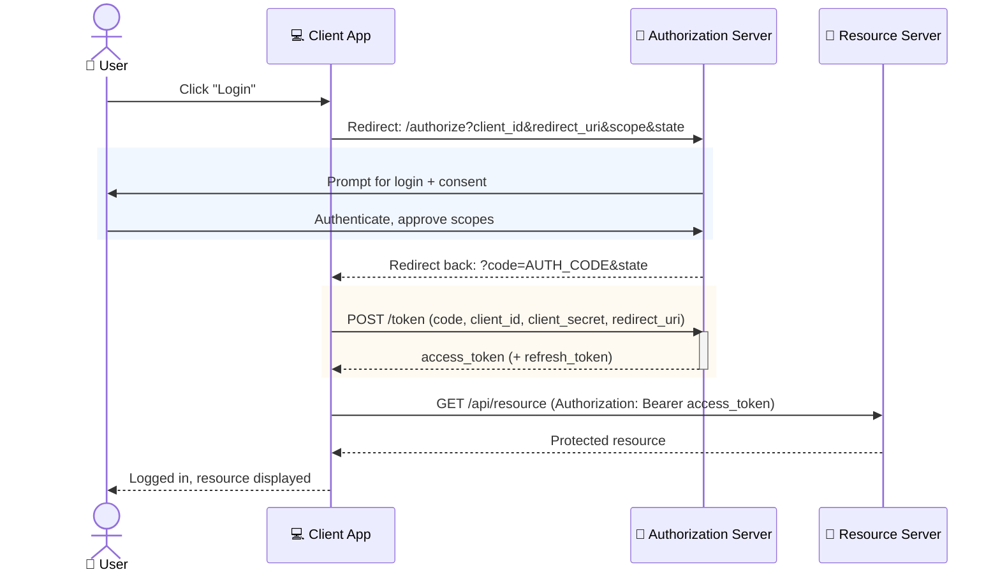

# Sequence Example: OAuth 2.0 Authorization Code Flow

The redirect-based delegated-authorization pattern behind most "Login with X" buttons — a confidential
client (a server-side app) exchanging an authorization code for tokens, kept server-side so the access
token never touches the browser.

> **Key Steps**:
> 1. **Redirect to Authorize**: The client never collects the user's credentials itself — it redirects the
>    browser to the authorization server, which owns the login/consent screen entirely.
> 2. **Code, Not Tokens, Comes Back First**: The redirect back to the client carries only a short-lived
>    authorization *code* in the URL — never the access token itself, since URLs end up in browser
>    history and server logs.
> 3. **Code-for-Token Exchange Happens Server-Side**: The client's backend exchanges the code for the
>    actual access token via a direct, non-redirect POST request, authenticating itself with a
>    `client_secret` the browser never sees — this is what makes it a *confidential* client flow.
> 4. **`state` Prevents CSRF**: The `state` parameter set on the initial redirect and echoed back
>    unchanged is how the client verifies the redirect actually corresponds to a request it initiated —
>    skipping it opens a cross-site request forgery hole in the login flow itself.
>
> **Design Note**: This is the *confidential client* variant (client secret used in the token exchange).
> Public clients (SPAs, mobile apps) that can't safely hold a secret use OAuth 2.1 with PKCE instead — see
> that flow separately once it's added to this catalog.
