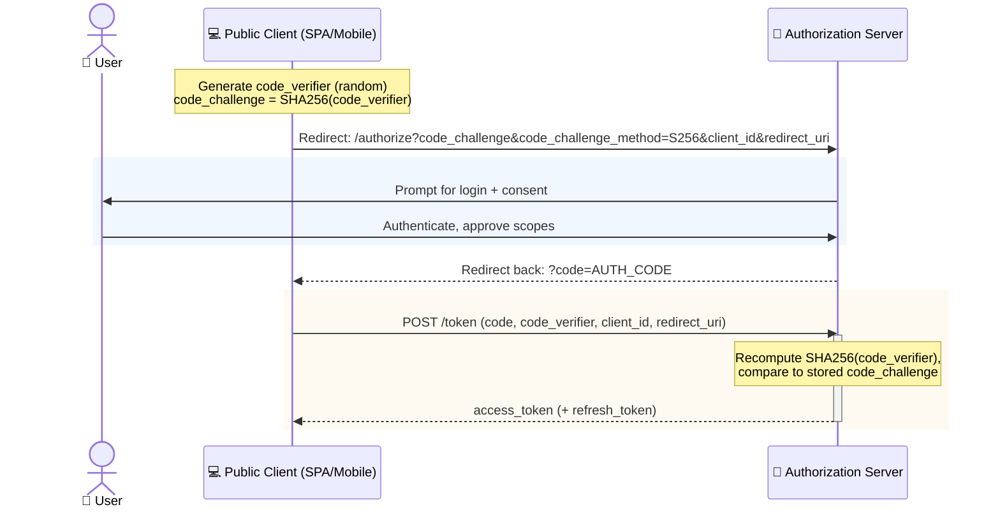

# Sequence Example: OAuth 2.1 with PKCE

The flow required for *public* clients (SPAs, mobile apps) that can't safely hold a `client_secret` —
PKCE (Proof Key for Code Exchange) closes the authorization-code-interception gap the plain OAuth 2.0
confidential-client flow relies on a secret to close.

> **Key Steps**:
> 1. **Challenge Before Redirect**: The client generates `code_verifier` and derives `code_challenge`
>    *before* the user ever leaves the app — only the challenge (a one-way hash) is sent in the
>    authorize redirect, never the verifier itself.
> 2. **No Secret, No Problem**: Because there's no `client_secret` anywhere in this flow (public clients
>    can't keep one safe — it'd ship inside the app bundle), the security burden moves entirely onto the
>    verifier/challenge pair.
> 3. **The Interception Attack This Closes**: If a malicious app on the same device intercepts the
>    authorization code (a real risk on mobile via custom URL scheme hijacking), it still can't redeem
>    that code for tokens — it doesn't have the original `code_verifier`, which never left the legitimate
>    client process.
> 4. **Verification, Not Trust**: The authorization server doesn't trust that the token request came from
>    the same client that started the flow — it *proves* it, by recomputing the hash and checking it
>    matches what was presented at the start.
>
> **Design Note**: OAuth 2.1 makes PKCE mandatory for *all* clients, not just public ones — confidential
> clients gain defense-in-depth from it too, at negligible extra cost.
