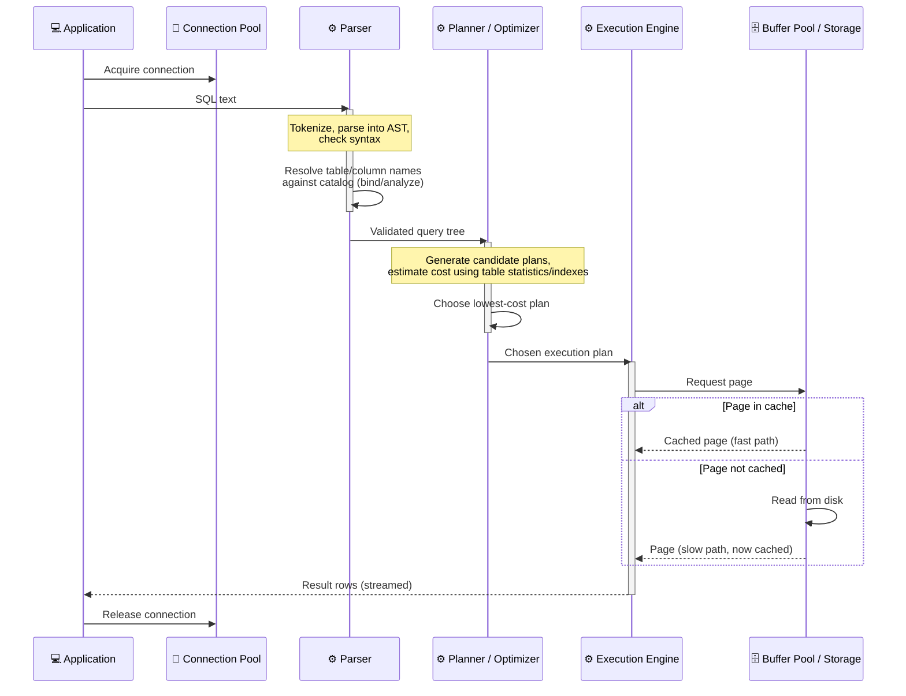

# Sequence Example: SQL Query Execution Flow

What actually happens inside an RDBMS between a client sending SQL text and rows coming back — parse,
bind/analyze, plan/optimize, execute. Real database-internals terminology, not a hand-wave.

> **Key Steps**:
> 1. **Parse Before Plan**: The parser only checks *syntax* and resolves names against the catalog — it
>    has no opinion yet about *how* to actually retrieve the data; that's the planner's job entirely.
> 2. **The Optimizer Chooses, It Doesn't Guess**: The planner generates multiple candidate execution
>    strategies (which index to use, join order, sort vs. hash) and picks the one with the lowest
>    estimated cost using real table statistics — not the first plan that would technically work.
> 3. **Cache Hit vs. Miss Is the Real Latency Story**: The buffer pool's cache-hit path and disk-read path
>    are drawn as a genuine fork because the latency difference between them (microseconds vs.
>    milliseconds) is usually the single biggest factor in real query performance — not the query's SQL
>    complexity.
> 4. **Results Stream, They Don't Batch-Return**: Rows are typically streamed back to the client as
>    they're produced, not accumulated into one giant response — this is why a client can start processing
>    the first row of a million-row result before the query engine has finished producing the last one.
>
> **Design Note**: This models a read (`SELECT`). A write query adds a write-ahead-log append step before
> the buffer pool is modified, so a crash mid-write can be recovered by replaying the log — a distinct
> concern from anything shown here.
