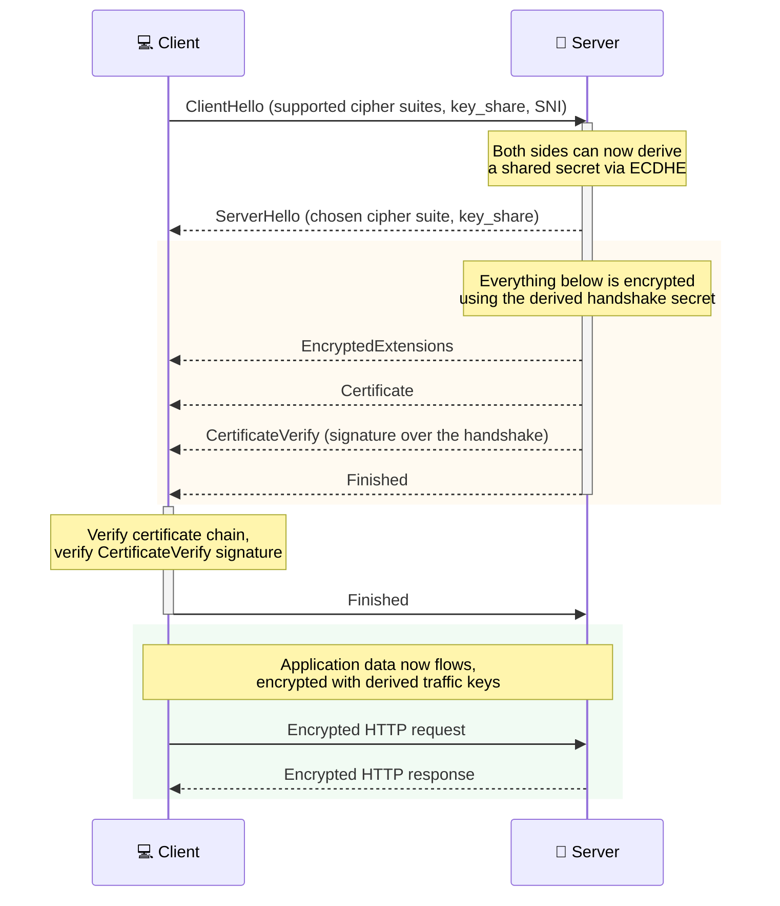

# Sequence Example: TLS 1.3 Handshake

What actually happens before the first byte of an HTTPS response arrives — the modern TLS 1.3 handshake
(RFC 8446), which completes in a single round trip (1-RTT), unlike the older TLS 1.2 handshake.

> **Key Steps**:
> 1. **Key Agreement Happens First, Immediately**: `ClientHello`/`ServerHello` alone are enough for both
>    sides to derive a shared secret via ephemeral Diffie-Hellman (`key_share`) — nothing about identity
>    or trust has been verified yet, only that both sides now share a secret nobody eavesdropping on the
>    exchange can compute.
> 2. **Encryption Starts Before Trust Is Established**: Everything the server sends after `ServerHello`
>    (including its own certificate) is already encrypted with that derived secret — TLS 1.3's real
>    improvement over 1.2 is compressing what used to be multiple round trips of plaintext negotiation
>    into this single exchange.
> 3. **The Client Verifies, Then Confirms**: The client checks the certificate chain against trusted CAs
>    and verifies `CertificateVerify` (proof the server holds the private key matching that certificate)
>    *before* sending its own `Finished` — a bad certificate or signature aborts the handshake right here,
>    before any application data is ever sent.
> 4. **`Finished` Is a Handshake Integrity Check, Not Just a Sign-Off**: Both `Finished` messages contain a
>    hash of the entire handshake transcript so far — if anything was tampered with in transit, the hashes
>    won't match and the connection is aborted, catching downgrade or injection attacks the encryption
>    alone wouldn't.
>
> **Design Note**: This is the full handshake (a new connection to a server for the first time). TLS 1.3
> also supports 0-RTT session resumption for a server the client has already connected to recently — a
> genuinely different, faster flow with its own replay-attack tradeoffs, not shown here.
