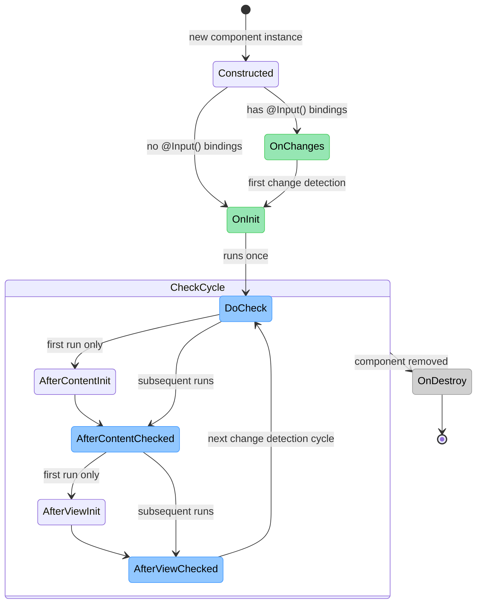

# State Example: Angular Component Lifecycle

Real Angular lifecycle hook firing order — not a guessed sequence. `ngOnChanges` only fires for
components with `@Input()`-bound properties; every other hook shown fires for every component.

> **Key Steps**:
> 1. **`ngOnChanges` Is Conditional**: It only fires for components that actually have `@Input()`-bound
>    properties, and it fires *before* `ngOnInit` — a component with no inputs skips straight to
>    `ngOnInit`.
> 2. **`ngOnInit` Runs Exactly Once**: Regardless of how many times change detection runs afterward,
>    initialization logic belongs here, not in the constructor (which shouldn't do real work — Angular
>    hasn't set up bindings yet when the constructor runs).
> 3. **Content vs. View, First-Run vs. Every-Run**: `ngAfterContentInit`/`ngAfterViewInit` fire once each
>    (after projected `<ng-content>` and after the component's own view + children, respectively);
>    `ngDoCheck`/`ngAfterContentChecked`/`ngAfterViewChecked` fire on *every* change detection pass,
>    including the very first one — the "Init" hooks are a subset of the first pass, not a separate phase.
> 4. **Destroy Is Terminal**: `ngOnDestroy` fires once, right before Angular tears the component down —
>    the only correct place to unsubscribe from observables or clear timers the component created.
