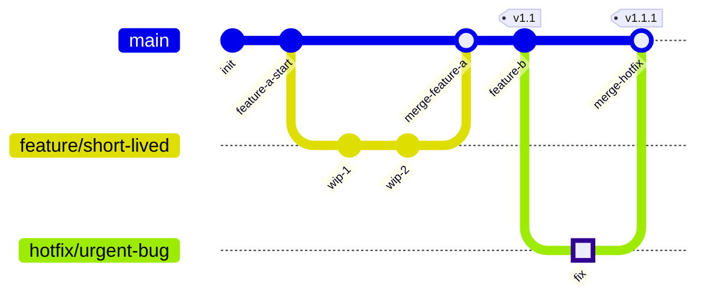

# Git Graph Guidelines (`gitGraph`)

**Scope**: this file covers Mermaid's `gitGraph` syntax — use it for branching strategy, release
strategy, or commit-history diagrams. This is a narrow, mostly-fixed vocabulary (commit/branch/checkout/
merge/cherry-pick) — there's much less "beautification" surface here than a flowchart, so this file is
intentionally shorter than the others.

## Core Syntax

```
gitGraph
    commit
    branch develop
    checkout develop
    commit
    commit
    checkout main
    merge develop
    commit
```

- **`commit`**: registers a commit on the *current* branch. Optional attributes: `id: "name"`,
  `tag: "v1.0"`, `type: NORMAL|REVERSE|HIGHLIGHT` (e.g. `commit id: "release" tag: "v1.0" type: HIGHLIGHT`).
- **`branch name`**: creates a new branch off the current one *and switches to it* — the new branch
  becomes current immediately, no separate checkout needed.
- **`checkout name`** (or `switch name`, interchangeable): switches the current branch without creating one.
- **`merge name`**: merges the named branch into the current branch, rendered as a filled double circle.
- **`cherry-pick id: "commit_id"`**: applies a specific commit from another branch onto the current one,
  with the source commit ID shown visually.

## Commit Types — Use Them Deliberately, Not Decoratively

| Type | Renders as | Use for |
|---|---|---|
| `NORMAL` (default) | Solid circle | Ordinary commits |
| `REVERSE` | Crossed solid circle | A revert commit — visually flags "this undoes prior work" |
| `HIGHLIGHT` | Filled rectangle | A commit worth calling out — typically a release/tag point, not routine work |

Don't `HIGHLIGHT` every commit "to make it pop" — it only carries meaning if used sparingly, same
principle as this skill's emoji-overload anti-pattern for flowcharts.

## Configuration Worth Knowing

- `mainBranchName` (default `"main"`) — set to match the repo's actual default branch name if it differs.
- Orientation: `LR:` (default), `TB:`, `BT:` as a directive before `gitGraph`.
- `parallelCommits` (default `false`) — affects whether commits on different branches at the "same time"
  render at the same horizontal position.

## What Transfers From the Flowchart Rules, and What Doesn't

| Flowchart rule | Applies to `gitGraph`? |
|---|---|
| Node Shape Vocabulary | **No** — commit/branch/merge have their own fixed native rendering (circle/crossed-circle/rectangle/double-circle); there's no shape choice to make |
| Color via `style` | **No per-node styling** — color comes from gitGraph's own theme variables (`git0`-`git7` for branch colors, `gitBranchLabel0-7`, etc.), a different mechanism than flowchart `style` lines |
| One emoji per element | **Atypical** — branch/commit labels are conventionally short identifiers (`v1.0`, `hotfix/payment-bug`); an emoji per commit reads as noise |
| Diagram Explanation | **Yes** — a branching *strategy* diagram (as opposed to a trivial 3-commit example) benefits from the same quote-block explaining *why* the strategy branches the way it does |
| Link Indexing / `linkStyle` | **No** — no equivalent; the graph structure itself (which branch, which merge) is the whole story |

## Worked Example: Trunk-Based Development



> **Design Rationale**: Trunk-based development keeps feature branches deliberately short-lived —
> `feature/short-lived` exists only long enough for two commits before merging straight back into `main`,
> minimizing merge conflicts and keeping `main` always close to what's actually deployed. The hotfix
> branch is flagged `HIGHLIGHT` specifically because it's an out-of-band emergency fix, not routine
> feature work — the visual distinction matters here precisely because it's the exception, not the norm.
> Both merges are tagged with the resulting release version, so the graph doubles as a release history,
> not just a branch-topology diagram.

## Validate the Same Way

```bash
node scripts/validate_diagrams.js --markdown path/to/doc.md
```
