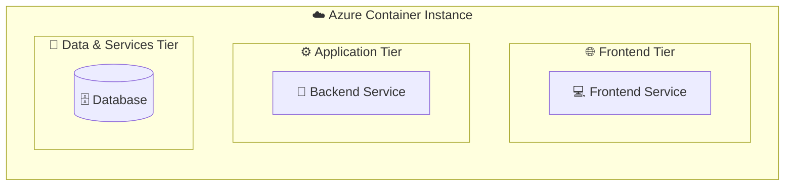

# Layout Best Practices

### 1. Use Hierarchical Subgraphs

Organize services into logical tiers using nested subgraphs.



**Benefits:**
- Clear visual separation
- Prevents arrow overlap
- Logical grouping
- Better readability

### 2. Direction Control

Use `direction TB` (top-to-bottom) or `direction LR` (left-to-right) within subgraphs:

```
subgraph MyGroup["Title"]
    direction TB
    A --> B --> C
end
```

### 3. Avoid Subgraph Title Overflow

**Problem:**
```
subgraph Title["Very Long Title That Gets Cut Off (Extra Info)"]
```

**Solution:**
- Keep titles concise
- Put extra info in node labels instead
- Use emojis to save space

**Good:**
```
subgraph Volumes["💿 Persistent Volumes"]
    Vol1["📁 volume-name<br/>(Extra details here)"]
end
```

### 4. Connection Order Matters

Define connections in logical order to prevent crossing arrows:

**Good Order:**
1. Internal tier connections (within same subgraph)
2. Cross-tier connections (between subgraphs)
3. External service connections
4. Infrastructure connections

---

