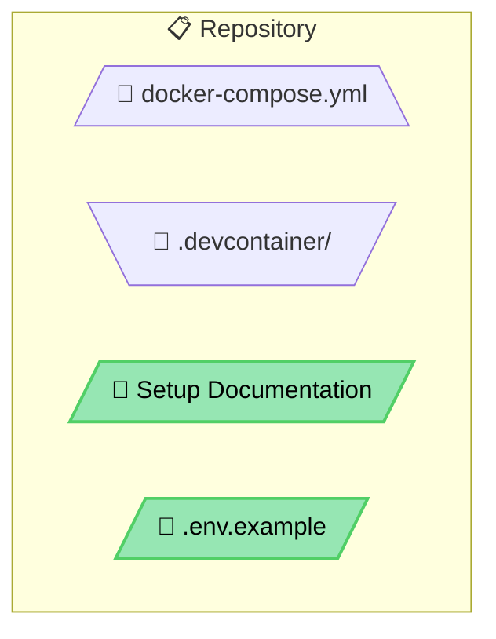
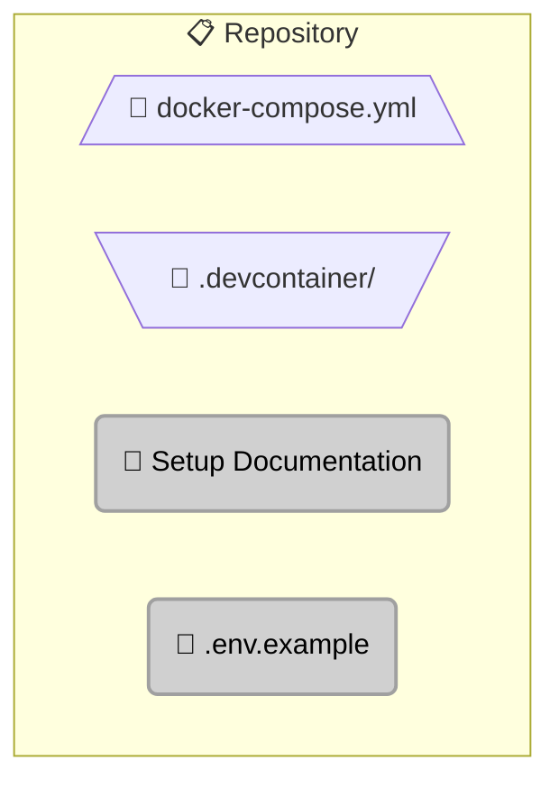

# Retrofitting Existing Diagrams

### Why This Is a Different Task Than Designing One

Every example and pattern above assumes a greenfield diagram — you're picking shapes and colors for
nodes that don't have any yet. Uplifting a large *existing* doc set (dozens of diagrams, often authored
independently over months, sometimes by different people) is a different job with its own failure modes,
found by actually running this exact task at scale (a ~40-diagram, 17-file retrofit) rather than by
guessing in advance. If you're applying this skill to bring old diagrams up to current standards rather
than drafting something new, read this section before starting.

### 1. Preserve the Real Information — This Is a Style Pass, Not a Rewrite

The goal is re-shaping/re-coloring/re-labeling existing architecture correctly, not redesigning the
architecture itself. If a diagram already correctly describes what connects to what and why, don't
restructure it, rename nodes, or change what it depicts — even if you'd have drawn it differently from
scratch. Confusable exception: if the *existing* structure is actually wrong (an arrow points at the wrong
node, a described flow doesn't match the surrounding prose, a duplicated/dangling block from a copy-paste
error), fix that too — factual correctness always outranks "don't touch existing structure." Just don't
conflate "this doesn't match the vocabulary" (fix it) with "I would have modeled this differently" (leave
it) — only the former is in scope for a retrofit pass.

### 2. Accuracy Beats Novelty — Don't Manufacture Shape Diversity

The single biggest failure mode found retrofitting at scale: forcing nodes into a shape or color that
isn't a plain Rectangle *specifically because* a diagram already has several rectangles, not because the
node's role actually calls for it. This produced diagrams where read-only reference content became
Parallelogram, manual action steps became Trapezoid, and summary callouts became Cylinder — all "not
rectangles," none of them correct. See [Node Shape Vocabulary → Disambiguation Notes](shapes.md#disambiguation-notes--cases-that-come-up-in-practice)
for the eight named cases this produced. **A diagram that's honestly 60% Rectangle because 60% of its
nodes are genuinely "doing work" is correct. A diagram that's 30% Rectangle and 30% wrongly-shaped nodes
is worse, even though it looks more varied at a glance.** Judge each node on its own role; never on how
many Rectangles already exist nearby.

### 3. Check Sibling Diagrams in the Same File Before Improvising

Doc files with multiple diagrams describing structurally parallel scenarios (four versioning strategies in
one file, four testing-stage flows in another) should use the *same* shape/color for the *same* conceptual
role across all of them — a retrofit pass found a backend handler colored correctly as Backend/API-orange
in one sub-diagram and, for no reason, as Storage-green in an otherwise-identical sibling sub-diagram three
sections later. Before choosing a shape or color for an ambiguous node, check whether the same file already
has a structurally equivalent node elsewhere and match it, rather than re-deciding independently each time
and risking inconsistency within a single document.

### 4. A Sane Bar for "Already Good, Leave It"

Not every existing diagram needs touching. If a diagram's shapes already match roles correctly, its colors
already come from the documented palette, its arrows are already correctly solid/dashed with the right
dasharray, and its link indexing is already present and correct — it's done. Re-authoring a diagram that
already meets the standard, just to put your own stamp on it, wastes effort and risks introducing a real
regression into something that worked. Confirm compliance against the [Checklist for Creating Diagrams](checklist.md)
(or SKILL.md's own Output Checklist) first; only touch what actually fails a checklist item.

### 5. Validate Every File You Touch, Not Just the Ones You're Unsure Of

Retrofitting means editing files that already rendered correctly before your change — it's easy to
introduce a syntax regression (a stray bracket, a shape mismatch) while fixing a semantic issue. Re-run
`scripts/validate_diagrams.js` against every file you edit, even ones where you only changed a `style`
line and "obviously" didn't touch the structure.

### Worked Example: Before/After

This is a real correction made during the ~40-diagram retrofit that motivated this section, generalized
slightly. A "Repository" subgraph had a documentation file and an env-var template, both forced into
Parallelogram + Storage-green to avoid looking like plain rectangles next to two correctly-Trapezoid config
files in the same subgraph:

> **What changed and why**: `Compose` and `Devcontainer` were already correct — both are config that
> lives inside the Repository resource, a textbook Trapezoid case — and were left untouched. `Docs` and
> `EnvExample` are read once by a human during setup; nothing in the diagram fetches or processes them at
> runtime, so Parallelogram (data entering a process) and Storage-green (a stored artifact) both
> overstated their role. Rounded + generic-infra-gray reflects what they actually are: static reference
> material, not compute, not a data store. Nothing about the diagram's actual architecture changed — only
> the shape/color of two nodes that were miscategorized.

---

