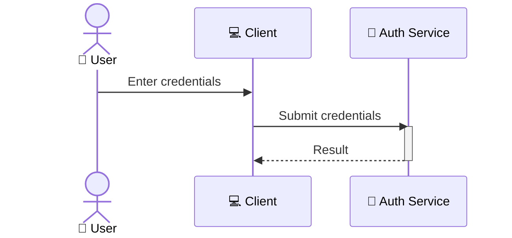
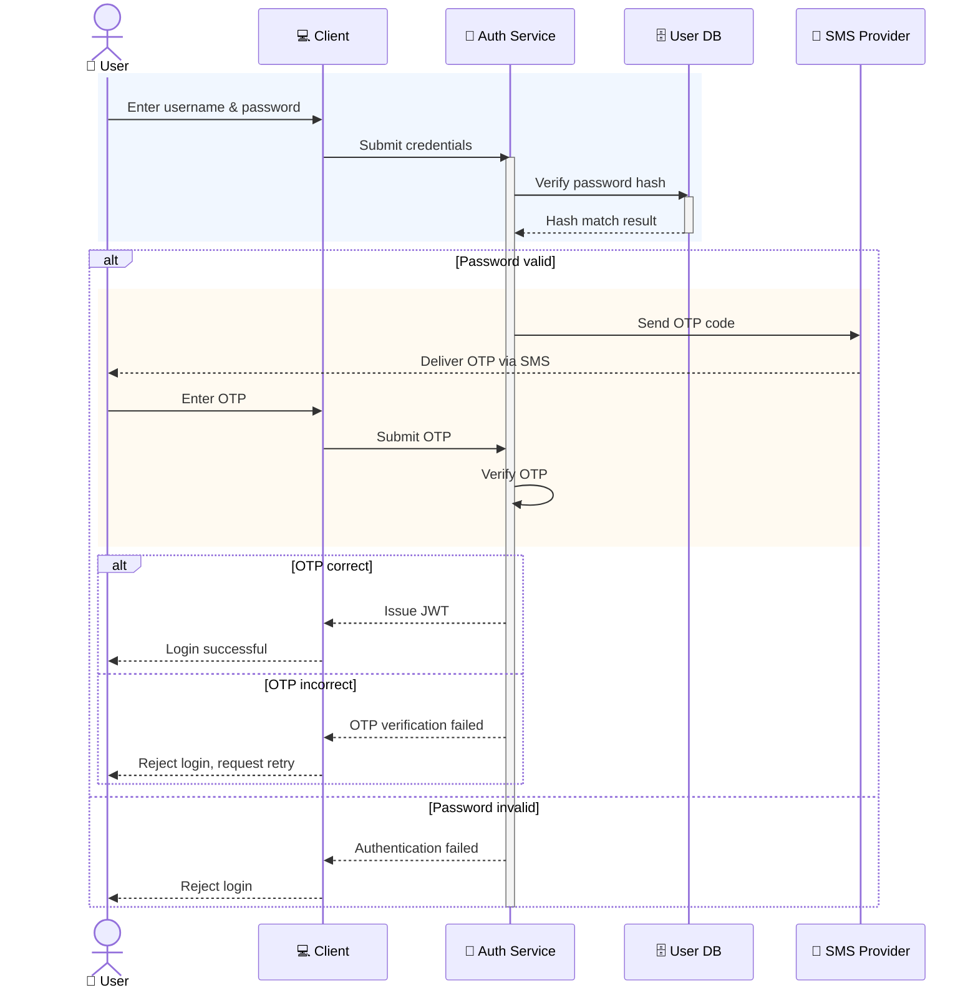

# Sequence Diagram Guidelines

**Scope**: this file covers Mermaid's `sequenceDiagram` syntax specifically. If you're drawing an
architecture/flowchart diagram instead (`graph`/`flowchart`), start at `README.md` instead — almost none
of the shape/color/subgraph machinery here transfers, because a sequence diagram has no nodes to shape,
no subgraphs, and no per-arrow `linkStyle`.

## What Actually Transfers From the Flowchart Rules, and What Doesn't

| Flowchart rule (see `README.md` for the topic index) | Applies to `sequenceDiagram`? |
|---|---|
| Node Shape Vocabulary (`id["text"]`, `id{"text"}`, etc.) | **No** — participants are plain labels, no shape syntax exists |
| `style NodeName fill:...` per-node coloring | **No** — no per-participant fill/stroke; see "Phase Highlighting" below for the real equivalent |
| `graph TB`/`LR`, `subgraph`, `direction` | **No** — `sequenceDiagram` is its own top-level type; the closest analog to grouping is `box ... end` (rarely needed below ~6 participants) |
| Arrow label quoting (`-->|"text"|`), `(N)`/`[N]` step numbering | **No** — sequence-diagram messages use `A->>B: text` with no pipe/bracket label syntax, and order is already visually encoded by vertical position, so redundant numbering is generally unnecessary |
| Per-arrow `linkStyle` (color/width/dasharray) | **No** — no equivalent exists |
| Solid vs. dashed arrow meaning (direct vs. async/return) | **Yes, and it maps onto Mermaid's own built-in convention** — see below |
| One emoji per element, at the start | **Yes** — works the same way via `participant X as "🔧 Label"` |
| Diagram Explanation (quote-block, bolded steps) | **Yes** — and sequence diagrams are in the "always required" category already, same as the flowchart rules in `diagram-explanations.md` |
| Link Indexing (`%% Link N:` comments + summary) | **No** — it exists specifically to pair with `linkStyle` indices, which don't exist here; use lightweight `%% Phase: ...` comments instead if grouping helps |
| Validator (`scripts/validate_diagrams.js`) | **Yes, unconditionally** — applies to every diagram type Mermaid supports, sequence diagrams included |

## Solid vs. Dashed — Maps Cleanly Onto Mermaid's Own Convention

Mermaid's native sequence-diagram syntax already distinguishes solid (`->>`) from dashed (`-->>`) arrows,
and it happens to line up with the flowchart skill's own solid=direct/dashed=async-or-return intent:

```
A->>B: Request (solid — a call being made)
B-->>A: Response (dashed — a return/reply)
```

Use solid for a message initiating an action or request; dashed for a response, return value, or
acknowledgment. This isn't a new rule invented for this skill — it's just Mermaid's own idiom, confirmed
consistent with the flowchart rules' spirit.

## Core Syntax



- **`actor`** vs. **`participant`**: use `actor` for a human; `participant` for a system/service. Both
  support `as "emoji Label"` aliasing.
- **`activate`/`deactivate`**: shows a participant actively doing work between a request and its
  response — draws a vertical bar over the participant's lifeline. Use it when "this component is busy
  processing" is worth calling out visually, not on every single message (that just adds visual noise).
- **`alt` / `else` / `end`**: branching — a genuine fork in the flow (e.g. "password valid" vs. "password
  invalid"). Nest `alt` blocks for sequential independent gates (e.g. password check, then OTP check)
  rather than combining unrelated conditions into one block.
- **`opt` / `end`**: an optional step that either happens or is skipped, with no alternative branch.
- **`loop` / `end`**: a repeated sequence of messages.
- **`Note over/left of/right of X`**: a free-text annotation attached to one or more participants' lifelines.

### The Activation-Stack Gotcha

Mermaid's `activate`/`deactivate` tracking is a **single linear stack over the whole diagram** — it does
not reset per `alt`/`else` branch. A common mistake: opening `activate X` in one branch and closing it with
`deactivate X` in a different, mutually-exclusive branch (or in both branches separately) — the second
`deactivate` fails because the branch structure makes it look like `X` was already inactive by the time
that line runs. Confirmed by actually hitting this in the validator (`Error: Trying to inactivate an
inactive participant`), not a hypothetical. Fix: open and close each `activate`/`deactivate` pair spanning
the parts of the flow common to all branches, not nested asymmetrically inside branch-specific blocks. If
in doubt, put a single `activate`/`deactivate` pair around the outermost span of "this participant is
doing something," opened before any `alt` and closed after its matching `end`.

## Phase Highlighting — the Real Equivalent of Node `style`

Sequence diagrams have no per-participant fill/stroke, but do have a genuine background-highlight feature
that serves a similar "visually separate this part of the flow" purpose:

```
rect rgb(74, 158, 255, 0.08)
User->>Client: Enter username & password
Client->>AuthService: Submit credentials
end
```

Use `rect rgb(r, g, b, alpha) ... end` to shade a contiguous block of messages — e.g. one color per logical
phase (credential check, then a second-factor check). Loosely reuse this skill's existing palette hues at
low alpha (~0.08) for the shading rather than inventing new colors, so a sequence diagram still feels like
it belongs to the same visual family as an architecture diagram in the same doc set.

## Worked Example: 2FA Login Flow



> **Key Steps**:
> 1. **Credential Submission**: The user enters credentials in the client, which forwards them to the
>    Auth Service.
> 2. **Password Verification**: Auth Service checks the password hash against the User DB before doing
>    anything else — no OTP is sent for a bad password.
> 3. **OTP Dispatch**: On a valid password, Auth Service asks the SMS Provider to deliver a one-time code
>    out-of-band, so possession of the phone becomes the second factor.
> 4. **OTP Verification**: The user relays the code back through the client; Auth Service checks it and
>    only then issues a JWT.
> 5. **Failure Paths**: Both the password check and the OTP check have explicit rejection paths.
>
> **Design Note**: The two `alt` blocks are sequential gates (password, then OTP) rather than a single
> combined condition — this keeps the failure messaging distinct and mirrors how a real 2FA
> implementation would branch. Note the single `activate`/`deactivate AuthService` pair spans the entire
> flow, opened before the first `alt` and closed after the outer `alt/else/end` — not one pair per branch
> (see the Activation-Stack Gotcha above).

## Validate the Same Way

```bash
node scripts/validate_diagrams.js --file path/to/diagram.mmd
node scripts/validate_diagrams.js --markdown path/to/doc.md
```

The validator doesn't care whether the block is `graph`/`flowchart` or `sequenceDiagram` — it renders
whatever's in the fence. Run it before presenting a sequence diagram as final, same as any other diagram
type.
