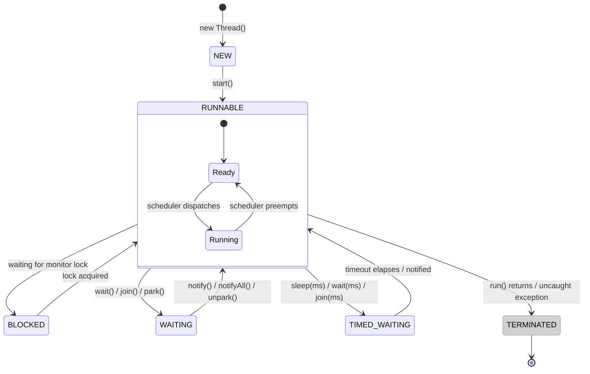

# State Diagram Guidelines (`stateDiagram-v2`)

**Scope**: this file covers Mermaid's `stateDiagram-v2` syntax — use it when the content is genuinely
about an entity's lifecycle (the states it can be in and what triggers each transition), not an
architecture/data-flow diagram. See `README.md`'s diagram-type table if you're unsure which type fits.

## Core Syntax

```
stateDiagram-v2
    [*] --> Idle
    Idle --> Running: start()
    Running --> Paused: pause()
    Paused --> Running: resume()
    Running --> [*]: complete()
```

- **`[*]`** is the special start/end pseudostate — every real lifecycle should have at least one `[*] -->`
  entry point; a terminal `--> [*]` is optional (some lifecycles never formally "end").
- **Transition labels** (`: text`) name the trigger/event, not a description of the state — label with
  the method call, event name, or condition that causes the transition, e.g. `: start()` not `: starts running`.
- **Composite (nested) states** — a state that's itself a mini state machine:
  ```
  state Running {
      [*] --> Executing
      Executing --> Waiting: blockOnIO()
      Waiting --> Executing: ioComplete()
  }
  ```
- **Choice points** — a genuine branch based on a condition, distinct from a plain transition:
  ```
  state Validate <<choice>>
  Validate --> Approved: valid
  Validate --> Rejected: invalid
  ```
- **Fork/join** — splitting into concurrent sub-states and rejoining:
  ```
  state Fork <<fork>>
  state Join <<join>>
  Fork --> TaskA
  Fork --> TaskB
  TaskA --> Join
  TaskB --> Join
  ```
- **Concurrent regions inside one composite state** — separate parallel regions with `--`:
  ```
  state Active {
      RegionA --
      RegionB
  }
  ```
- **Notes**: `note right of StateName` / `note left of StateName` ... `end note`.
- **Direction**: `direction LR` (or `TB`/`RL`/`BT`) as a top-level or in-composite-state statement.

## What Transfers From the Flowchart Rules, and What Doesn't

| Flowchart rule | Applies to `stateDiagram-v2`? |
|---|---|
| Node Shape Vocabulary | **No** — states have no shape choice; the diagram type itself already encodes "this is a state," and composite/choice/fork are distinct *native* constructs, not a shape decision like in a flowchart |
| Color via `style`/`classDef` | **Yes, but** `classDef` cannot style the start/end pseudostate or composite-state container boxes (a real Mermaid limitation, not an oversight in this guidance) — apply `classDef` to plain leaf states only |
| One emoji per element | **Yes** — works in a state's description: `state "🔄 Processing" as Processing` |
| Diagram Explanation | **Yes** — a state machine with more than a couple of states/transitions is exactly the "non-obvious relationships" case this skill already requires an explanation for |
| Link Indexing / `linkStyle` | **No** — `stateDiagram-v2` has no per-transition indexed styling equivalent to flowchart's `linkStyle N`; don't invent one |
| Arrow solid/dashed convention | **No** — all transitions use the same `-->` regardless of sync/async; state diagrams describe *logical* transitions, not runtime call semantics |

## Coloring States by Category

`classDef` on leaf states is the natural home for this skill's Environment/Status-Tier color convention
(see `colors.md`) — a lifecycle with healthy/degraded/terminal-failure states is a textbook fit:

```
classDef healthy fill:#8CE99A,stroke:#2F9E44,color:#000
classDef degraded fill:#FFD43B,stroke:#F08C00,color:#000
classDef failed fill:#FF6B6B,stroke:#C92A2A,color:#000

class Running healthy
class Degraded degraded
class Failed failed
```

## Worked Example: Java `Thread` Lifecycle

Real JVM thread states and their actual transition triggers (`Thread.start()`, scheduler actions, lock
acquisition, `wait()`/`notify()`, `join()`/timeout) — get the state names exactly right, they're a fixed,
checkable enum (`java.lang.Thread.State`).



> **Key Steps**:
> 1. **Creation**: A `Thread` object starts in `NEW` — it exists but hasn't been scheduled to run yet;
>    calling `start()` (not `run()`) is what actually transitions it to `RUNNABLE`.
> 2. **Runnable Is Not Always Running**: `RUNNABLE` is itself a composite state — the JVM scheduler moves
>    a thread between actually-executing and ready-but-waiting-for-CPU within this single JVM-visible
>    state, which is why `jstack`/`Thread.getState()` never distinguishes "ready" from "running."
> 3. **Three Different Kinds of Waiting**: `BLOCKED` (waiting on a monitor lock specifically),
>    `WAITING` (indefinite, requires an explicit wake), and `TIMED_WAITING` (bounded by a timeout) are
>    genuinely distinct states in the real `Thread.State` enum, not synonyms — mixing them up is a common
>    factual error.
> 4. **Terminal Is Terminal**: Once `TERMINATED`, a thread object can never be restarted — calling
>    `start()` again throws `IllegalThreadStateException`, which is why there's no edge back to `NEW`.

## Validate the Same Way

```bash
node scripts/validate_diagrams.js --markdown path/to/doc.md
```
