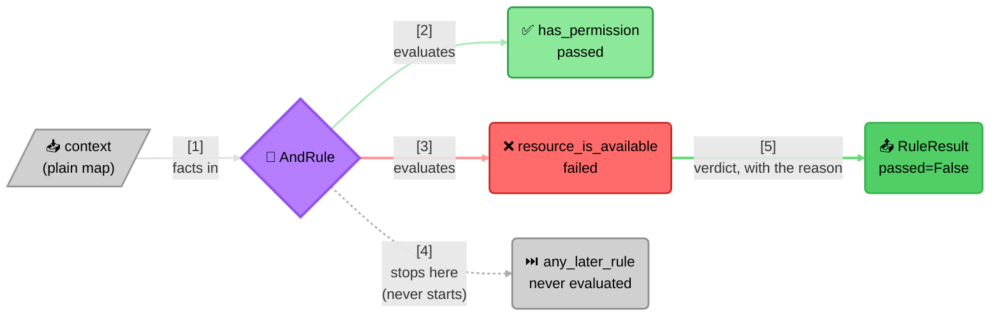

# Verdict

> This project lives as an extension of an idea from my mentor and
> guiding light — [`@SanjayVyas`](https://github.com/SanjayVyas), to
> whom I owe everything I know about building software that lasts; and
> beyond. 🙏

Every system built long enough accumulates the same shape of question:
*given what I know right now, is this allowed?* A rate limiter asks it
of a request. An access check asks it of a caller. A checkout page asks
it of a cart. The question is always the same shape — only the specific
conditions behind it change, and they tend to keep changing long after
the code asking the question has shipped.

Verdict is the small piece of infrastructure that question deserves: a
place to name each condition once, combine named conditions into a
verdict, and run that verdict against whatever facts a caller hands it
— a plain map, nothing more. It has no idea what a rate limit is, or
a permission, or a discount. It only knows how to ask a rule "did you
pass?" and combine the answers honestly.

Verdict is a polyglot design.

## Quickstart

<details open>
<summary>Python</summary>

```bash
pip install verdict-rules
```

```python
from verdict import AndRule, FunctionRule, RuleResult, RulesEngine

async def has_permission(ctx):
    return RuleResult("has_permission", ctx["permission"])

async def resource_is_available(ctx):
    return RuleResult("resource_is_available", ctx["available"])

can_proceed = AndRule("can_proceed", [
    FunctionRule("has_permission", has_permission),
    FunctionRule("resource_is_available", resource_is_available),
])

engine = RulesEngine([can_proceed])
verdict = await engine.run_named("can_proceed", {"permission": True, "available": False})
verdict.passed   # False
verdict.detail   # "'resource_is_available' failed"
```

</details>

<details>
<summary>JavaScript/TypeScript</summary>

```bash
npm install verdict-rules
```

```ts
import { AndRule, FunctionRule, RulesEngine } from "verdict-rules";

async function hasPermission(ctx) {
  return { ruleName: "has_permission", passed: ctx.permission };
}

async function resourceIsAvailable(ctx) {
  return { ruleName: "resource_is_available", passed: ctx.available };
}

const canProceed = new AndRule("can_proceed", [
  new FunctionRule("has_permission", hasPermission),
  new FunctionRule("resource_is_available", resourceIsAvailable),
]);

const engine = new RulesEngine([canProceed]);
const verdict = await engine.runNamed("can_proceed", { permission: true, available: false });
verdict.passed;   // false
verdict.detail;   // "'resource_is_available' failed"
```

</details>

<details>
<summary>Dart</summary>

```yaml
dependencies:
  verdict_rules: ^0.0.2
```

```dart
import 'package:verdict_rules/verdict_rules.dart';

Future<RuleResult> hasPermission(Map<String, Object?> ctx) async =>
    RuleResult(ruleName: 'has_permission', passed: ctx['permission']! as bool);

Future<RuleResult> resourceIsAvailable(Map<String, Object?> ctx) async =>
    RuleResult(ruleName: 'resource_is_available', passed: ctx['available']! as bool);

final canProceed = AndRule('can_proceed', [
  FunctionRule('has_permission', hasPermission),
  FunctionRule('resource_is_available', resourceIsAvailable),
]);

final engine = RulesEngine([canProceed]);
final verdict = await engine.runNamed('can_proceed', {'permission': true, 'available': false});
verdict.passed;   // false
verdict.detail;   // "'resource_is_available' failed"
```

</details>

<details>
<summary>C#</summary>

```sh
dotnet add package VerdictRules
```

```csharp
using VerdictRules;

static Task<RuleResult> HasPermission(IReadOnlyDictionary<string, object?> ctx, CancellationToken cancellationToken = default) =>
    Task.FromResult(new RuleResult("has_permission", (bool)ctx["permission"]!));

static Task<RuleResult> ResourceIsAvailable(IReadOnlyDictionary<string, object?> ctx, CancellationToken cancellationToken = default) =>
    Task.FromResult(new RuleResult("resource_is_available", (bool)ctx["available"]!));

var canProceed = new AndRule("can_proceed", new IRule[]
{
    new FunctionRule("has_permission", HasPermission),
    new FunctionRule("resource_is_available", ResourceIsAvailable),
});

var engine = new RulesEngine(new IRule[] { canProceed });
var verdict = await engine.RunNamedAsync("can_proceed", new Dictionary<string, object?>
{
    ["permission"] = true,
    ["available"] = false,
});

Console.WriteLine(verdict.Passed); // false
Console.WriteLine(verdict.Detail); // "'resource_is_available' failed"
```

</details>

That is the whole library in one screen. What it buys you is not the
composition — you could write that yourself in an afternoon — but the
guarantee underneath it:



> **Short-circuiting is a contract here, not an optimisation.** Rules are
> evaluated **sequentially, never concurrently**, so work after a decided
> outcome doesn't merely get discarded — it never starts. That matters
> the moment a rule does something: calls an API, takes a lock, writes an
> audit row. A library that evaluated all three concurrently would return
> the same `False` and be silently wrong.
>
> The rest follows from it. Facts are a plain map Verdict never
> inspects. A `Rule` is anything with `name`, `group` and
> `evaluate()` — no base class, no registration. `RulesEngine` is the
> diagnostic counterpart, for when you want every rule's answer rather
> than the fastest one.

## Why it's shaped this way

- **Zero external dependencies.** Nothing to audit, nothing to pin,
  nothing that can break because a transitive package changed underneath
  it.
- **No knowledge of any domain.** Verdict doesn't know what a "rate
  limit" or a "discount" is — that vocabulary lives in a small adapter
  a caller writes, never inside this package. That's what lets the exact
  same engine answer unrelated questions in the same codebase without
  the two ever coupling to each other.
- **Rules are structurally typed, not inherited.** A custom rule never
  imports anything from this package or subclasses anything — it just
  needs a `name`, a `group`, and an `evaluate(context)` that returns a
  `RuleResult`.

## Where to go next

| Doc | For |
| --- | --- |
| [`python/README.md`](python/packages/verdict-rules/README.md) | Python quickstart — `pip install verdict-rules`, first rule |
| [`python/packages/verdict-rules/docs/quickstart.md`](python/packages/verdict-rules/docs/quickstart.md) | Core concepts and a full worked example |
| [`js/README.md`](js/packages/verdict-rules/README.md) | JS/TS quickstart — `npm install verdict-rules`, first rule |
| [`js/packages/verdict-rules/docs/quickstart.md`](js/packages/verdict-rules/docs/quickstart.md) | Core concepts and a full worked example |
| [`dart/README.md`](dart/packages/verdict_rules/README.md) | Dart quickstart — add `verdict_rules` to `pubspec.yaml`, first rule |
| [`dart/packages/verdict_rules/doc/quickstart.md`](dart/packages/verdict_rules/doc/quickstart.md) | Core concepts and a full worked example |
| [`csharp/README.md`](csharp/src/VerdictRules/README.md) | C# quickstart — `dotnet add package VerdictRules`, first rule |
| [`csharp/src/VerdictRules/docs/quickstart.md`](csharp/src/VerdictRules/docs/quickstart.md) | Core concepts and a full worked example |
| [`docs/architecture/`](docs/architecture/README.md) | Why it's shaped this way, in depth — type structure, the execution model |
| [`docs/extending/`](docs/extending/README.md) | Building on top of it from your own code, with no changes here |
| [`docs/maintenance/`](docs/maintenance/README.md) | Changing this package itself |
| [`docs/testing/`](docs/testing/README.md) | How the test suite is organized, and what a change needs to prove |
| [`docs/future_plan.md`](docs/future_plan.md) | Exploratory feature candidates, and the test used to evaluate one |
| [`docs/samples/`](docs/samples/README.md) | Worked examples — dynamic discounts, fee waivers, tier promotions, moderation routing, data-driven rule sets |
| [`python/examples/`](python/examples/README.md) | Full, tested mini-projects behind the more comprehensive samples — real code, real tests, real docs |
| [`skills/verdict/SKILL.md`](skills/verdict/SKILL.md) | The AI-agent skill for building with Verdict |

## Contributing

See [`CONTRIBUTING.md`](CONTRIBUTING.md) for how to set up a change and
what it needs to prove before it's mergeable — it names where each
language keeps its own concrete dev-setup commands.  
Licensed under [MIT](LICENSE).  
Release history:

- [`python/packages/verdict-rules/CHANGELOG.md`](python/packages/verdict-rules/CHANGELOG.md)
- [`js/packages/verdict-rules/CHANGELOG.md`](js/packages/verdict-rules/CHANGELOG.md)
- [`dart/packages/verdict_rules/CHANGELOG.md`](dart/packages/verdict_rules/CHANGELOG.md)
- [`csharp/src/VerdictRules/CHANGELOG.md`](csharp/src/VerdictRules/CHANGELOG.md)
- [`skills/verdict/CHANGELOG.md`](skills/verdict/CHANGELOG.md)

## Status

| Language | Registry | Version | Compatibility | Tests | Supply Chain |
| :-- | :-- | :-- | :-- | :-- | :-- |
| Python | [PyPI](https://pypi.org/project/verdict-rules/) | [](https://pypi.org/project/verdict-rules/) | [](https://pypi.org/project/verdict-rules/) | [](https://github.com/pawan-vyas/verdict-rules/actions/workflows/test-python.yml) | [Socket.dev](https://socket.dev/pypi/package/verdict-rules) |
| JS/TS | [npm](https://www.npmjs.com/package/verdict-rules) | [](https://www.npmjs.com/package/verdict-rules) | [](https://www.npmjs.com/package/verdict-rules) `<script>`/CDN | [](https://github.com/pawan-vyas/verdict-rules/actions/workflows/test-js.yml) | [Socket.dev](https://socket.dev/npm/package/verdict-rules) |
| Dart | [pub.dev](https://pub.dev/packages/verdict_rules) | [](https://pub.dev/packages/verdict_rules) | `>=3.0.0 <4.0.0` | [](https://github.com/pawan-vyas/verdict-rules/actions/workflows/test-dart.yml) | — |
| C# | [NuGet](https://www.nuget.org/packages/VerdictRules/) | [](https://www.nuget.org/packages/VerdictRules/) | `net10.0`, `netstandard2.1` | [](https://github.com/pawan-vyas/verdict-rules/actions/workflows/test-csharp.yml) | [Socket.dev](https://socket.dev/nuget/package/verdictrules) |
| Verdict-Rules Skill | [GitHub](skills/verdict/) | [](skills/verdict/CHANGELOG.md) | Any [Agent Skills](https://agentskills.io/home)-conformant harness | [](https://github.com/pawan-vyas/verdict-rules/actions/workflows/check-skill-version.yml) | — |
