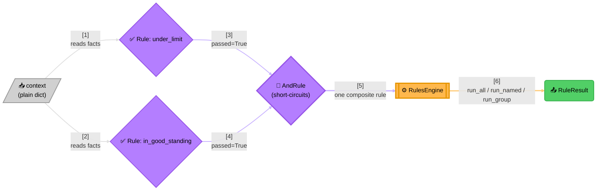

# Verdict

> This project lives as an extension of an idea from my mentor and
> guiding light — @SanjayVyas, to whom I owe everything I know about
> building software that lasts; and beyond.

Every system built long enough accumulates the same shape of question:
*given what I know right now, is this allowed?* A rate limiter asks it
of a request. An access check asks it of a caller. A checkout page asks
it of a cart. The question is always the same shape — only the specific
conditions behind it change, and they tend to keep changing long after
the code asking the question has shipped.

Verdict is the small piece of infrastructure that question deserves: a
place to name each condition once, combine named conditions into a
verdict, and run that verdict against whatever facts a caller hands it
— a plain `dict`, nothing more. It has no idea what a rate limit is, or
a permission, or a discount. It only knows how to ask a rule "did you
pass?" and combine the answers honestly.



> **Reading the Diagram**:
> 1. **Facts flow in as a plain `dict`** — Verdict never defines or
>    inspects that shape; the caller and its own rules agree on it
>    privately.
> 2. **Each rule answers one question about those facts** — a `Rule` is
>    just anything with `name`/`group`/`evaluate()`; `FunctionRule` wraps
>    a plain predicate, the common case.
> 3. **`AndRule`/`OrRule` combine rules into one verdict**, short-
>    circuiting the moment the outcome can no longer change — a failing
>    `AndRule` never evaluates a sub-rule that comes after the first
>    failure.
> 4. **`RulesEngine` is what a caller actually holds onto** — it runs
>    named/grouped rules (or everything) against a context and hands
>    back a plain, immutable result: a fresh answer every call, never a
>    cached or mutated one.
>
> Nothing in this picture knows what the facts *mean* — that's the
> point. See [`python/docs/samples/`](python/docs/samples/1_README.md)
> for the same shape answering a rate-limit check, an access grant, or a
> discount question, with zero changes to Verdict itself.

## Why it's shaped this way

- **Zero external dependencies.** Nothing to audit, nothing to pin,
  nothing that can break because a transitive package changed underneath
  it.
- **No knowledge of any domain.** Verdict doesn't know what a "rate
  limit" or a "discount" is — that vocabulary lives in a small adapter
  a caller writes, never inside this package. That's what lets the exact
  same engine answer unrelated questions in the same codebase without
  the two ever coupling to each other.
- **Rules are structurally typed, not inherited.** A custom rule never
  imports anything from this package or subclasses anything — it just
  needs a `name`, a `group`, and an `evaluate(context)` coroutine.

## Where to go next

Verdict is a polyglot design — the `Rule`/`FunctionRule`/`AndRule`/
`OrRule`/`RulesEngine` shape and its execution-model guarantees are
meant to exist in more than one language. **Only Python ships today.**
The docs below split the same way the repo does: language-agnostic
design rationale lives at the repo root; anything with directly
runnable code lives under that language's own directory.

| Doc | For |
|---|---|
| [`python/README.md`](python/README.md) | Python quickstart — `pip install verdict-rules`, first rule |
| [`python/docs/quickstart.md`](python/docs/quickstart.md) | Core concepts and a full worked example |
| [`docs/architecture.md`](docs/architecture.md) | Why it's shaped this way, in depth — type structure, the execution model |
| [`docs/extension.md`](docs/extension.md) | Building on top of it from your own code, with no changes here |
| [`docs/maintenance.md`](docs/maintenance.md) | Changing this package itself |
| [`docs/testing.md`](docs/testing.md) | How the test suite is organized, and what a change needs to prove |
| [`docs/future_plan.md`](docs/future_plan.md) | Exploratory feature candidates, and the test used to evaluate one |
| [`python/docs/samples/`](python/docs/samples/1_README.md) | Worked examples — dynamic discounts, fee waivers, tier promotions, moderation routing, data-driven rule sets |
| [`python/examples/`](python/examples/README.md) | Full, tested mini-projects behind the more comprehensive samples — real code, real tests, real docs |
| [`skills/verdict/SKILL.md`](skills/verdict/SKILL.md) | The AI-agent skill for building with Verdict |

## Development

```bash
cd python/
uv sync
uv run pytest
```

## Contributing

See [`CONTRIBUTING.md`](CONTRIBUTING.md) for how to set up a change and
what it needs to prove before it's mergeable, and
[`CODE_OF_CONDUCT.md`](CODE_OF_CONDUCT.md) for community standards.
Licensed under [MIT](LICENSE). See [`CHANGELOG.md`](CHANGELOG.md) for
release history, grouped by language-scoped tag.
