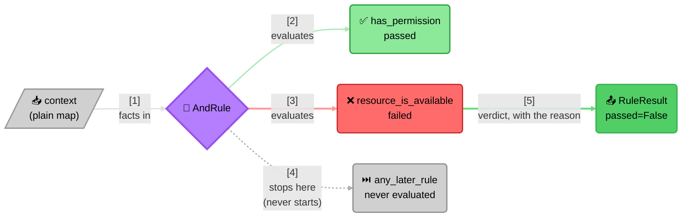

# Verdict

> This project lives as an extension of an idea from my mentor and
> guiding light — [`@SanjayVyas`](https://github.com/SanjayVyas), to
> whom I owe everything I know about building software that lasts; and
> beyond. 🙏

Every system built long enough accumulates the same shape of question:
*given what I know right now, is this allowed?* A rate limiter asks it
of a request. An access check asks it of a caller. A checkout page asks
it of a cart. The question is always the same shape — only the specific
conditions behind it change, and they tend to keep changing long after
the code asking the question has shipped.

Verdict is the small piece of infrastructure that question deserves: a
place to name each condition once, combine named conditions into a
verdict, and run that verdict against whatever facts a caller hands it
— a plain map, nothing more. It has no idea what a rate limit is, or
a permission, or a discount. It only knows how to ask a rule "did you
pass?" and combine the answers honestly.

Verdict is a polyglot design.

## Quickstart

<details open>
<summary>Python</summary>

```bash
pip install verdict-rules
```

```python
from dataclasses import dataclass

from verdict import AndRule, FunctionRule, PredicateOutcome, RulesEngine


@dataclass(frozen=True)
class AccessContext:
    permission: bool
    available: bool


async def has_permission(ctx: AccessContext) -> PredicateOutcome:
    return PredicateOutcome(passed=ctx.permission)

async def resource_is_available(ctx: AccessContext) -> PredicateOutcome:
    return PredicateOutcome(passed=ctx.available)

can_proceed = AndRule("can_proceed", [
    FunctionRule("has_permission", has_permission),
    FunctionRule("resource_is_available", resource_is_available),
])

engine = RulesEngine([can_proceed])
verdict = await engine.run_named("can_proceed", AccessContext(permission=True, available=False))
verdict.passed                       # False
verdict.failing_leaves[0].rule_name  # "resource_is_available"
```

</details>

<details>
<summary>JavaScript/TypeScript</summary>

```bash
npm install verdict-rules
```

```ts
import { AndRule, FunctionRule, RulesEngine } from "verdict-rules";

interface AccessContext {
  permission: boolean;
  available: boolean;
}

async function hasPermission(ctx: AccessContext) {
  return { passed: ctx.permission };
}

async function resourceIsAvailable(ctx: AccessContext) {
  return { passed: ctx.available };
}

// TContext is inferred from each predicate's own parameter type -- no explicit
// type argument at any constructor call site.
const canProceed = new AndRule("can_proceed", [
  new FunctionRule("has_permission", hasPermission),
  new FunctionRule("resource_is_available", resourceIsAvailable),
]);

const engine = new RulesEngine([canProceed]);
const verdict = await engine.runNamed("can_proceed", { permission: true, available: false });
verdict.passed;                        // false
verdict.failingLeaves[0].ruleName;     // "resource_is_available"
```

</details>

<details>
<summary>Dart</summary>

```sh
dart pub add verdict_rules
```

```dart
import 'package:verdict_rules/verdict_rules.dart';

class AccessContext {
  const AccessContext({required this.permission, required this.available});

  final bool permission;
  final bool available;
}

Future<PredicateOutcome> hasPermission(AccessContext ctx) async =>
    PredicateOutcome(ctx.permission);

Future<PredicateOutcome> resourceIsAvailable(AccessContext ctx) async =>
    PredicateOutcome(ctx.available);

final canProceed = AndRule<AccessContext>('can_proceed', [
  FunctionRule('has_permission', hasPermission),
  FunctionRule('resource_is_available', resourceIsAvailable),
]);

final engine = RulesEngine<AccessContext>([canProceed]);
final verdict = await engine.runNamed(
    'can_proceed', const AccessContext(permission: true, available: false));
verdict.passed;                        // false
verdict.failingLeaves.first.ruleName;  // 'resource_is_available'
```

</details>

<details>
<summary>C#</summary>

```sh
dotnet add package VerdictRules
```

```csharp
using VerdictRules;

record AccessContext(bool Permission, bool Available);

static Task<PredicateOutcome> HasPermission(AccessContext ctx, CancellationToken cancellationToken = default) =>
    Task.FromResult(new PredicateOutcome(ctx.Permission));

static Task<PredicateOutcome> ResourceIsAvailable(AccessContext ctx, CancellationToken cancellationToken = default) =>
    Task.FromResult(new PredicateOutcome(ctx.Available));

var canProceed = new AndRule<AccessContext>("can_proceed", new IRule<AccessContext>[]
{
    new FunctionRule<AccessContext>("has_permission", HasPermission),
    new FunctionRule<AccessContext>("resource_is_available", ResourceIsAvailable),
});

var engine = new RulesEngine<AccessContext>(new IRule<AccessContext>[] { canProceed });
var verdict = await engine.RunNamedAsync("can_proceed", new AccessContext(Permission: true, Available: false));

Console.WriteLine(verdict.Passed);                          // False
Console.WriteLine(verdict.GetFailingLeaves()[0].RuleName);  // resource_is_available
```

</details>

That is the whole library in one screen. What it buys you is not the
composition — you could write that yourself in an afternoon — but the
guarantee underneath it:


```mermaid
graph LR
    Ctx[/"📥 context<br/>(plain map)"/]
    Comp{"🔀 AndRule"}
    R1("✅ has_permission<br/>passed")
    R2("❌ resource_is_available<br/>failed")
    R3("⏭️ any_later_rule<br/>never evaluated")
    Out("📤 RuleResult<br/>passed=False")

    %% Link 0: context -> AndRule
    Ctx -->|"[1]<br/>facts in"| Comp
    %% Link 1: AndRule -> R1
    Comp -->|"[2]<br/>evaluates"| R1
    %% Link 2: AndRule -> R2
    Comp -->|"[3]<br/>evaluates"| R2
    %% Link 3: AndRule -> R3
    Comp -.->|"[4]<br/>stops here<br/>(never starts)"| R3
    %% Link 4: R2 -> Out
    R2 -->|"[5]<br/>verdict, with the reason"| Out

    style Ctx fill:#D0D0D0,stroke:#999999,stroke-width:2px,color:#000
    style Comp fill:#B47EFF,stroke:#9654E8,stroke-width:3px,color:#000
    style R1 fill:#8CE99A,stroke:#2F9E44,stroke-width:2px,color:#000
    style R2 fill:#FF6B6B,stroke:#C92A2A,stroke-width:2px,color:#000
    style R3 fill:#D0D0D0,stroke:#909090,stroke-width:2px,color:#000
    style Out fill:#51CF66,stroke:#37B24D,stroke-width:2px,color:#000

    %% Link Index:
    %% 0: facts enter as a plain map
    %% 1: the first sub-rule is evaluated and passes
    %% 2: the second is evaluated and fails
    %% 3: everything after it is never started at all
    %% 4: the verdict carries which rule failed and why
    linkStyle 0 stroke:#E0E0E0,stroke-width:2px
    linkStyle 1 stroke:#A9E8B5,stroke-width:2px
    linkStyle 2 stroke:#FF9999,stroke-width:3px
    linkStyle 3 stroke:#B0B0B0,stroke-width:2px,stroke-dasharray:3 3
    linkStyle 4 stroke:#69DB7C,stroke-width:3px
```

> **Short-circuiting is a contract here, not an optimisation.** Rules are
> evaluated **sequentially, never concurrently**, so work after a decided
> outcome doesn't merely get discarded — it never starts. That matters
> the moment a rule does something: calls an API, takes a lock, writes an
> audit row. A library that evaluated all three concurrently would return
> the same `False` and be silently wrong.
>
> The rest follows from it. Facts are whatever type you say they are —
> the examples above use a small typed context, and a plain map works
> identically; Verdict never inspects either. A `Rule` is anything with
> `name`, `group` and `evaluate()` — no base class, no registration.
> `RulesEngine` is the diagnostic counterpart, for when you want every
> rule's answer rather than the fastest one.

## Why it's shaped this way

- **Zero external dependencies.** Nothing to audit, nothing to pin,
  nothing that can break because a transitive package changed underneath
  it.
- **No knowledge of any domain.** Verdict doesn't know what a "rate
  limit" or a "discount" is — that vocabulary lives in a small adapter
  a caller writes, never inside this package. That's what lets the exact
  same engine answer unrelated questions in the same codebase without
  the two ever coupling to each other.
- **A rule is a contract, not a base class.** A custom rule needs a
  `name`, a `group`, and an `evaluate(context)` returning a `RuleResult`
  — nothing to subclass, and nothing to register before a composite will
  run it. How that contract is spelled follows each language's own type
  system: Python's `Protocol` and TypeScript's `interface` are satisfied
  structurally, so a rule there imports nothing from this package at all,
  while Dart and C# name the interface explicitly the way those
  ecosystems expect.

## Where to go next

| Doc | For |
| --- | --- |
| [`python/packages/verdict-rules/README.md`](python/packages/verdict-rules/README.md) | Python quickstart — `pip install verdict-rules`, first rule |
| [`python/packages/verdict-rules/docs/quickstart.md`](python/packages/verdict-rules/docs/quickstart.md) | Core concepts and a full worked example |
| [`js/packages/verdict-rules/README.md`](js/packages/verdict-rules/README.md) | JS/TS quickstart — `npm install verdict-rules`, first rule |
| [`js/packages/verdict-rules/docs/quickstart.md`](js/packages/verdict-rules/docs/quickstart.md) | Core concepts and a full worked example |
| [`dart/packages/verdict_rules/README.md`](dart/packages/verdict_rules/README.md) | Dart quickstart — add `verdict_rules` to `pubspec.yaml`, first rule |
| [`dart/packages/verdict_rules/doc/quickstart.md`](dart/packages/verdict_rules/doc/quickstart.md) | Core concepts and a full worked example |
| [`csharp/src/VerdictRules/README.md`](csharp/src/VerdictRules/README.md) | C# quickstart — `dotnet add package VerdictRules`, first rule |
| [`csharp/src/VerdictRules/docs/quickstart.md`](csharp/src/VerdictRules/docs/quickstart.md) | Core concepts and a full worked example |
| [`docs/architecture/`](docs/architecture/README.md) | Why it's shaped this way, in depth — type structure, the execution model |
| [`docs/extending/`](docs/extending/README.md) | Building on top of it from your own code, with no changes here |
| [`docs/maintenance/`](docs/maintenance/README.md) | Changing this package itself |
| [`docs/testing/`](docs/testing/README.md) | How the test suite is organized, and what a change needs to prove |
| [`docs/future_plan.md`](docs/future_plan.md) | Exploratory feature candidates, and the test used to evaluate one |
| [`fixtures/README.md`](fixtures/README.md) | The shared inputs and expected outcomes every language must reproduce exactly — the evidence a port is the same engine |
| [`python/examples/README.md`](python/examples/README.md) | Full, tested mini-projects behind the fixtures — real code, real tests, real docs. Every language ships the same two under its own `examples/` |
| [`skills/verdict/SKILL.md`](skills/verdict/SKILL.md) | The AI-agent skill for building with Verdict |

## Contributing

See [`CONTRIBUTING.md`](CONTRIBUTING.md) for how to set up a change and
what it needs to prove before it's mergeable — it names where each
language keeps its own concrete dev-setup commands.  
Licensed under [MIT](LICENSE).  
Release history:

- [`python/packages/verdict-rules/CHANGELOG.md`](python/packages/verdict-rules/CHANGELOG.md)
- [`js/packages/verdict-rules/CHANGELOG.md`](js/packages/verdict-rules/CHANGELOG.md)
- [`dart/packages/verdict_rules/CHANGELOG.md`](dart/packages/verdict_rules/CHANGELOG.md)
- [`csharp/src/VerdictRules/CHANGELOG.md`](csharp/src/VerdictRules/CHANGELOG.md)
- [`skills/verdict/CHANGELOG.md`](skills/verdict/CHANGELOG.md)

## Status

| Language | Registry | Version | Compatibility | Tests | Supply Chain |
| :-- | :-- | :-- | :-- | :-- | :-- |
| Python | [PyPI](https://pypi.org/project/verdict-rules/) | [](https://pypi.org/project/verdict-rules/) | [](https://pypi.org/project/verdict-rules/) | [](https://github.com/pawan-vyas/verdict-rules/actions/workflows/test-python.yml) | [Socket.dev](https://socket.dev/pypi/package/verdict-rules) |
| JS/TS | [npm](https://www.npmjs.com/package/verdict-rules) | [](https://www.npmjs.com/package/verdict-rules) | [](https://www.npmjs.com/package/verdict-rules) `<script>`/CDN | [](https://github.com/pawan-vyas/verdict-rules/actions/workflows/test-js.yml) | [Socket.dev](https://socket.dev/npm/package/verdict-rules) |
| Dart | [pub.dev](https://pub.dev/packages/verdict_rules) | [](https://pub.dev/packages/verdict_rules) | `>=3.0.0 <4.0.0` | [](https://github.com/pawan-vyas/verdict-rules/actions/workflows/test-dart.yml) | — |
| C# | [NuGet](https://www.nuget.org/packages/VerdictRules/) | [](https://www.nuget.org/packages/VerdictRules/) | `net10.0`, `netstandard2.1` | [](https://github.com/pawan-vyas/verdict-rules/actions/workflows/test-csharp.yml) | [Socket.dev](https://socket.dev/nuget/package/verdictrules) |
| Verdict-Rules Skill | [GitHub](skills/verdict/) | [](skills/verdict/CHANGELOG.md) | Any [Agent Skills](https://agentskills.io/home)-conformant harness | [](https://github.com/pawan-vyas/verdict-rules/actions/workflows/check-skill-version.yml) | — |
