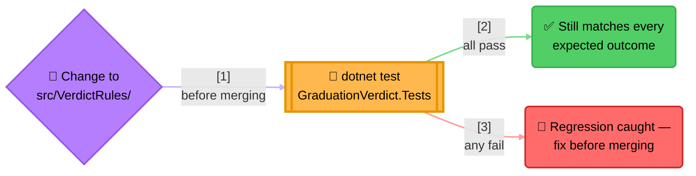
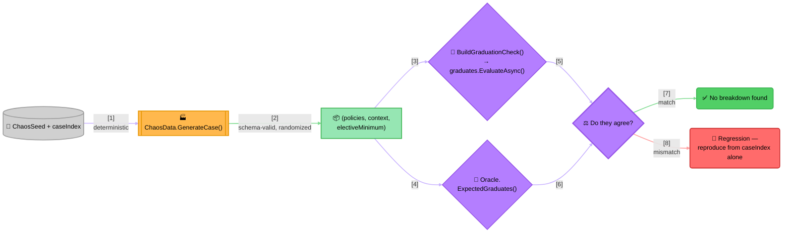

<!-- Title: Graduation Verdict — Testing -->
# Graduation Verdict — Testing

> How this project is tested, and why its two test files serve two
> different purposes rather than being one bigger suite of the same
> kind. See
> [`../../../../docs/samples/graduation-requirement-verdict/`](../../../../docs/samples/graduation-requirement-verdict/README.md)
> for why it's built the way it is, and
> [`../../../../fixtures/graduation_verdict/README.md`](../../../../fixtures/graduation_verdict/README.md)
> for how to extend the curriculum.

## Two suites, two different jobs

| File | Style | Proves |
| --- | --- | --- |
| `GraduationVerdictTests.cs` | Curated scenarios | Each subject type builds the right `IRule` shape; `RunNamedAsync`/`RunGroupAsync`/`RunAllAsync` each behave as documented; all 8 hand-picked, hand-verified students get exactly the verdict their own `expected` block says. |
| `ChaosTests.cs` | Differential/property-based | The real engine agrees with an independent oracle across 500 deterministically-generated, schema-valid random curricula and students -- a much wider space than anyone would hand-curate. |

`dotnet test examples/GraduationVerdict.Tests/GraduationVerdict.Tests.csproj`
runs both (557 tests in this project as of this writing -- 57 curated
scenarios, 500 chaos cases).

## Why this project is a regression net for verdict-rules itself, not just a sample

This project isn't only a sample -- because its test suite exercises
`FunctionRule`, `AndRule`, `OrRule`, a custom `IRule` shape
(`AtLeastNRule`), and all three `RulesEngine` run modes *together*,
against real, varied data, it functions as an integration/e2e test for
verdict-rules itself. It's a different, complementary kind of coverage
from verdict-rules' own `tests/`:

- verdict-rules' own `RuleTests.cs`/`EngineTests.cs` prove narrow,
  unit-level contracts in isolation -- short-circuit behavior,
  vacuous-truth polarity -- each against minimal fixtures built just to
  exercise that one contract. See verdict-rules' own
  [`testing/`](../../../../docs/testing/README.md) for the full reasoning.
- This project proves those same primitives compose correctly *together*,
  the way a real consumer's code actually uses them -- heterogeneous
  rule shapes built from external data, `IRule` objects shared between
  an engine and a separate composite, a custom rule type nested inside
  a built-in one. A regression that breaks some *interaction* between
  primitives, rather than one primitive's own contract, is exactly the
  class of bug the core suite's narrow, isolated fixtures are least
  likely to catch -- and exactly what this project's broader, realistic
  scenario is positioned to catch instead.



> **Reading the Diagram**: `dotnet test examples/GraduationVerdict.Tests/GraduationVerdict.Tests.csproj`
> is the concrete action -- run it after any change to
> `src/VerdictRules/`, not just a change to this project.

## The chaos suite: differential testing against an independent oracle

`GraduationVerdictTests.cs` proves 8 hand-picked, hand-verified
scenarios come out right. `ChaosTests.cs` checks a much wider space,
using a different technique than fixture matching: **differential
testing** against `Oracle.cs`, a second, deliberately dumb,
verdict-rules-free re-implementation of the same decision (the "naive
way" from the [sample spec](../../../../docs/samples/graduation-requirement-verdict/README.md),
generalized to score *any* policy list). If the real engine and the
oracle ever disagree on a generated case, one of them is wrong -- that
disagreement is the signal, not a fixed expected value.



> **Why This Needs Two Implementations, Not One Plus Assertions**: for
> the 8 curated students, "what should happen" was known before the
> data was written, so asserting against `expected` works. For 500
> randomly-generated curricula, nobody hand-computed the right answer
> for each one -- there's nothing to assert against *except* a second,
> independent computation. `Oracle.cs` is that second computation: a
> plain loop with ordinary `if`/`&&`/`||`, no `IRule` objects anywhere,
> so it can't share a bug with the thing it's checking. Its only job is
> to be obviously correct by reading it, not to be elegant.
>
> **Determinism is the entire point, not an implementation detail**:
> unlike JavaScript's `Math.random()`, .NET's own `Random` is already
> seedable and produces a deterministic sequence for a given seed, so
> `ChaosData.cs` needs no custom generator -- every method takes a
> `Random` instance explicitly, never a shared or ambient one.
> `ChaosTests.cs` seeds one per case as `new Random(ChaosSeed +
> caseIndex)`. "The chaos suite passed" is therefore a real,
> re-checkable claim on every future run, and any single failure
> reproduces on its own from just its `caseIndex`, with nothing to
> replay first. `ChaosSeed` is pinned deliberately -- bumping it
> reshuffles every case's data, which trades away coverage rather than
> adding to it; raise `NumCases` instead to test more.

## Running the tests

```bash
# From csharp/
dotnet test examples/GraduationVerdict.Tests/GraduationVerdict.Tests.csproj
```

## Related

- [`../../../../docs/samples/graduation-requirement-verdict/`](../../../../docs/samples/graduation-requirement-verdict/README.md) --
  the language-agnostic spec, why it's built the way it is.
- [`../../../../fixtures/graduation_verdict/README.md`](../../../../fixtures/graduation_verdict/README.md) --
  how to extend the curriculum, and the shared cross-language fixture
  contract.
- [`../README.md`](../README.md) -- how to run the demo.
- [`../../../../docs/maintenance/`](../../../../docs/maintenance/README.md) --
  verdict-rules' own maintenance guide, whose consumer-impact checklist
  points back here.
- [`../../../../docs/testing/`](../../../../docs/testing/README.md) -- verdict-rules'
  own testing guide, which this project complements rather than
  duplicates.
