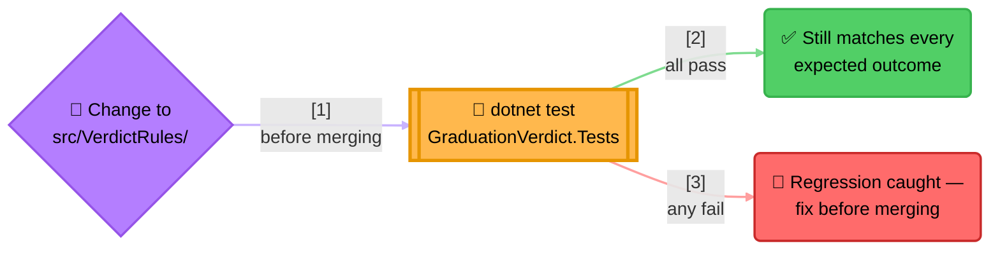
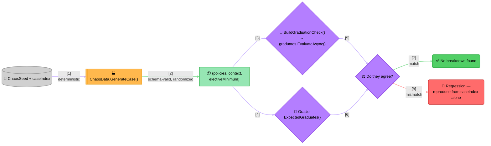

<!-- Title: Graduation Verdict — Testing -->
# Graduation Verdict — Testing

> How this project is tested, and why its four test files each serve a
> different purpose rather than being one bigger suite of the same
> kind. See
> [`../../../../docs/samples/graduation-requirement-verdict/`](../../../../docs/samples/graduation-requirement-verdict/README.md)
> for why it's built the way it is, and
> [`../../../../fixtures/graduation_verdict/README.md`](../../../../fixtures/graduation_verdict/README.md)
> for how to extend the curriculum.

## Four suites, four different jobs

| File | Style | Proves |
| --- | --- | --- |
| `GraduationVerdictTests.cs` | Curated scenarios | Each subject type builds the right `IRule` shape; `RunNamedAsync`/`RunGroupAsync`/`RunAllAsync` each behave as documented; all 8 hand-picked, hand-verified students get exactly the verdict their own `expected` block says. |
| `ChaosTests.cs` | Differential/property-based + structural | The real engine agrees with an independent oracle across 500 deterministically-generated, schema-valid random curricula and students -- a much wider space than anyone would hand-curate -- plus, reusing the same 500 generated cases, that the `AndRule`/`OrRule`/`AtLeastNRule`/`FunctionRule` short-circuit/no-short-circuit/leaf contract holds all the way down the real tree, that `RunAllAsync` reports exactly one result per registered rule, and that evaluating the same case twice is pure (identical result trees, not just an equal top-level verdict). |
| `CurriculumFuzzTests.cs` | Fuzzing | `GraduationCheck.CurriculumFromJson` -- the manual validation behind `LoadCurriculum` -- never crashes oddly or silently produces a garbage policy list across 150 deterministically-generated malformed variants of `policies.json`'s shape; every outcome is either a valid parse or one of the reader's own already-documented error types. |
| `Shrinker.cs` / `ShrinkerTests.cs` | Shrinking mechanism | `GraduationShrinker.Shrink` genuinely minimizes a failing (policies, context, electiveMinimum) case while re-checking the same failure still reproduces at each step, proven against a synthetic predicate so the test ships without needing a real bug to shrink. |

`dotnet test examples/GraduationVerdict.Tests/GraduationVerdict.Tests.csproj`
runs all four (1720 tests in this project as of this writing -- 57 curated
scenarios, 1011 chaos-derived cases, 150 fuzz cases, 2 shrinker unit tests).

## Why this project is a regression net for verdict-rules itself, not just a sample

This project isn't only a sample -- because its test suite exercises
`FunctionRule`, `AndRule`, `OrRule`, a custom `IRule` shape
(`AtLeastNRule`), and all three `RulesEngine` run modes *together*,
against real, varied data, it functions as an integration/e2e test for
verdict-rules itself. It's a different, complementary kind of coverage
from verdict-rules' own `tests/`:

- verdict-rules' own `RuleTests.cs`/`EngineTests.cs` prove narrow,
  unit-level contracts in isolation -- short-circuit behavior,
  vacuous-truth polarity -- each against minimal fixtures built just to
  exercise that one contract. See verdict-rules' own
  [`testing/`](../../../../docs/testing/README.md) for the full reasoning.
- This project proves those same primitives compose correctly *together*,
  the way a real consumer's code actually uses them -- heterogeneous
  rule shapes built from external data, `IRule` objects shared between
  an engine and a separate composite, a custom rule type nested inside
  a built-in one. A regression that breaks some *interaction* between
  primitives, rather than one primitive's own contract, is exactly the
  class of bug the core suite's narrow, isolated fixtures are least
  likely to catch -- and exactly what this project's broader, realistic
  scenario is positioned to catch instead.


```mermaid
graph LR
    Change{"🔧 Change to<br/>src/VerdictRules/"}
    Rerun[["🧪 dotnet test<br/>GraduationVerdict.Tests"]]
    Safe("✅ Still matches every<br/>expected outcome")
    Caught("🚨 Regression caught —<br/>fix before merging")

    %% Link 0: Change -> Rerun
    Change -->|"[1]<br/>before merging"| Rerun
    %% Link 1: Rerun -> Safe
    Rerun -->|"[2]<br/>all pass"| Safe
    %% Link 2: Rerun -> Caught
    Rerun -->|"[3]<br/>any fail"| Caught

    style Change fill:#B47EFF,stroke:#9654E8,stroke-width:2px,color:#000
    style Rerun fill:#FFB84D,stroke:#E69500,stroke-width:3px,color:#000
    style Safe fill:#51CF66,stroke:#37B24D,stroke-width:2px,color:#000
    style Caught fill:#FF6B6B,stroke:#C92A2A,stroke-width:2px,color:#000

    %% Link Index:
    %% 0: any change to verdict-rules' own source is the trigger
    %% 1: a clean run means the change didn't disturb this project's real usage pattern
    %% 2: any failure here is a regression worth fixing before it reaches a real consumer
    linkStyle 0 stroke:#C9B3FF,stroke-width:2px
    linkStyle 1 stroke:#7EDB8F,stroke-width:2px
    linkStyle 2 stroke:#FF9F9F,stroke-width:2px
```

> **Reading the Diagram**: `dotnet test examples/GraduationVerdict.Tests/GraduationVerdict.Tests.csproj`
> is the concrete action -- run it after any change to
> `src/VerdictRules/`, not just a change to this project.

## The chaos suite: differential testing against an independent oracle

`GraduationVerdictTests.cs` proves 8 hand-picked, hand-verified
scenarios come out right. `ChaosTests.cs` checks a much wider space,
using a different technique than fixture matching: **differential
testing** against `Oracle.cs`, a second, deliberately dumb,
verdict-rules-free re-implementation of the same decision (the "naive
way" from the [sample spec](../../../../docs/samples/graduation-requirement-verdict/README.md),
generalized to score *any* policy list). If the real engine and the
oracle ever disagree on a generated case, one of them is wrong -- that
disagreement is the signal, not a fixed expected value.


```mermaid
graph LR
    Seed[("🎲 ChaosSeed + caseIndex")]
    Gen[["🏭 ChaosData.GenerateCase()"]]
    Case["📦 (policies, context,<br/>electiveMinimum)"]
    Engine{"🔀 BuildGraduationCheck()<br/>→ graduates.EvaluateAsync()"}
    Oracle{"🔀 Oracle.<br/>ExpectedGraduates()"}
    Compare{"⚖️ Do they agree?"}
    Pass("✅ No breakdown found")
    Fail("🚨 Regression —<br/>reproduce from caseIndex alone")

    %% Link 0: Seed -> Gen
    Seed -->|"[1]<br/>deterministic"| Gen
    %% Link 1: Gen -> Case
    Gen -->|"[2]<br/>schema-valid, randomized"| Case
    %% Link 2: Case -> Engine
    Case -->|"[3]"| Engine
    %% Link 3: Case -> Oracle
    Case -->|"[4]"| Oracle
    %% Link 4: Engine -> Compare
    Engine -->|"[5]"| Compare
    %% Link 5: Oracle -> Compare
    Oracle -->|"[6]"| Compare
    %% Link 6: Compare -> Pass
    Compare -->|"[7]<br/>match"| Pass
    %% Link 7: Compare -> Fail
    Compare -->|"[8]<br/>mismatch"| Fail

    style Seed fill:#D0D0D0,stroke:#999999,stroke-width:2px,color:#000
    style Gen fill:#FFB84D,stroke:#E69500,stroke-width:2px,color:#000
    style Case fill:#96E6B3,stroke:#37B24D,stroke-width:2px,color:#000
    style Engine fill:#B47EFF,stroke:#9654E8,stroke-width:2px,color:#000
    style Oracle fill:#B47EFF,stroke:#9654E8,stroke-width:2px,color:#000
    style Compare fill:#B47EFF,stroke:#9654E8,stroke-width:3px,color:#000
    style Pass fill:#51CF66,stroke:#37B24D,stroke-width:2px,color:#000
    style Fail fill:#FF6B6B,stroke:#C92A2A,stroke-width:2px,color:#000

    %% Link Index:
    %% 0-1: every case is generated from an explicit, pinned seed, never ambient randomness
    %% 2-3: the same generated case feeds both implementations
    %% 4-5: both verdicts are computed independently
    %% 6-7: agreement is the pass condition; a mismatch is a real, reproducible regression
    linkStyle 0 stroke:#C9B3FF,stroke-width:2px
    linkStyle 1 stroke:#7EDB8F,stroke-width:2px
    linkStyle 2 stroke:#C9B3FF,stroke-width:2px
    linkStyle 3 stroke:#C9B3FF,stroke-width:2px
    linkStyle 4 stroke:#C9B3FF,stroke-width:2px
    linkStyle 5 stroke:#C9B3FF,stroke-width:2px
    linkStyle 6 stroke:#7EDB8F,stroke-width:2px
    linkStyle 7 stroke:#FF9F9F,stroke-width:2px
```

> **Why This Needs Two Implementations, Not One Plus Assertions**: for
> the 8 curated students, "what should happen" was known before the
> data was written, so asserting against `expected` works. For 500
> randomly-generated curricula, nobody hand-computed the right answer
> for each one -- there's nothing to assert against *except* a second,
> independent computation. `Oracle.cs` is that second computation: a
> plain loop with ordinary `if`/`&&`/`||`, no `IRule` objects anywhere,
> so it can't share a bug with the thing it's checking. Its only job is
> to be obviously correct by reading it, not to be elegant.
>
> **Determinism is the entire point, not an implementation detail**:
> unlike JavaScript's `Math.random()`, .NET's own `Random` is already
> seedable and produces a deterministic sequence for a given seed, so
> `ChaosData.cs` needs no custom generator -- every method takes a
> `Random` instance explicitly, never a shared or ambient one.
> `ChaosTests.cs` seeds one per case as `new Random(ChaosSeed +
> caseIndex)`. "The chaos suite passed" is therefore a real,
> re-checkable claim on every future run, and any single failure
> reproduces on its own from just its `caseIndex`, with nothing to
> replay first. `ChaosSeed` is pinned deliberately -- bumping it
> reshuffles every case's data, which trades away coverage rather than
> adding to it; raise `NumCases` instead to test more.

## Beyond the boolean: structural invariants on the same generated cases

`ChaosTests.cs`'s oracle comparison only ever checks the final boolean
verdict. Three more `[Theory]` methods in that same file reuse the
identical 500 `ChaosData.GenerateCase` cases to check more than the
boolean, without generating anything new:

- `StructuralInvariantsHoldForEveryGeneratedCase` walks the real
  `IRule` objects together with the `RuleResult` tree they produced
  (see `StructuralInvariants.cs`), asserting the short-circuit shape
  `AndRule`/`OrRule` each promise, the always-evaluate-everything shape
  `AtLeastNRule` promises, and that a `FunctionRule` is always a leaf
  -- recursively, down into the nested `AndRule`/`OrRule` a vocational
  or language subject's own policy produces, not just `graduates`' own
  four immediate children.
- `RunAllReturnsExactlyOneResultPerRegisteredRule` checks a structural
  count, not a verdict: `engine.RunAllAsync(context).Results.Count`
  always equals the number of registered subject rules.
- `EvaluatingTheSameCaseTwiceProducesIdenticalResultTrees` checks
  purity on a handful of the 500 cases (every 47th, not all 500 --
  purity doesn't need the full sweep): evaluating the exact same
  inputs twice produces two result trees identical in every field,
  recursively, via `StructuralInvariants.AssertResultTreesEqual`.

`AndRule`/`OrRule` don't expose their own sub-rules publicly outside
`src/VerdictRules` (by design), so `StructuralInvariants.Node` carries
each composite's known child `IRule` objects alongside it explicitly
rather than reflecting into the rule itself --
`StructuralInvariants.BuildGraduatesMirror` builds that shape using the
same public pieces (`RuleForSubject`, `CgpaMet`, `AttendanceMet`)
`GraduationCheck.BuildGraduationCheck` does internally, so the mirror's
shape always matches the tree actually evaluated.

## Fuzzing the curriculum reader

`CurriculumFuzzTests.cs` fuzzes `GraduationCheck.CurriculumFromJson` --
the manual field-by-field validation `LoadCurriculum` runs after
`JsonDocument.Parse` -- with 150 deterministically-generated malformed
variants of `policies.json`'s shape (`CurriculumFuzz.GenerateMalformedVariant`,
seeded the same way the chaos suite is): a wrong-typed field, a dropped
required key, an added unexpected key, deeply nested junk in place of a
scalar, an empty `subjects` array, a `null` in place of an object, and a
handful of whole-document shapes that aren't well-formed JSON at all
(truncated, empty, a bare scalar). Every variant must either parse into
a usable policy list or raise one of the reader's own already-documented
error types (`JsonException`, `KeyNotFoundException`,
`InvalidOperationException`, `FormatException`) -- never an unrelated
crash or a silent, wrong-but-plausible policy list. This run found no
genuine reader bug; the reader's existing exception behavior already
covers every malformed shape the harness generates, so no change was
needed to `GraduationCheck.CurriculumFromJson`.

## Failing-run-to-fixture shrinking

`Shrinker.cs`'s `GraduationShrinker.Shrink` takes a (policies, context,
electiveMinimum) case that reproduces some failure -- an oracle
disagreement, a structural-invariant violation, anything expressible as
a `FailurePredicate` over those three inputs -- and greedily simplifies
it (fewer subjects, a lower elective threshold, each remaining field
snapped toward its simplest value) while re-checking the same failure
still reproduces at every step, stopping once a full pass makes no
further progress. `GraduationShrinker.WriteFixture` writes the result
out as a standalone JSON fixture in the shared `{ curriculum, student }`
shape (the same shape `fixtures/graduation_verdict/edge_cases.json`
uses), reloadable with `GraduationCheck.CurriculumFromJson`/
`ContextFromJson` directly -- intended to live under this test project's
own `ShrunkFixtures/` output location as a per-language debugging aid,
never under the shared cross-language `fixtures/` directory.

`ShrinkerTests.cs` proves the mechanism itself against a synthetic
`FailurePredicate` ("at least 2 subjects, and a positive cgpa") that has
nothing to do with `GraduationCheck`'s real evaluation, so this ships as
a permanent, ordinary unit test rather than a one-off demonstration.
The mechanism was additionally verified by hand against a real
disagreement: a scratch copy of `Oracle.cs`'s vocational-subject check
with `&&` deliberately flipped to `||`, run across the same 500 chaos
cases to find a genuine engine/buggy-oracle disagreement, shrunk from 7
subjects down to 2, and written to a real fixture file -- confirming in
the process that the shrinker correctly *refused* to zero a field
(`written_min_pct`) whose simplification would have made the
disagreement stop reproducing. That demonstration lived only in a
throwaway test file for the duration of the check and was deleted
afterward; nothing from it is part of the committed suite.

## Running the tests

```bash
# From csharp/
dotnet test examples/GraduationVerdict.Tests/GraduationVerdict.Tests.csproj
```

## Related

- [`../../../../docs/samples/graduation-requirement-verdict/`](../../../../docs/samples/graduation-requirement-verdict/README.md) --
  the language-agnostic spec, why it's built the way it is.
- [`../../../../fixtures/graduation_verdict/README.md`](../../../../fixtures/graduation_verdict/README.md) --
  how to extend the curriculum, and the shared cross-language fixture
  contract.
- [`../README.md`](../README.md) -- how to run the demo.
- [`../../../../docs/maintenance/`](../../../../docs/maintenance/README.md) --
  verdict-rules' own maintenance guide, whose consumer-impact checklist
  points back here.
- [`../../../../docs/testing/`](../../../../docs/testing/README.md) -- verdict-rules'
  own testing guide, which this project complements rather than
  duplicates.
