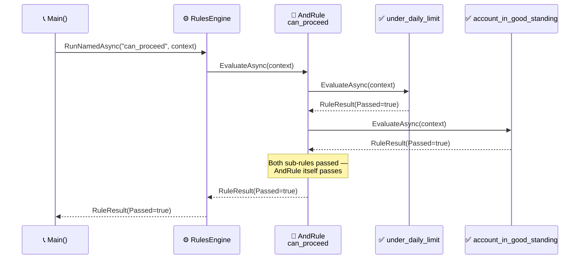

<!-- Title: Verdict Quickstart (C#) -->
# Verdict — Quickstart

> The five names you need, and one complete example using all of them.
> See [`../README.md`](../README.md) for this package's own
> `dotnet add package`/first-rule quickstart, the top-level
> [`../../../../README.md`](../../../../README.md) for what Verdict is in
> narrative form, and
> [`../../../../docs/architecture/`](../../../../docs/architecture/README.md)
> for the full design reasoning — this doc is just "how do I start."

## Core concepts

- **`IRule`** — anything with a `Name`, an optional `Group`, and an
  `EvaluateAsync(IReadOnlyDictionary<string, object?> context)` method
  returning `Task<RuleResult>`. A custom rule shape declares
  `: IRule` explicitly — C# has no free structural typing for a
  multi-member interface the way Python's `Protocol` does.
- **`FunctionRule`** — wraps a plain delegate as an `IRule`. The common
  case: most rules are "run this method against the context."
- **`AndRule`** / **`OrRule`** — composite rules that combine other
  rules, short-circuiting the same way a boolean `&&`/`||` expression
  would (`AndRule` stops at the first failure, `OrRule` stops at the
  first pass).
- **`RulesEngine`** — holds a set of rules and runs them three ways:
  `RunAllAsync` (every rule, full diagnostic picture — deliberately does
  **not** short-circuit), `RunNamedAsync` (one specific rule by name),
  `RunGroupAsync` (every rule sharing a group label). An unknown name or
  label throws `KeyNotFoundException`; `TryRunNamedAsync`/`TryRunGroupAsync`
  return `null` instead, for callers whose own domain has an answer for
  absence — see
  [`../../../../docs/extending/absence-vs-failure/`](../../../../docs/extending/absence-vs-failure/README.md).
- **`RuleResult`** / **`RunResult`** — plain, immutable outcome types.
  `RuleResult.Data` is a fully opaque slot for a caller's own domain
  object to ride through evaluation — Verdict never reads or depends on
  its shape.

## One complete example

```csharp
using VerdictRules;

static Task<RuleResult> UnderDailyLimit(IReadOnlyDictionary<string, object?> context)
{
    var spentToday = (int)context["spent_today"]!;
    var limit = (int)context["daily_limit"]!;
    return Task.FromResult(new RuleResult(
        "under_daily_limit",
        spentToday < limit,
        $"{spentToday} of {limit}"));
}

static Task<RuleResult> AccountInGoodStanding(IReadOnlyDictionary<string, object?> context) =>
    Task.FromResult(new RuleResult(
        "account_in_good_standing",
        (string)context["account_status"]! == "active"));

var canProceed = new AndRule("can_proceed", new IRule[]
{
    new FunctionRule("under_daily_limit", UnderDailyLimit),
    new FunctionRule("account_in_good_standing", AccountInGoodStanding),
});

var engine = new RulesEngine(new IRule[] { canProceed });
var result = await engine.RunNamedAsync("can_proceed", new Dictionary<string, object?>
{
    ["spent_today"] = 42,
    ["daily_limit"] = 100,
    ["account_status"] = "active",
});

Console.WriteLine(result.Passed); // True
```



> **Reading the Sequence**:
>
> 1. **The engine looks up `"can_proceed"` by name** — `RunNamedAsync`
>    is exactly one dictionary lookup plus one `EvaluateAsync()` call on
>    whatever it finds.
> 2. **`AndRule` evaluates its two sub-rules in order** — the plain
>    field comparison, then the account-status check — stopping at the
>    first failure if there is one (neither fails here, so both run).
> 3. **The composite's own result is what the engine hands back** — the
>    caller only sees one `RuleResult`, `Passed=true`; the two sub-rules'
>    own results live nested in that one result's `Data`, not flattened
>    into anything the caller has to unpack for this simple case.

## Next: build rules from your own configuration, not just hard-coded ones

Because rules are just objects, they're straightforward to build up at
runtime from whatever configuration a caller already has, rather than
hand-writing one `FunctionRule` per case — see
[`../../../../docs/extending/data-driven-rule-construction/`](../../../../docs/extending/data-driven-rule-construction/README.md)
for the scenario.

## Related docs

- [`../../../../README.md`](../../../../README.md) — the narrative front door.
- [`../../../../docs/architecture/`](../../../../docs/architecture/README.md) — the full
  design reasoning.
- [`../../../../docs/extending/`](../../../../docs/extending/README.md) — building on top
  of this package from your own code.
- [`../../../../docs/testing/`](../../../../docs/testing/README.md) — `dotnet build`
  and `dotnet test`, and what a test here actually needs to prove.
- [`../../../../docs/samples/`](../../../../docs/samples/README.md) — more worked examples.
