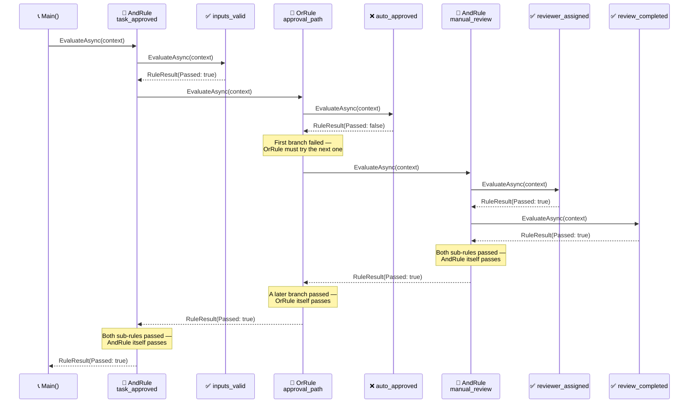

<!-- Title: Verdict Quickstart (C#) -->
# Verdict — Quickstart

> The five names you need, and one complete example using all of them.
> See [`../README.md`](../README.md) for this package's own
> `dotnet add package`/first-rule quickstart, the top-level
> [`../../../../README.md`](../../../../README.md) for what Verdict is in
> narrative form, and
> [`../../../../docs/architecture/`](../../../../docs/architecture/README.md)
> for the full design reasoning — this doc is just "how do I start."

## Core concepts

- **`IRule`** — anything with a `Name`, an optional `Group`, and an
  `EvaluateAsync(IReadOnlyDictionary<string, object?> context, CancellationToken cancellationToken = default)`
  method returning `Task<RuleResult>`. A custom rule shape declares
  `: IRule` explicitly — C# has no free structural typing for a
  multi-member interface the way Python's `Protocol` does.
- **`FunctionRule`** — wraps a plain delegate as an `IRule`. The common
  case: most rules are "run this method against the context."
- **`AndRule`** / **`OrRule`** — composite rules that combine other
  rules, short-circuiting the same way a boolean `&&`/`||` expression
  would (`AndRule` stops at the first failure, `OrRule` stops at the
  first pass).
- **`RulesEngine`** — holds a set of rules and runs them three ways:
  `RunAllAsync` (every rule, full diagnostic picture — deliberately does
  **not** short-circuit), `RunNamedAsync` (one specific rule by name),
  `RunGroupAsync` (every rule sharing a group label). An unknown name or
  label throws `KeyNotFoundException`; `TryRunNamedAsync`/`TryRunGroupAsync`
  return `null` instead, for callers whose own domain has an answer for
  absence — see
  [`../../../../docs/extending/absence-vs-failure/`](../../../../docs/extending/absence-vs-failure/README.md).
- **`RuleResult`** / **`RunResult`** — plain, immutable outcome types.
  `RuleResult.Data` is a fully opaque slot for a caller's own domain
  object to ride through evaluation — Verdict never reads or depends on
  its shape.

## One complete example

Composites nest arbitrarily deep — an `AndRule` can hold an `OrRule`,
which can hold another `AndRule`, and so on. The same leaf checks below
also get registered on a `RulesEngine` under one shared group label, so
`RunGroupAsync` can report on all four regardless of whether the nested
decision above ever looked at each one:

```csharp
using VerdictRules;

static Task<RuleResult> InputsValid(IReadOnlyDictionary<string, object?> context, CancellationToken cancellationToken = default) =>
    Task.FromResult(new RuleResult("inputs_valid", (bool)context["has_required_fields"]!));

static Task<RuleResult> AutoApproved(IReadOnlyDictionary<string, object?> context, CancellationToken cancellationToken = default) =>
    Task.FromResult(new RuleResult("auto_approved", (bool)context["auto_approved"]!));

static Task<RuleResult> ReviewerAssigned(IReadOnlyDictionary<string, object?> context, CancellationToken cancellationToken = default) =>
    Task.FromResult(new RuleResult("reviewer_assigned", (bool)context["reviewer_assigned"]!));

static Task<RuleResult> ReviewCompleted(IReadOnlyDictionary<string, object?> context, CancellationToken cancellationToken = default) =>
    Task.FromResult(new RuleResult("review_completed", (bool)context["review_completed"]!));

var taskApproved = new AndRule("task_approved", new IRule[]
{
    new FunctionRule("inputs_valid", InputsValid),
    new OrRule("approval_path", new IRule[]
    {
        new FunctionRule("auto_approved", AutoApproved),
        new AndRule("manual_review", new IRule[]
        {
            new FunctionRule("reviewer_assigned", ReviewerAssigned),
            new FunctionRule("review_completed", ReviewCompleted),
        }),
    }),
});

var passing = new Dictionary<string, object?>
{
    ["has_required_fields"] = true,
    ["auto_approved"] = false,
    ["reviewer_assigned"] = true,
    ["review_completed"] = true,
};
var result = await taskApproved.EvaluateAsync(passing);
Console.WriteLine(result.Passed); // True -- auto_approved failed, but manual review covered it

var failing = new Dictionary<string, object?>(passing) { ["review_completed"] = false };
result = await taskApproved.EvaluateAsync(failing);
Console.WriteLine(result.Passed); // False -- neither approval path succeeded

// The same four leaf checks, registered flat under one group for a full
// diagnostic view -- RunGroupAsync never short-circuits, so every check
// reports regardless of whether the nested decision above stopped early.
var engine = new RulesEngine(new IRule[]
{
    new FunctionRule("inputs_valid", InputsValid, "approval_checks"),
    new FunctionRule("auto_approved", AutoApproved, "approval_checks"),
    new FunctionRule("reviewer_assigned", ReviewerAssigned, "approval_checks"),
    new FunctionRule("review_completed", ReviewCompleted, "approval_checks"),
});
var diagnostic = await engine.RunGroupAsync("approval_checks", passing);
Console.WriteLine(string.Join(", ", diagnostic.Results.Select(r => r.Passed)));
// True, False, True, True -- auto_approved's own failure is visible here,
// even though the nested decision above never had to look at it once the
// manual-review branch already succeeded
```



> **Reading the Sequence**:
>
> 1. **`inputs_valid` passes first** — a plain leaf check, no nesting
>    involved yet.
> 2. **`approval_path`'s first branch fails** — `auto_approved` is
>    `false`, so the `OrRule` has no choice but to try its next branch;
>    an `OrRule` only stops early once *something* passes, never on a
>    failure.
> 3. **`manual_review`, itself an `AndRule`, runs both its own checks**
>    and passes — this is the nesting: `approval_path`'s second branch
>    is a whole composite, not a leaf.
> 4. **Every result folds upward** — `manual_review`'s pass makes
>    `approval_path` pass, which makes `task_approved` pass. The caller
>    only ever sees the one top-level `RuleResult`.
> 5. **`RunGroupAsync` tells a different story from the same rules** —
>    it reports `auto_approved`'s real failure, something the nested
>    decision above never had to surface once a later branch succeeded.

## Next: build rules from your own configuration, not just hard-coded ones

Because rules are just objects, they're straightforward to build up at
runtime from whatever configuration a caller already has, rather than
hand-writing one `FunctionRule` per case — see
[`../../../../docs/extending/data-driven-rule-construction/`](../../../../docs/extending/data-driven-rule-construction/README.md)
for the scenario.

## Related docs

- [`../../../../README.md`](../../../../README.md) — the narrative front door.
- [`../../../../docs/architecture/`](../../../../docs/architecture/README.md) — the full
  design reasoning.
- [`../../../../docs/extending/`](../../../../docs/extending/README.md) — building on top
  of this package from your own code.
- [`../../../../docs/testing/`](../../../../docs/testing/README.md) — `dotnet build`
  and `dotnet test`, and what a test here actually needs to prove.
- [`../../../../docs/samples/`](../../../../docs/samples/README.md) — more worked examples.
