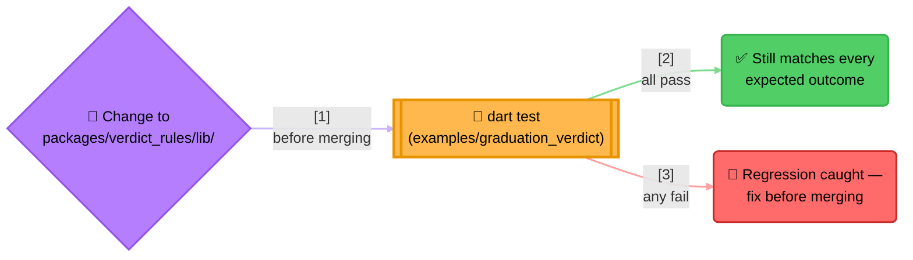
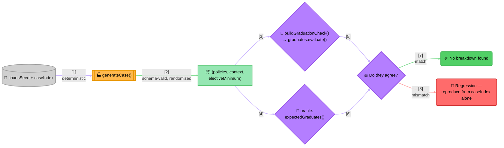

<!-- Title: Graduation Verdict — Testing -->
# Graduation Verdict — Testing

> How this project is tested, and why its four test files each serve a
> different purpose rather than being one bigger suite of the same
> kind. See
> [`../../../../docs/samples/graduation-requirement-verdict/`](../../../../docs/samples/graduation-requirement-verdict/README.md)
> for why it's built the way it is, and
> [`../../../../fixtures/graduation_verdict/README.md`](../../../../fixtures/graduation_verdict/README.md)
> for how to extend the curriculum.

## Four suites, four different jobs

| File | Style | Proves |
| --- | --- | --- |
| `test/graduation_verdict_test.dart` | Curated scenarios | Each subject type builds the right `Rule` shape; `runNamed`/`runGroup`/`runAll` each behave as documented; all 8 hand-picked, hand-verified students get exactly the verdict their own `expected` block says. |
| `test/chaos_test.dart` | Differential/property-based | The real engine agrees with an independent oracle across 500 deterministically-generated, schema-valid random curricula and students -- a much wider space than anyone would hand-curate. |
| `test/structural_invariants_test.dart` | Property-based, tree-shaped | The *shape* of every generated case's result tree, not just its final boolean -- short-circuit position, vacuous truth, `AtLeastNRule`'s no-short-circuit contrast, a `runAll` count, and purity across two independent evaluations. See [Structural invariants on the result tree](#structural-invariants-on-the-result-tree) below. |
| `test/policy_fuzz_test.dart` | Fuzz | `curriculumFromJson`/`loadCurriculum` either parse successfully or raise the one documented error type for malformed input, never an unrelated crash. See [Fuzzing the curriculum reader](#fuzzing-the-curriculum-reader) below. |

`dart test` runs all four (1247 tests in this project as of this writing
-- 57 curated scenarios, 500 chaos cases, 500 structural-invariant cases
plus 10 purity cases, and 180 fuzz cases).

## Why this project is a regression net for verdict_rules itself, not just a sample

This project isn't only a sample -- because its test suite exercises
`FunctionRule`, `AndRule`, `OrRule`, a custom `Rule` shape
(`AtLeastNRule`), and all three `RulesEngine` run modes *together*,
against real, varied data, it functions as an integration/e2e test for
verdict_rules itself. It's a different, complementary kind of coverage
from verdict_rules' own `test/`:

- verdict_rules' own `rule_test.dart`/`engine_test.dart` prove narrow,
  unit-level contracts in isolation -- short-circuit behavior,
  vacuous-truth polarity -- each against minimal fixtures built just to
  exercise that one contract. See verdict_rules' own
  [`testing/`](../../../../docs/testing/README.md) for the full reasoning.
- This project proves those same primitives compose correctly *together*,
  the way a real consumer's code actually uses them -- heterogeneous
  rule shapes built from external data, `Rule` objects shared between
  an engine and a separate composite, a custom rule type nested inside
  a built-in one. A regression that breaks some *interaction* between
  primitives, rather than one primitive's own contract, is exactly the
  class of bug the core suite's narrow, isolated fixtures are least
  likely to catch -- and exactly what this project's broader, realistic
  scenario is positioned to catch instead.



> **Reading the Diagram**: `dart test` from
> `dart/examples/graduation_verdict/` is the concrete action -- run it
> after any change to `packages/verdict_rules/lib/`, not just a change
> to this project.

## The chaos suite: differential testing against an independent oracle

`test/graduation_verdict_test.dart` proves 8 hand-picked, hand-verified
scenarios come out right. `test/chaos_test.dart` checks a much wider
space, using a different technique than fixture matching: **differential
testing** against `lib/src/oracle.dart`, a second, deliberately dumb,
verdict_rules-free re-implementation of the same decision (the "naive
way" from the [sample spec](../../../../docs/samples/graduation-requirement-verdict/README.md),
generalized to score *any* policy list). If the real engine and the
oracle ever disagree on a generated case, one of them is wrong -- that
disagreement is the signal, not a fixed expected value.



> **Why This Needs Two Implementations, Not One Plus Assertions**: for
> the 8 curated students, "what should happen" was known before the
> data was written, so asserting against `expected` works. For 500
> randomly-generated curricula, nobody hand-computed the right answer
> for each one -- there's nothing to assert against *except* a second,
> independent computation. `oracle.dart` is that second computation: a
> plain loop with ordinary `if`/`&&`/`||`, no `Rule` objects anywhere,
> so it can't share a bug with the thing it's checking. Its only job is
> to be obviously correct by reading it, not to be elegant.
>
> **Determinism is the entire point, not an implementation detail**:
> unlike JavaScript's `Math.random()`, `dart:math`'s own `Random` is
> already seedable and produces a deterministic sequence for a given
> seed, so `chaos_data.dart` needs no custom generator -- every function
> takes a `Random` instance explicitly, never a shared or ambient one.
> `test/chaos_test.dart` seeds one per case as `Random(chaosSeed +
> caseIndex)`. "The chaos suite passed" is therefore a real,
> re-checkable claim on every future run, and any single failure
> reproduces on its own from just its `caseIndex`, with nothing to
> replay first. `chaosSeed` is pinned deliberately -- bumping it
> reshuffles every case's data, which trades away coverage rather than
> adding to it; raise `numCases` instead to test more.

## Structural invariants on the result tree

`test/chaos_test.dart` only ever asks one question of each generated
case: did the final `passed` boolean agree with the oracle?
`test/structural_invariants_test.dart` asks a different question of the
exact same 500 cases: is the *shape* of the result tree the one
`buildGraduationCheck`'s own docstring promises? A broken short-circuit
or a sub-result silently dropped could still leave the top-level
boolean right by coincidence on any one case -- the structural suite is
there to catch that class of bug even when the boolean doesn't.

For every generated `(policies, context, electiveMinimum)`, it walks
`graduates`' own fixed shape --
`AndRule("graduates", [AndRule("all_core_subjects_pass", ...),
AtLeastNRule("elective_requirement", ...), FunctionRule("cgpa_met", ...),
FunctionRule("attendance_met", ...)])` -- and for every per-subject rule
nested inside the first two, asserts:

- **`AndRule`**: a `passed` result has every sub-result passed; a failed
  result has every sub-result passed *except* the last, which failed --
  proving the short-circuit stopped at exactly the first failure.
- **`OrRule`**: the mirror image -- a `passed` result has every
  sub-result failed except the last, which passed; a failed result has
  every sub-result failed, proving a full failure really did evaluate
  every one of them (`OrRule` only short-circuits on a pass).
- **`AtLeastNRule`**: the contrast case -- its own `result.data` always
  has exactly as many entries as it has sub-rules, regardless of
  pass/fail, since [`AtLeastNRule`](../lib/src/at_least_n_rule.dart)
  deliberately never short-circuits.
- **`FunctionRule`**: a leaf -- its `result.data` is never a list of
  `RuleResult`, and recursion stops there.

Since `AndRule`/`OrRule` never expose their own sub-rules publicly (by
design -- see [`Rule`](../../../packages/verdict_rules/lib/src/rule.dart)),
the checker gets each per-subject rule's own concrete type by calling
the exported, pure `ruleForSubject` again for that subject's policy,
rather than reaching into the tree `buildGraduationCheck` already built.

The same suite also checks two claims that aren't about any one rule's
shape:

- **`runAll` is a structural count, not a verdict**: `engine.runAll(context).results.length`
  always equals the number of registered subject rules, for every
  generated case, independent of how many passed.
- **Purity**: building `buildGraduationCheck(policies, electiveMinimum)`
  twice and evaluating both against the same `context` produces two
  result trees identical in every field -- `ruleName`, `passed`,
  `detail`, and the full nested `data` -- recursively, not just an equal
  top-level `passed`. This reuses a handful of the same 500 generated
  cases rather than a new sample.

## Fuzzing the curriculum reader

`curriculumFromJson`/`loadCurriculum` turn `policies.json`'s untyped
JSON into typed `SubjectPolicy` objects via a chain of `as` casts and no
further validation -- the "naive way" for a reader, same spirit as
`oracle.dart` for the decision itself. `test/policy_fuzz_test.dart`
feeds it 150 deliberately malformed variants of the curriculum shape
(wrong type in a field, a required key dropped, an unexpected key
added, deeply nested junk in place of a scalar, an empty array, `null`
in place of an object -- generated by
[`lib/src/policy_fuzz_data.dart`](../lib/src/policy_fuzz_data.dart) from
a seeded `Random`) plus 30 syntactically truncated JSON documents fed
through `loadCurriculum`'s own `jsonDecode` call.

The only two acceptable outcomes, for every one of them: a successful
parse into a valid policy list, or the one error type these readers
already document for malformed input -- a `TypeError` from a failed
`as` cast, or a `FormatException` from `jsonDecode` on invalid JSON
text. An unrelated crash (a raw `NoSuchMethodError`, a `RangeError`, a
silently wrong policy list) would fail the suite. As of this writing,
fuzzing found no such case -- `curriculumFromJson`/`loadCurriculum`
needed no changes.

## Failing-run-to-fixture shrinking

[`lib/src/shrink.dart`](../lib/src/shrink.dart) ships a generic
shrinker, `shrinkFailingCase`, for the case this project's own suites
never hit in practice: a generated case that fails some check (an
oracle disagreement, a broken structural invariant) in a form too large
to read at a glance. Given a failing `(policies, context,
electiveMinimum)` and a `StillFails` predicate, it greedily applies a
fixed list of simplifications -- drop the last subject, lower
`electiveMinimum`, zero out a score/CGPA/attendance field -- keeping
each simplification only if the case still fails the same way,
stopping at a fixed point where no further simplification keeps it
failing. `writeShrunkFixture` then serializes the minimal case to a
standalone JSON file under this project's own `test/testdata/`, in the
same `{curriculum, student}` shape
[`fixtures/graduation_verdict/edge_cases.json`](../../../../fixtures/graduation_verdict/README.md)
uses -- a per-language debugging aid, never the shared cross-language
fixtures directory.

Because the engine agrees with the oracle on every generated case, there
is no real failure to show this shrinking from -- so it was verified by
injecting a deliberate bug into a scratch copy of the oracle check
inside a throwaway test file (an oracle that always claimed "passed"
for an empty policy list), confirming the shrinker found the
disagreement, shrank it down to the minimal zero-subject reproduction,
and wrote a fixture recording it, then deleting both the throwaway test
file and the fixture it wrote and confirming the real suite was back to
green. Nothing from that demonstration is part of this repository --
only `shrink.dart` itself ships.

## Running the tests

```bash
# From dart/examples/graduation_verdict/
dart test
```

## Related

- [`../../../../docs/samples/graduation-requirement-verdict/`](../../../../docs/samples/graduation-requirement-verdict/README.md) --
  the language-agnostic spec, why it's built the way it is.
- [`../../../../fixtures/graduation_verdict/README.md`](../../../../fixtures/graduation_verdict/README.md) --
  how to extend the curriculum, and the shared cross-language fixture
  contract.
- [`../README.md`](../README.md) -- how to run the demo.
- [`../../../../docs/maintenance/`](../../../../docs/maintenance/README.md) --
  verdict_rules' own maintenance guide, whose consumer-impact checklist
  points back here.
- [`../../../../docs/testing/`](../../../../docs/testing/README.md) -- verdict_rules'
  own testing guide, which this project complements rather than
  duplicates.
