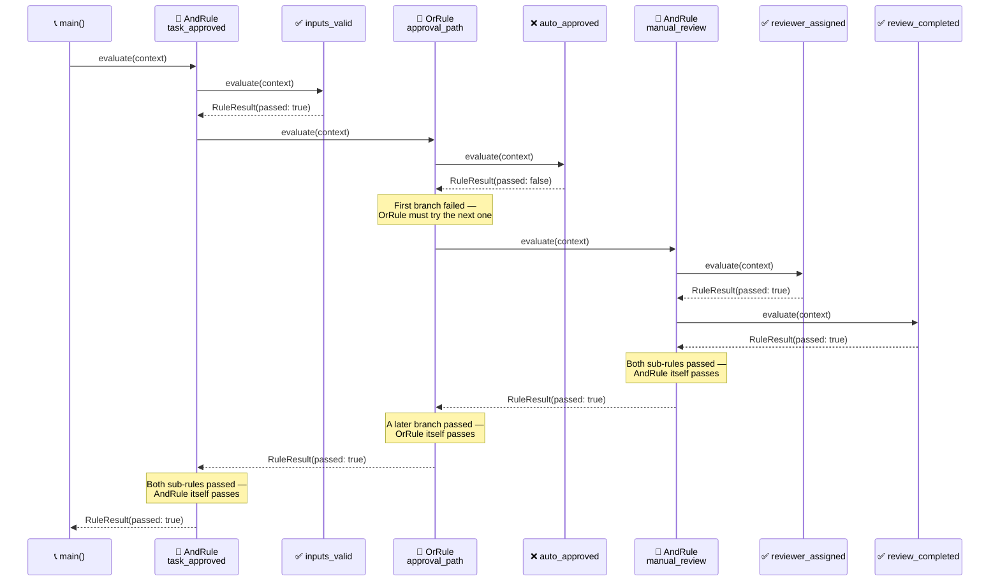

<!-- Title: Verdict Quickstart (Dart) -->
# Verdict — Quickstart

> The five names you need, and one complete example using all of them.
> See [`../README.md`](../README.md) for this package's own
> `dart pub add`/first-rule quickstart, the top-level
> [`../../../../README.md`](../../../../README.md) for what Verdict is in
> narrative form, and
> [`../../../../docs/architecture/`](../../../../docs/architecture/README.md)
> for the full design reasoning — this doc is just "how do I start."

## Core concepts

- **`Rule`** — anything with a `name`, an optional `group`, and an
  `evaluate(Map<String, Object?> context)` method returning
  `Future<RuleResult>`. `Rule` is an `abstract interface class`: a
  custom rule shape says `implements Rule` explicitly — Dart has no
  free structural typing for a multi-member interface the way Python's
  `Protocol` does.
- **`FunctionRule`** — wraps a plain function as a `Rule`. The common
  case: most rules are "run this function against the context."
- **`AndRule`** / **`OrRule`** — composite rules that combine other
  rules, short-circuiting the same way a boolean `&&`/`||` expression
  would (`AndRule` stops at the first failure, `OrRule` stops at the
  first pass).
- **`RulesEngine`** — holds a set of rules and runs them three ways:
  `runAll` (every rule, full diagnostic picture — deliberately does
  **not** short-circuit), `runNamed` (one specific rule by name),
  `runGroup` (every rule sharing a group label). An unknown name or
  label throws `ArgumentError`; `tryRunNamed`/`tryRunGroup` return
  `null` instead, for callers whose own domain has an answer for
  absence — see
  [`../../../../docs/extending/absence-vs-failure/`](../../../../docs/extending/absence-vs-failure/README.md).
- **`RuleResult`** / **`RunResult`** — plain, immutable outcome types.
  `RuleResult.data` is a fully opaque slot for a caller's own domain
  object to ride through evaluation — Verdict never reads or depends on
  its shape.

## One complete example

Composites nest arbitrarily deep — an `AndRule` can hold an `OrRule`,
which can hold another `AndRule`, and so on. The same leaf checks below
also get registered on a `RulesEngine` under one shared group label, so
`runGroup` can report on all four regardless of whether the nested
decision above ever looked at each one:

```dart
import 'package:verdict_rules/verdict_rules.dart';

Future<RuleResult> inputsValid(Map<String, Object?> context) async =>
    RuleResult(ruleName: 'inputs_valid', passed: context['has_required_fields']! as bool);

Future<RuleResult> autoApproved(Map<String, Object?> context) async =>
    RuleResult(ruleName: 'auto_approved', passed: context['auto_approved']! as bool);

Future<RuleResult> reviewerAssigned(Map<String, Object?> context) async =>
    RuleResult(ruleName: 'reviewer_assigned', passed: context['reviewer_assigned']! as bool);

Future<RuleResult> reviewCompleted(Map<String, Object?> context) async =>
    RuleResult(ruleName: 'review_completed', passed: context['review_completed']! as bool);

Future<void> main() async {
  final taskApproved = AndRule('task_approved', [
    FunctionRule('inputs_valid', inputsValid),
    OrRule('approval_path', [
      FunctionRule('auto_approved', autoApproved),
      AndRule('manual_review', [
        FunctionRule('reviewer_assigned', reviewerAssigned),
        FunctionRule('review_completed', reviewCompleted),
      ]),
    ]),
  ]);

  final passing = {
    'has_required_fields': true,
    'auto_approved': false,
    'reviewer_assigned': true,
    'review_completed': true,
  };
  var result = await taskApproved.evaluate(passing);
  print(result.passed); // true -- auto_approved failed, but manual review covered it

  final failing = {...passing, 'review_completed': false};
  result = await taskApproved.evaluate(failing);
  print(result.passed); // false -- neither approval path succeeded

  // The same four leaf checks, registered flat under one group for a full
  // diagnostic view -- runGroup never short-circuits, so every check
  // reports regardless of whether the nested decision above stopped early.
  final engine = RulesEngine([
    FunctionRule('inputs_valid', inputsValid, group: 'approval_checks'),
    FunctionRule('auto_approved', autoApproved, group: 'approval_checks'),
    FunctionRule('reviewer_assigned', reviewerAssigned, group: 'approval_checks'),
    FunctionRule('review_completed', reviewCompleted, group: 'approval_checks'),
  ]);
  final diagnostic = await engine.runGroup('approval_checks', passing);
  print(diagnostic.results.map((r) => r.passed).toList());
  // [true, false, true, true] -- auto_approved's own failure is visible here,
  // even though the nested decision above never had to look at it once the
  // manual-review branch already succeeded
}
```



> **Reading the Sequence**:
>
> 1. **`inputs_valid` passes first** — a plain leaf check, no nesting
>    involved yet.
> 2. **`approval_path`'s first branch fails** — `auto_approved` is
>    `false`, so the `OrRule` has no choice but to try its next branch;
>    an `OrRule` only stops early once *something* passes, never on a
>    failure.
> 3. **`manual_review`, itself an `AndRule`, runs both its own checks**
>    and passes — this is the nesting: `approval_path`'s second branch
>    is a whole composite, not a leaf.
> 4. **Every result folds upward** — `manual_review`'s pass makes
>    `approval_path` pass, which makes `task_approved` pass. The caller
>    only ever sees the one top-level `RuleResult`.
> 5. **`runGroup` tells a different story from the same rules** — it
>    reports `auto_approved`'s real failure, something the nested
>    decision above never had to surface once a later branch succeeded.

## Next: build rules from your own configuration, not just hard-coded ones

Because rules are just objects, they're straightforward to build up at
runtime from whatever configuration a caller already has, rather than
hand-writing one `FunctionRule` per case — see
[`../../../../docs/extending/data-driven-rule-construction/`](../../../../docs/extending/data-driven-rule-construction/README.md)
for the scenario.

## Related docs

- [`../../../../README.md`](../../../../README.md) — the narrative front door.
- [`../../../../docs/architecture/`](../../../../docs/architecture/README.md) — the full
  design reasoning.
- [`../../../../docs/extending/`](../../../../docs/extending/README.md) — building on top
  of this package from your own code.
- [`../../../../docs/testing/`](../../../../docs/testing/README.md) — `dart analyze`
  and `dart test`, and what a test here actually needs to prove.
- [`../../../../docs/samples/`](../../../../docs/samples/README.md) — more worked examples.
