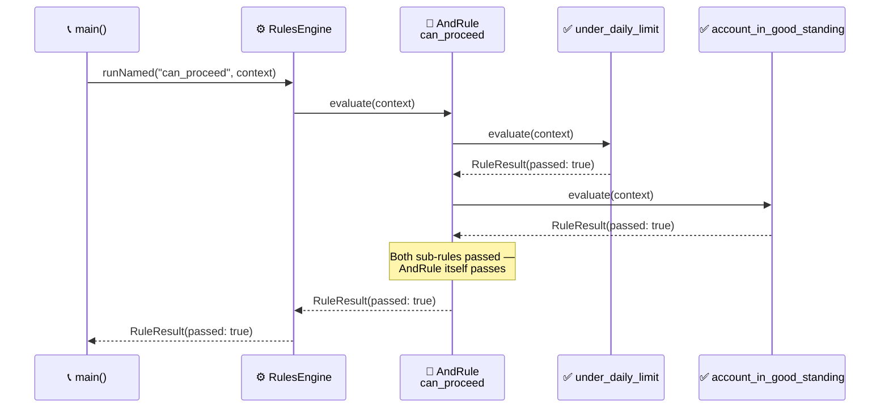

<!-- Title: Verdict Quickstart (Dart) -->
# Verdict — Quickstart

> The five names you need, and one complete example using all of them.
> See [`../README.md`](../README.md) for this package's own
> `dart pub add`/first-rule quickstart, the top-level
> [`../../../../README.md`](../../../../README.md) for what Verdict is in
> narrative form, and
> [`../../../../docs/architecture/`](../../../../docs/architecture/README.md)
> for the full design reasoning — this doc is just "how do I start."

## Core concepts

- **`Rule`** — anything with a `name`, an optional `group`, and an
  `evaluate(Map<String, Object?> context)` method returning
  `Future<RuleResult>`. `Rule` is an `abstract interface class`: a
  custom rule shape says `implements Rule` explicitly — Dart has no
  free structural typing for a multi-member interface the way Python's
  `Protocol` does.
- **`FunctionRule`** — wraps a plain function as a `Rule`. The common
  case: most rules are "run this function against the context."
- **`AndRule`** / **`OrRule`** — composite rules that combine other
  rules, short-circuiting the same way a boolean `&&`/`||` expression
  would (`AndRule` stops at the first failure, `OrRule` stops at the
  first pass).
- **`RulesEngine`** — holds a set of rules and runs them three ways:
  `runAll` (every rule, full diagnostic picture — deliberately does
  **not** short-circuit), `runNamed` (one specific rule by name),
  `runGroup` (every rule sharing a group label). An unknown name or
  label throws `ArgumentError`; `tryRunNamed`/`tryRunGroup` return
  `null` instead, for callers whose own domain has an answer for
  absence — see
  [`../../../../docs/extending/absence-vs-failure/`](../../../../docs/extending/absence-vs-failure/README.md).
- **`RuleResult`** / **`RunResult`** — plain, immutable outcome types.
  `RuleResult.data` is a fully opaque slot for a caller's own domain
  object to ride through evaluation — Verdict never reads or depends on
  its shape.

## One complete example

```dart
import 'package:verdict_rules/verdict_rules.dart';

Future<RuleResult> underDailyLimit(Map<String, Object?> context) async {
  final spentToday = context['spent_today']! as int;
  final limit = context['daily_limit']! as int;
  return RuleResult(
    ruleName: 'under_daily_limit',
    passed: spentToday < limit,
    detail: '$spentToday of $limit',
  );
}

Future<RuleResult> accountInGoodStanding(Map<String, Object?> context) async =>
    RuleResult(
      ruleName: 'account_in_good_standing',
      passed: context['account_status'] == 'active',
    );

Future<void> main() async {
  final canProceed = AndRule('can_proceed', [
    FunctionRule('under_daily_limit', underDailyLimit),
    FunctionRule('account_in_good_standing', accountInGoodStanding),
  ]);

  final engine = RulesEngine([canProceed]);
  final result = await engine.runNamed('can_proceed', {
    'spent_today': 42,
    'daily_limit': 100,
    'account_status': 'active',
  });
  print(result.passed); // true
}
```



> **Reading the Sequence**:
>
> 1. **The engine looks up `"can_proceed"` by name** — `runNamed` is
>    exactly one map lookup plus one `evaluate()` call on whatever it
>    finds.
> 2. **`AndRule` evaluates its two sub-rules in order** — the plain
>    field comparison, then the account-status check — stopping at the
>    first failure if there is one (neither fails here, so both run).
> 3. **The composite's own result is what the engine hands back** — the
>    caller only sees one `RuleResult`, `passed: true`; the two
>    sub-rules' own results live nested in that one result's `data`, not
>    flattened into anything the caller has to unpack for this simple
>    case.

## Next: build rules from your own configuration, not just hard-coded ones

Because rules are just objects, they're straightforward to build up at
runtime from whatever configuration a caller already has, rather than
hand-writing one `FunctionRule` per case — see
[`../../../../docs/extending/data-driven-rule-construction/`](../../../../docs/extending/data-driven-rule-construction/README.md)
for the scenario.

## Related docs

- [`../../../../README.md`](../../../../README.md) — the narrative front door.
- [`../../../../docs/architecture/`](../../../../docs/architecture/README.md) — the full
  design reasoning.
- [`../../../../docs/extending/`](../../../../docs/extending/README.md) — building on top
  of this package from your own code.
- [`../../../../docs/testing/`](../../../../docs/testing/README.md) — `dart analyze`
  and `dart test`, and what a test here actually needs to prove.
- [`../../../../docs/samples/`](../../../../docs/samples/README.md) — more worked examples.
