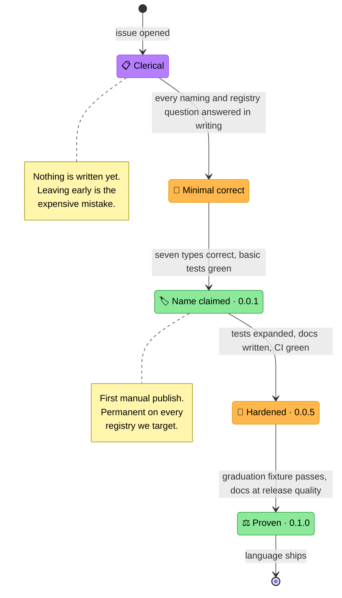

<!-- Title: Adding a Language -->
# Adding a language to verdict

> The repeatable ritual for bringing a new language SDK from nothing to
> a first real release. It exists because the order matters: the
> clerical work — naming, registry mechanics, publishing model,
> permanence — is cheapest before any code exists and most expensive
> after a name has been published. Python never got this treatment, as
> its package predated the question; every language after it does.

## Why a ritual rather than judgement each time

Three of the four things that can go permanently wrong in shipping a
package have nothing to do with the code:

- **A name, once published, is effectively unrecoverable.** Most
  registries never delete anything, and the ones that do allow it only
  inside a short window.
- **A publishing model chosen late is a migration.** Some registries
  cannot bootstrap their own first release, and at least one has an
  ownership transfer that cannot be reversed.
- **A namespace decision is only cheap before the second package
  exists.**

None of those are discovered by writing good code. They are discovered
by reading registry documentation, which is why that happens first here.

The fourth — proving the engine actually behaves identically across
languages — is handled by a shared fixture rather than by each language
inventing its own evidence. See
[`testing.md`](testing.md) and
[`../fixtures/graduation_verdict/README.md`](../fixtures/graduation_verdict/README.md).

## The stages

> **Stage transitions**:
> 1. **Clerical → Minimal**: every naming and registry question is
>    answered *in writing*, not in someone's head. This is the stage
>    people skip, and the only one whose mistakes cannot be corrected
>    later.
> 2. **Minimal → Claimed**: all seven types exist and are faithful to
>    the execution-model guarantees, with short-circuit and
>    vacuous-truth tests proving it. Correct but small — not a stub.
> 3. **Claimed → Hardened**: the name is held. Everything after this is
>    normal iteration under a version nobody is expected to depend on.
> 4. **Hardened → Proven**: the shared graduation fixture passes, which
>    is what makes "the same engine, in another language" a
>    demonstrated claim rather than an asserted one.
>
> **Design note**: `0.0.1` is deliberately publishable rather than a
> placeholder. A registry entry is permanent and public from the moment
> it exists, so the first thing under a name should be honest code
> somebody could actually use.

## Stage 0 · Clerical

**Ships nothing. Produces a written record.** Every item is a decision
recorded in the language's plan document, not an intention.

- [ ] **Name availability** checked against the live registry, with the
      alternatives that were considered and rejected
- [ ] **Name decided**, in that registry's own casing convention
- [ ] **Namespacing position**: what the registry offers, whether it is
      defensible, and what a future companion package would be called
- [ ] **Publisher model**: account type, who owns the package, whether
      an organization is needed
- [ ] **Publishing mechanism**: OIDC/trusted publishing where it exists,
      and what it requires on the registry side
- [ ] **Can the registry bootstrap its own first publish?** If not, plan
      the manual one
- [ ] **Permanence**: what can be deleted, what can only be
      hidden/retracted, and what is irreversible
- [ ] **Directory name** and any language-specific layout conventions
- [ ] **The one non-mechanical design point**, if the language has one —
      e.g. a language without structural typing cannot express `Rule`
      the way Python does, and that difference belongs in the docs
      rather than being smoothed over

Registry research supporting these decisions is working material and
belongs in `.agents/scratch/`, not in the repo's public surfaces.

## Stage 1 · Minimal correct

- [ ] Directory scaffolded with the language's manifest and its own
      `AGENTS.md`, mirroring `python/AGENTS.md`'s role
- [ ] All seven types: `Rule`, `FunctionRule`, `AndRule`, `OrRule`,
      `RulesEngine`, `RuleResult`, `RunResult`
- [ ] **Sequential evaluation**, in a plain loop with `await` — never
      the language's "run these concurrently" primitive. See
      [`architecture.md`](architecture.md)
- [ ] Short-circuiting proven with a call counter or mutable-list side
      effect, never just the final boolean
- [ ] Vacuous-truth cases explicit: the empty-`AndRule` and empty-`OrRule`
      polarities each get their own test
- [ ] Zero runtime dependencies
- [ ] No domain vocabulary anywhere in the package source

## Stage 2 · Claim the name — `0.0.1`

- [ ] Registry account and organization in place, per stage 0
- [ ] Anything irreversible decided **first** — some registries have
      one-way ownership transfers
- [ ] Metadata correct: description, licence file, repository link
- [ ] **Published manually.** This is a deliberate human step; it cannot
      be automated on every registry, and it should not be automated on
      the ones where it could
- [ ] Trusted publishing configured immediately afterwards, so `0.0.1`
      is the only version ever published by hand

## Stage 3 · Harden — `0.0.5`

- [ ] Test coverage expanded across every type and run mode
- [ ] Language-level `README` and quickstart
- [ ] `test-<lang>.yml`, path-filtered, as a **new** workflow file
- [ ] `release-<lang>.yml` on a `<lang>-v*` tag, publishing via trusted
      publishing
- [ ] Release workflow attaches the full skill artifact set — see
      [`maintenance.md`](maintenance.md)
- [ ] `CHANGELOG.md` entry under that language's own tag heading

## Stage 4 · Prove — `0.1.0`

- [ ] The shared graduation fixture passes, including the short-circuit
      counts, failing chains, run-mode expectations and vacuous-truth
      curriculum — this is the stage that turns "same design" into a
      demonstrated claim
- [ ] An oracle/differential suite in the language's own idiom, with
      explicitly seeded generators so a failure reproduces from its seed
      alone
- [ ] `skills/verdict/references/<lang>/` and the skill's
      language-routing note, with `.claude-plugin/plugin.json` bumped in
      the same commit
- [ ] Documentation at the quality of the Python set: architecture
      notes where the language diverges, extension recipes in its own
      idiom
- [ ] A real install from the registry exercised end to end

## What is shared and what is not

**Shared**: the fixture data under
[`../fixtures/graduation_verdict/`](../fixtures/graduation_verdict/) —
the curriculum, the students, and the expected outcomes, including the
short-circuit evidence. Every language asserts against the same numbers.

**Not shared**: the example implementation, the oracle, and the chaos
generators. Those are per-language by necessity — no two languages
produce identical pseudo-random sequences from the same seed, so each
suite is seeded and reproducible on its own terms rather than against
another language's output.

**Shared in shape, free in wording.** The example program follows the
established pattern — a detailed lookup for one subject, then a batch
verdict across every student from one engine built once — because that
shape is what demonstrates the "build once, apply many" claim. How it
prints is up to the language: the fixture deliberately pins rule *names*
and evaluation *counts* but never the human-readable `detail` string,
which each SDK should phrase idiomatically.

The reason the fixture is non-negotiable is narrower than "we like
consistency": a port can return the correct verdict for every student
while having destroyed short-circuiting, because the boolean is
identical either way. The shared counts are what make that detectable.
Any language claiming to be verdict has to clear it.

## Related

- [`architecture.md`](architecture.md) — the guarantees a port must
  preserve.
- [`testing.md`](testing.md) — what a change has to prove.
- [`maintenance.md`](maintenance.md) — release procedure, tagging, and
  the skill's separate version.
- [`extension.md`](extension.md) — the recipes each language's own
  reference content should cover.
