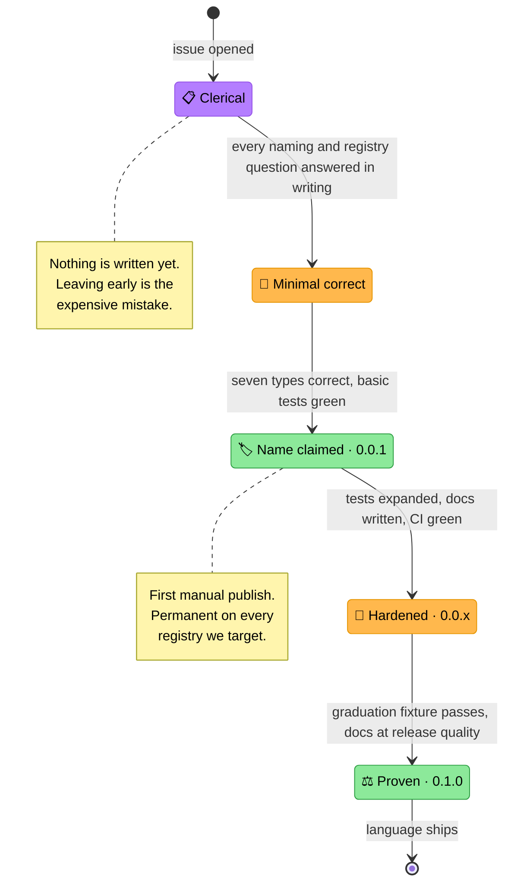

<!-- Title: Adding a Language -->
# Adding a language to verdict

> The repeatable ritual for bringing a new language SDK from nothing to
> a first real release. It exists because the order matters: the
> clerical work — naming, registry mechanics, publishing model,
> permanence — is cheapest before any code exists and most expensive
> after a name has been published. Python never got this treatment, as
> its package predated the question; every language after it does.

## Why a ritual rather than judgement each time

Three of the four things that can go permanently wrong in shipping a
package have nothing to do with the code:

- **A name, once published, is effectively unrecoverable.** Most
  registries never delete anything, and the ones that do allow it only
  inside a short window.
- **A publishing model chosen late is a migration.** Some registries
  cannot bootstrap their own first release, and at least one has an
  ownership transfer that cannot be reversed.
- **A namespace decision is only cheap before the second package
  exists.**

None of those are discovered by writing good code. They are discovered
by reading registry documentation, which is why that happens first here.

The fourth — proving the engine actually behaves identically across
languages — is handled by a shared fixture rather than by each language
inventing its own evidence. See
[`testing.md`](testing.md) and
[`../fixtures/graduation_verdict/README.md`](../fixtures/graduation_verdict/README.md).

## The stages

> **Stage transitions**:
> 1. **Clerical → Minimal**: every naming and registry question is
>    answered *in writing*, not in someone's head. This is the stage
>    people skip, and the only one whose mistakes cannot be corrected
>    later.
> 2. **Minimal → Claimed**: all seven types exist and are faithful to
>    the execution-model guarantees, with short-circuit and
>    vacuous-truth tests proving it. Correct but small — not a stub.
> 3. **Claimed → Hardened**: the name is held. Everything after this is
>    normal iteration under a version nobody is expected to depend on —
>    `0.0.2`, `0.0.3`, as many as it takes. The point of staying in
>    `0.0.x` is that the publishing pipeline is still unproven for that
>    language, and a version number spent proving it is a version number
>    nobody misses.
> 4. **Hardened → Proven**: the shared graduation fixture passes, which
>    is what makes "the same engine, in another language" a
>    demonstrated claim rather than an asserted one.
>
> **Design note**: the `0.0.x` numbers are not a fixed count. Spend as
> many as the pipeline needs — several registries burn a version
> permanently the moment it is published, so proving the workflow on
> throwaway numbers is the cheap way to find out it is wrong. `0.0.1` is
> deliberately publishable rather than a placeholder. A registry entry is permanent and public from the moment
> it exists, so the first thing under a name should be honest code
> somebody could actually use.

## Stage 0 · Clerical

**Ships nothing. Produces a written record.** Every item is a decision
recorded in the language's plan document, not an intention.

- [ ] **Name availability** checked against the live registry, with the
      alternatives that were considered and rejected
- [ ] **Name decided**, in that registry's own casing convention
- [ ] **Namespacing position**: what the registry offers, whether it is
      defensible, and what a future companion package would be called
- [ ] **Publisher model**: account type, who owns the package, whether
      an organization is needed
- [ ] **Publishing mechanism**: OIDC/trusted publishing where it exists,
      and what it requires on the registry side
- [ ] **Can the registry bootstrap its own first publish?** If not, plan
      the manual one
- [ ] **Permanence**: what can be deleted, what can only be
      hidden/retracted, and what is irreversible
- [ ] **Directory name** and any language-specific layout conventions
- [ ] **The one non-mechanical design point**, if the language has one —
      e.g. a language without structural typing cannot express `Rule`
      the way Python does, and that difference belongs in the docs
      rather than being smoothed over

Registry research supporting these decisions is working material and
belongs in `.agents/scratch/`, not in the repo's public surfaces.

## Stage 1 · Minimal correct

- [ ] Directory scaffolded with the language's manifest and its own
      `AGENTS.md`, mirroring `python/AGENTS.md`'s role
- [ ] All seven types: `Rule`, `FunctionRule`, `AndRule`, `OrRule`,
      `RulesEngine`, `RuleResult`, `RunResult`
- [ ] **Sequential evaluation**, in a plain loop with `await` — never
      the language's "run these concurrently" primitive. See
      [`architecture.md`](architecture.md)
- [ ] Short-circuiting proven with a call counter or mutable-list side
      effect, never just the final boolean
- [ ] Vacuous-truth cases explicit: the empty-`AndRule` and empty-`OrRule`
      polarities each get their own test
- [ ] Zero runtime dependencies
- [ ] No domain vocabulary anywhere in the package source

## Stage 2 · Claim the name — `0.0.1`

- [ ] Registry account and organization in place, per stage 0
- [ ] Anything irreversible decided **first** — some registries have
      one-way ownership transfers
- [ ] Metadata correct: description, licence file, repository link
- [ ] **Published manually.** This is a deliberate human step; it cannot
      be automated on every registry, and it should not be automated on
      the ones where it could
- [ ] Trusted publishing configured immediately afterwards, so `0.0.1`
      is the only version ever published by hand

## Stage 3 · Harden — `0.0.x`

- [ ] Test coverage expanded across every type and run mode
- [ ] Language-level `README` and quickstart
- [ ] `test-<lang>.yml` as a **new** workflow file, following the gate pattern
      below rather than filtering on the trigger
- [ ] `release-<lang>.yml` on a `<lang>-v*` tag, publishing via trusted
      publishing
- [ ] Release workflow attaches the full skill artifact set — see
      [`maintenance.md`](maintenance.md)
- [ ] **Publish over OIDC, never a stored token.** On PyPI and npm this is
      what produces provenance at all — a workflow using a token uploads
      successfully and silently carries none.
- [ ] **A `verify-published` job**, in this language's own release workflow
      rather than the shared tail, asserting the version is live and carries
      whatever provenance that registry offers. The mechanism is per-registry
      even though the question is not: PyPI exposes PEP 740 attestations, npm
      reports `dist.attestations`, NuGet embeds a `.signature.p7s`, pub.dev
      offers nothing comparable — say so explicitly there rather than leaving
      the omission looking accidental.

      Query the **version-specific** endpoint, not the package summary: the
      summary is usually CDN-cached and lags a publish by minutes, so
      asserting against it fails good releases.
- [ ] A `CHANGELOG.md` **beside that package's own manifest** — next to
      `pyproject.toml`, `package.json`, the `.csproj`, `pubspec.yaml — not at
      the repo root and not at the language directory root if the manifest
      sits deeper. That is what the packaging tools bundle, and it gives the
      track exactly one writer so two releases can never contend for one file.
      **Research that ecosystem's own convention** rather than copying
      Python's: pub.dev parses the file and documents `## 1.2.3`, PyPI and npm
      parse nothing and follow Keep a Changelog, and NuGet has no changelog
      file at all — it uses a `PackageReleaseNotes` metadata string

### A word on the test workflow's shape

Do **not** put a `paths:` filter on the trigger. It looks right and quietly
makes the check unusable: a workflow that never starts creates no check run, so
branch protection waits forever for a result and the pull request deadlocks at
"Expected — waiting for status to be reported".

The filter goes inward instead. `test-python.yml` is the reference:

1. A **`changes`** job diffs against the base and decides whether there is
   anything to test. If it cannot determine a base commit it answers *yes* —
   the uncertain case must run the suite, never skip it.
2. The **real jobs** are conditional on that.
3. A **`gate`** job with `if: always()` reports for the whole workflow. This is
   the job to mark required.

The gate is where this goes wrong, so it is worth stating what correct means:
it must treat `success` and `skipped` as fine, and `failure` and `cancelled` as
not. A gate that merely declares `if: always()` with no body reports success
even when the tests failed — strictly worse than no gate, because protection is
then satisfied by a red build. It must also fail when it receives *no* results
at all, since `needs` is non-empty and an empty answer means something failed
to resolve rather than that everything was fine.

That last one is the same distinction the library itself draws: emptiness folds
to an identity, absence is an error.

## Stage 4 · Prove — `0.1.0`

- [ ] The shared graduation fixture passes, including the short-circuit
      counts, failing chains, run-mode expectations and vacuous-truth
      curriculum — this is the stage that turns "same design" into a
      demonstrated claim
- [ ] An oracle/differential suite in the language's own idiom, with
      explicitly seeded generators so a failure reproduces from its seed
      alone
- [ ] `skills/verdict/references/<lang>/agent-notes.md` — **one file**,
      and the only hand-written skill content a language needs. Everything
      about what verdict *is* comes from the repository's own documents,
      which `scripts/build.sh` copies into the bundle from
      `skills/verdict/MANIFEST`; a language restating them is how the
      skill went stale twice. Keep it to what is specific to this SDK:
      its idioms, its naming, the mistakes that show up in generated code
      for this language, and the fetch recipe for the documents the
      bundle does not carry.
- [ ] Add this language's own documents to `skills/verdict/MANIFEST` —
      quickstart, samples, worked example — in the `fetch` tier. The
      `bundled` tier is language-agnostic and should not grow.
- [ ] `.claude-plugin/plugin.json` bumped in the same commit, with a
      `## skill-vX.Y.Z` changelog entry. **`SKILL.md` needs no edit** —
      it routes to `references/<language>/` and names no language, so
      adding one touches nothing another language's branch also touches
- [ ] Documentation at the quality of the Python set: architecture
      notes where the language diverges, extension recipes in its own
      idiom
- [ ] A real install from the registry exercised end to end

## Features land everywhere, or nowhere

Once more than one language ships, **a capability is added to all of
them or to none of them**. No language runs ahead.

This is the rule that keeps "the same engine, in another language" true
rather than aspirational. A feature present in one SDK and absent in
three turns the shared design into a family resemblance, and every
consumer then has to ask which language they are reading about before
trusting any documentation.

In practice:

- **A new capability is a cross-language piece of work**, not a
  single-language one. If it is not worth doing four times, that is
  useful evidence about whether it is worth doing at all —
  [`future_plan.md`](future_plan.md) already sets a high bar for
  additions, and this raises it further on purpose.
- **Behaviour changes are enforced mechanically**, not by memory: they
  show up as changes to the shared fixture, and every language's suite
  fails until it matches. A language cannot silently drift.
- **Fixing a defect in the reference implementation is not "running
  ahead."** Correcting behaviour is expected to propagate; languages
  that have not shipped yet inherit it for free, because the fixture is
  what they are built against.
- **It does not reach idiomatic surface.** See the section above — a
  `CancellationToken`, an `AbortSignal`, a `Result<T, E>` express the same
  engine the way a language expresses that kind of work, and are not
  capabilities one SDK has and the others lack.
- **Versions stay independent.** Parity is a property proven by the
  fixture, not encoded in matching version numbers. A language's version
  describes its own history; that package's own `CHANGELOG.md` is where
  "this matches the reference as of X" belongs, if it needs saying at all.

## What is shared and what is not

**Shared**: the fixture data under
[`../fixtures/graduation_verdict/`](../fixtures/graduation_verdict/) —
the curriculum, the students, and the expected outcomes, including the
short-circuit evidence. Every language asserts against the same numbers.

**Not shared**: the example implementation, the oracle, and the chaos
generators. Those are per-language by necessity — no two languages
produce identical pseudo-random sequences from the same seed, so each
suite is seeded and reproducible on its own terms rather than against
another language's output.

**Shared in shape, free in wording.** The example program follows the
established pattern — a detailed lookup for one subject, then a batch
verdict across every student from one engine built once — because that
shape is what demonstrates the "build once, apply many" claim. How it
prints is up to the language: the fixture deliberately pins rule *names*
and evaluation *counts* but never the human-readable `detail` string,
which each SDK should phrase idiomatically.

The reason the fixture is non-negotiable is narrower than "we like
consistency": a port can return the correct verdict for every student
while having destroyed short-circuiting, because the boolean is
identical either way. The shared counts are what make that detectable.
Any language claiming to be verdict has to clear it.

## Related

- [`architecture.md`](architecture.md) — the guarantees a port must
  preserve.
- [`testing.md`](testing.md) — what a change has to prove.
- [`maintenance.md`](maintenance.md) — release procedure, tagging, and
  the skill's separate version.
- [`extension.md`](extension.md) — the recipes each language's own
  reference content should cover.
