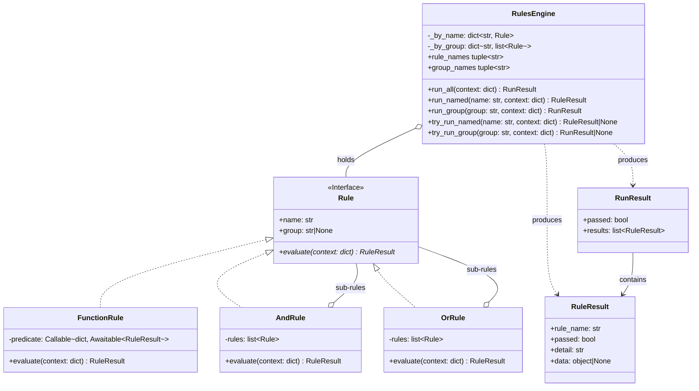
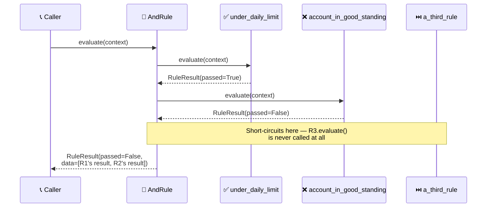
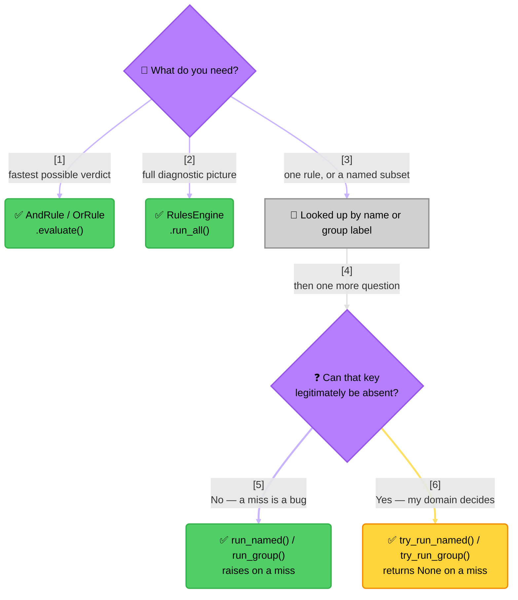

<!-- Title: Verdict Architecture -->
# Verdict — Architecture

> General-purpose, standalone documentation for this package on its own
> terms — no framing around any particular consumer's domain. See the
> top-level [`README.md`](../README.md) for the narrative overview and
> [`python/docs/quickstart.md`](../python/packages/verdict-rules/docs/quickstart.md) for the
> core concepts and one worked example; this doc covers *why* the
> package is shaped the way it is and the behavior a caller can rely on
> that isn't obvious from the API surface alone. The design described
> here applies to every language this package ever ships for — only
> Python exists today, so every illustration below is Python code; a
> future language's own SDK follows the same design, shown in its own
> idiom, not a separate rationale.

## Where this doc fits

```mermaid
graph LR
    Readme["📗 README.md<br/>narrative overview"]
    Quick["🚀 quickstart.md<br/>concepts + example"]
    Arch["📘 architecture.md<br/>(you are here)"]
    Fork{"🔀 Changing the package,<br/>or building on it?"}
    Maint["🔧 maintenance.md"]
    Test["🧪 testing.md"]
    Ext["🔌 extension.md"]
    Samples["📚 samples/"]

    %% Link 0: Readme -> Quick
    Readme -->|"[1]<br/>then get concrete"| Quick
    %% Link 1: Quick -> Arch
    Quick -->|"[2]<br/>then go deeper"| Arch
    %% Link 2: Arch -> Fork
    Arch -->|"[3]<br/>next question"| Fork
    %% Link 3: Fork -> Maint
    Fork -->|"[4]<br/>changing verdict itself"| Maint
    %% Link 4: Fork -> Ext
    Fork -->|"[5]<br/>building on top of it"| Ext
    %% Link 5: Maint -> Test
    Maint -->|"[6]<br/>then prove it"| Test
    %% Link 6: Ext -> Samples
    Ext -->|"[7]<br/>worked instances"| Samples

    style Readme fill:#D0D0D0,stroke:#999999,stroke-width:2px,color:#000
    style Quick fill:#D0D0D0,stroke:#999999,stroke-width:2px,color:#000
    style Arch fill:#FFD43B,stroke:#F08C00,stroke-width:4px,color:#000
    style Fork fill:#B47EFF,stroke:#9654E8,stroke-width:2px,color:#000
    style Maint fill:#D0D0D0,stroke:#999999,stroke-width:2px,color:#000
    style Test fill:#D0D0D0,stroke:#999999,stroke-width:2px,color:#000
    style Ext fill:#D0D0D0,stroke:#999999,stroke-width:2px,color:#000
    style Samples fill:#D0D0D0,stroke:#999999,stroke-width:2px,color:#000

    %% Link Index:
    %% 0: README's narrative overview is the entry point
    %% 1: quickstart.md makes it concrete before this doc makes it deep
    %% 2: this doc is the "why", reached after the quickstart
    %% 3-4: the next question splits readers into two audiences
    %% 5: changing the package needs its own tests proving the change
    %% 6: extension's recipes have full worked instances in samples/
    linkStyle 0 stroke:#E0E0E0,stroke-width:2px
    linkStyle 1 stroke:#E0E0E0,stroke-width:2px
    linkStyle 2 stroke:#E0E0E0,stroke-width:2px
    linkStyle 3 stroke:#C9B3FF,stroke-width:2px
    linkStyle 4 stroke:#C9B3FF,stroke-width:2px
    linkStyle 5 stroke:#E0E0E0,stroke-width:2px
    linkStyle 6 stroke:#E0E0E0,stroke-width:2px
```

> **Reading the Doc Set**:
> 1. **`README.md` is the entry point** — the narrative overview of what
>    this package is and why, with no code.
> 2. **[`python/docs/quickstart.md`](../python/packages/verdict-rules/docs/quickstart.md) makes
>    it concrete** — the five core names and one complete, runnable
>    example, in whichever language you're using (Python today).
> 3. **This doc (`architecture.md`) is the "why"** — type structure, the
>    execution model, and the reasoning behind each design choice, for
>    anyone who needs more than the quickstart before relying on this
>    package.
> 4. **From here, readers split into two audiences**: changing
>    `verdict` itself goes to [`maintenance.md`](maintenance.md) (and
>    from there to [`testing.md`](testing.md) to prove the change);
>    building something on top of it, without changing anything here,
>    goes to [`extension.md`](extension.md).
> 5. **`extension.md`'s recipes have full worked instances in
>    [`python/docs/samples/`](../python/packages/verdict-rules/docs/samples/1_README.md)** —
>    generic domains (discounts, fee waivers, tier promotions,
>    moderation routing) plus the data-driven pattern this package is
>    designed for.

## Design philosophy

Three small modules, each with exactly one job:

- **`rule.py`** — what a rule *is*: the `Rule` structural interface, and
  four concrete shapes (`FunctionRule`, `AndRule`, `OrRule`).
- **`engine.py`** — how a set of rules gets *run*: `RulesEngine` and its
  three execution modes.
- **`result.py`** — what evaluation *produces*: `RuleResult`/`RunResult`,
  deliberately plain and immutable.

`Rule` is a `Protocol`, not an `ABC` — a custom rule implementation
never needs to import from this package or inherit from anything; it
just needs a `name`, a `group`, and an `evaluate(context)` coroutine.
Structural typing over nominal typing is the whole reason `FunctionRule`
can exist at all: it's not a special case the engine recognizes, it's an
ordinary `Rule` that happens to delegate to a plain function.

Zero external dependencies and no knowledge of any specific domain
(rate limiting, validation, feature flags, ...) are both load-bearing,
not incidental — see the top-level `README.md` for the reasoning.

## Type structure

> **Design Rationale**:
> 1. **`AndRule`/`OrRule` both realize the same `Rule` interface they
>    aggregate** — the classic Composite pattern shape. This is what
>    makes arbitrarily deep nesting free: an `AndRule` can hold another
>    `AndRule` (or `OrRule`, or `FunctionRule`) as one of its own
>    sub-rules with no special-casing anywhere, since from the outside a
>    composite rule is indistinguishable from a plain one.
> 2. **Aggregation (`o--`), not composition, for sub-rules**: a `Rule`
>    instance's lifecycle isn't owned by any one composite that
>    references it — the same `FunctionRule` could legitimately be
>    reused inside two different `AndRule`s, since rules are stateless
>    wrappers around a predicate.
> 3. **`RulesEngine` depends on (`..>`) `RuleResult`/`RunResult` rather
>    than holding them** — it produces fresh instances per call, never
>    retains one between calls. There's no cache, no evaluation
>    history; every `run_*` call is a clean, independent evaluation
>    against whatever `context` it's given.
> 4. **`RunResult.results` never flattens a composite's own sub-results
>    into the outer list** — a short-circuited `AndRule` still
>    contributes exactly one `RuleResult` to `RunResult.results`; its
>    sub-rules' individual outcomes live nested inside that one
>    result's own `data` field. Walking a `RunResult` after
>    `run_all()`/`run_group()` always gives one entry per *top-level*
>    rule the engine was configured with, regardless of how deep any
>    individual rule's own internal composition goes.

## Execution model: sequential, not concurrent

`AndRule`/`OrRule` evaluate their sub-rules with a plain `for` loop and
`await`, one at a time — never `asyncio.gather` or any other concurrent
scheduling. This is a deliberate choice, not an oversight:

- **Short-circuiting only means something if later work never starts.**
  Concurrent evaluation would already have kicked off every sub-rule's
  coroutine before the first result comes back, defeating the entire
  point of `AndRule` stopping at the first failure (or `OrRule` at the
  first pass) — a rule whose predicate has a real side effect (a DB
  write, an external call) would still have fired even though its
  outcome could no longer change the composite's own result.
- **Evaluation order is a real part of the contract**, not an
  implementation detail — a caller ordering rules cheapest-first can
  rely on that ordering being honored exactly, not raced.

> **Key Steps**:
> 1. **`R1` passes, evaluation continues**: `AndRule` only stops on a
>    *failure*, so a passing sub-rule just moves on to the next one in
>    order.
> 2. **`R2` fails, `AndRule` stops immediately**: the loop returns as
>    soon as it sees `passed=False` — `R3` is never instantiated-into-a-
>    call, never awaited, has no observable effect on this evaluation at
>    all.
> 3. **The composite's own result carries only what actually ran**:
>    `data` holds `[R1's result, R2's result]` — two entries, not three,
>    since `R3` never contributed one. A caller inspecting `data` sees
>    an honest record of what was actually evaluated, not a
>    placeholder for skipped rules.
>
> **`OrRule` is the exact mirror**: stops at the first *pass* instead of
> the first *failure*, otherwise identical in shape.

`RulesEngine.run_all()`/`run_group()` are different on purpose: they
evaluate every rule unconditionally, with no short-circuiting at all —
see the next section for why.

## Three ways to run rules, and when each is the right one

| Method | Evaluates | Short-circuits? | Use when |
|---|---|---|---|
| `AndRule`/`OrRule`.`evaluate()` | Just that composite's own sub-rules | Yes | You want one fast, efficient verdict — the common case for "is this allowed?" |
| `RulesEngine.run_all()` | Every rule the engine was constructed with | No | You want a full diagnostic picture — every rule's own pass/fail, useful for a status page or an audit trail, not just a single yes/no |
| `RulesEngine.run_named()` | Exactly one rule, by name | N/A (single rule) | You already know which specific rule you want evaluated, independent of any others |
| `RulesEngine.run_group()` | Every rule sharing a `group` label | No (same as `run_all`) | A scoped version of `run_all()` — every rule relevant to one sub-concern, without pulling in unrelated rules registered on the same engine |

The engine's own methods deliberately never short-circuit — that's what
composing rules into an `AndRule`/`OrRule` *before* handing them to the
engine is for. `RulesEngine` and the composite rules solve two
different problems: the engine answers "run these named/grouped things
and tell me about each one," composition answers "reach one verdict as
cheaply as possible." Reach for whichever matches what the call site
actually needs — they compose together fine (an engine can hold an
`AndRule` as one of its named rules, evaluated as a single unit via
`run_named()`, its own sub-rule detail still available in that one
result's `data`).

The second decision in that diagram is deliberately separate from the
first. *Which run mode* and *what should happen on a miss* are different
questions, and collapsing them is how the API would have ended up with a
flag on every method. Whether a key can legitimately be absent is a fact
about the **caller's own data**, not about the engine, so it is answered
by choosing a method rather than by configuring one.

## Extensibility

**Adding a new rule shape** (a third composite type, a weighted
combinator, anything) needs nothing from this package at all — no
registration, no base class to extend. Any object with `name`, `group`,
and an `evaluate(context) -> RuleResult` coroutine already satisfies
`Rule` structurally (`@runtime_checkable`, so `isinstance(x, Rule)`
genuinely works, not just static type-checking). Building rules up from
configuration at runtime is the direct payoff of this: a caller's own
factory function can construct whatever `Rule` shape a config row calls
for, and every engine method and composite already knows how to run it,
with zero changes on this package's side. See
[`extension.md`](extension.md) for the full set of recipes this enables
(wrapping a predicate, a genuinely new composite shape, the
one-adapter-module pattern, building from stored config, nesting) with
worked code for each.

**Adding a new `RulesEngine` run mode** is a real change to this
package (a new method on `RulesEngine` itself) — the dict-dispatch
lookup structures (`_by_name`, `_by_group`) already cover "by name" and
"by group"; a genuinely new selection axis would need its own index,
built the same way in `__init__`. See [`maintenance.md`](maintenance.md)
for the full "where to make a change" guide this is one row of.

## Testing

### Emptiness is not absence

Two situations look alike and are deliberately handled in opposite ways.

**Emptiness** is a set you were handed that happened to have nothing in
it. `AndRule([])` passes and `OrRule([])` fails, because those are the
identities of the folds they perform — the same answers Python's own
`all([])` and `any([])` give. A caller who builds rules from
configuration and gets none back has a legitimate, meaningful result:
nothing to enforce. [`extension.md`](extension.md)'s Recipe 4 depends on
exactly that.

**Absence** is asking for something that does not exist.
`run_named("typo")` and `run_group("typo")` both raise `KeyError`. A
group exists only because some rule declared it, so a group lookup that
matches nothing is never a legitimately empty group — it can only be a
misspelling or a stale name. Returning a vacuous pass there would mean a
typo silently approves, which in an access-control or eligibility
adapter is the worst possible failure mode.

The distinction is worth stating plainly because it is the one place
this package is deliberately strict: it is permissive about arithmetic
and strict about lookups.

**Strict by default, not by force.** `try_run_named` and `try_run_group`
return `None` instead of raising, for callers whose own domain has an
answer for absence — a per-tenant rule set, an optional group behind a
flag, a name in configuration a deployment has not adopted yet. `None`
means *absent*, never *vacuously passed*; a rule that exists and fails is
still a `RuleResult` with `passed=False`.

The engine refuses to pick a fallback because it cannot: absence means
"no constraint applies" to one consumer and "the configuration is broken"
to another, and a single default would be wrong for one of them.
[`extension.md`](extension.md)'s Recipe 6 works through the four shapes
this takes in practice.

The `try_` forms are the **primitives**; `run_named` and `run_group` are
two-line assertions on top of them, so there is one lookup path rather
than two implementations that could drift.

The invariant that makes a caller's fallback safe to write: **a lookup
that matches always reports its real verdict.** A failing group returns a
failing `RunResult`, never `None`, so no choice of default can mask it.
The fallback is reached only on absence — which is why code written as
`… if result is not None else True` means "pass when absent", not
"pass when convenient". `RulesEngine.rule_names` and
`group_names` report exactly the lookups that will not raise, for
enumerating an engine rather than probing one name.

Short-circuiting (both directions) and every vacuous-truth edge case
above are the specific things worth proving, not just executing — see
[`testing.md`](testing.md) for the full reasoning, the current
coverage, and what a new contribution's own tests need to add.

## Related docs

- [`../README.md`](../README.md) — the narrative front door.
- [`../python/docs/quickstart.md`](../python/packages/verdict-rules/docs/quickstart.md) — core
  concepts and the one worked example, in Python (today's only shipped
  language).
- [`maintenance.md`](maintenance.md) — changing this package itself:
  the zero-release-step consumption model, where to make a given kind
  of change, and the consumer-impact checklist for a shape change.
- [`extension.md`](extension.md) — building on top of this package from
  a consumer's own code, with no changes here: wrapping a predicate, a
  new composite shape, the one-adapter-module pattern, and nesting.
- [`testing.md`](testing.md) — how this package's own test suite is
  organized, what a change needs to prove, and current coverage.
- [`../python/docs/samples/`](../python/packages/verdict-rules/docs/samples/1_README.md) —
  worked, domain-flavored examples of where a rule engine like this
  earns its keep, including the data-driven pattern this package is
  designed for.
