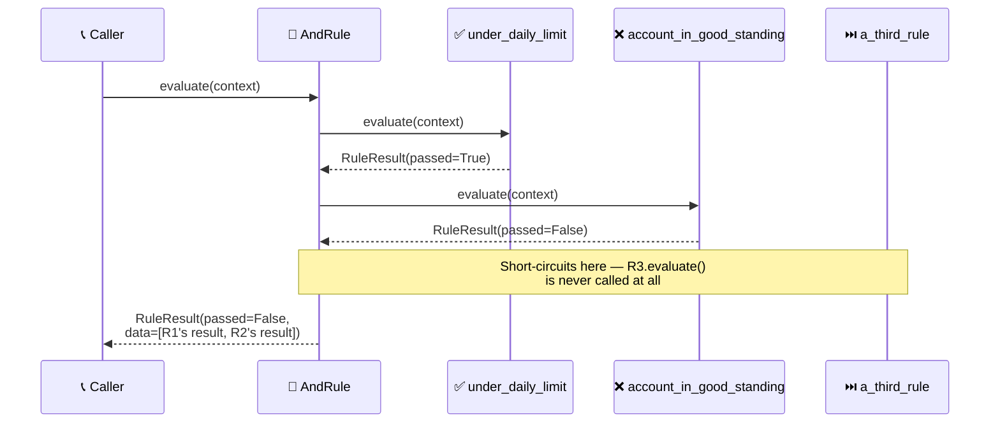
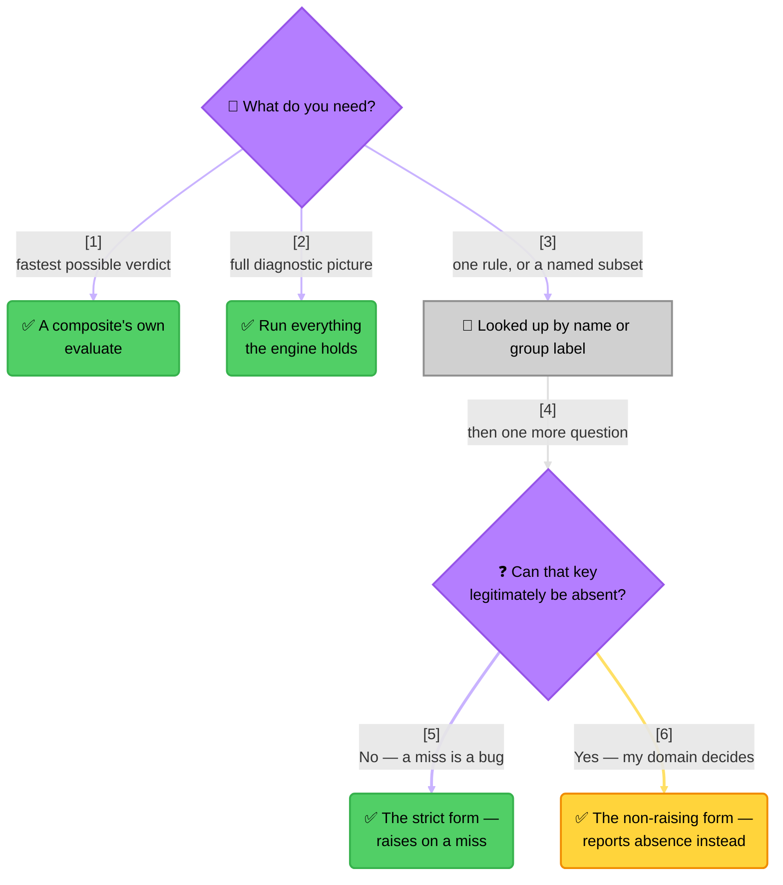

<!-- Title: Verdict Architecture -->
# Verdict — Architecture

> Why `verdict` is shaped the way it is, and the behavior a caller can
> rely on that isn't obvious from the API surface alone — independent of
> any specific consumer's domain or any one language's type system.
> [`../../README.md`](../../README.md) is the narrative overview;
> [`python/packages/verdict-rules/docs/quickstart.md`](../../python/packages/verdict-rules/docs/quickstart.md)
> is the core concepts and one worked example. The concrete realization
> in a real type system, with real method names, is each language's own
> file in this directory — [`python.md`](python.md) today, a future
> language's own `<language>.md` alongside it.

## Design philosophy

Three responsibilities, kept separate on purpose:

- **What a rule *is*** — a structural interface any object can satisfy
  without inheriting from anything, plus a small set of concrete shapes
  every SDK ships: a plain-predicate wrapper, and the AND/OR composites.
- **How a set of rules gets *run*** — one engine type, holding rules by
  name and by group, with a small, closed set of run modes.
- **What evaluation *produces*** — a plain, immutable result shape,
  never a bare boolean, so *why* is always available next to *whether*.

**Structural typing over nominal typing** is the reason the
plain-predicate rule shape can exist at all: it's not a special case the
engine recognizes, it's an ordinary rule that happens to delegate to a
function. A custom rule implementation in any language never needs to
import from this package or inherit from anything it provides — it only
needs to expose the same shape (a name, a group, an evaluation
operation) that every built-in rule already does. Each language's own
file in this directory covers how that language expresses it (Python's
`Protocol`, for instance) and what the decision costs a language
without structural typing at all.

Zero external dependencies and no knowledge of any specific domain
(rate limiting, validation, feature flags, ...) are both load-bearing,
not incidental — see the top-level [`../../README.md`](../../README.md)
for the reasoning.

## Type structure

The four built-in rule shapes and the engine relate to each other the
same way in every language, independent of how each one's type system
expresses it — each language's own file in this directory has the
concrete diagram in that language's own type syntax. The relationships
that matter, and why:

> **Design Rationale**:
>
> 1. **The two composites realize the same interface they aggregate** —
>    the classic Composite pattern shape. This is what makes arbitrarily
>    deep nesting free: an AND composite can hold another AND (or OR, or
>    a plain rule) as one of its own sub-rules with no special-casing
>    anywhere, since from the outside a composite rule is
>    indistinguishable from a plain one.
> 2. **Aggregation, not composition, for sub-rules**: a rule instance's
>    lifecycle isn't owned by any one composite that references it — the
>    same plain-predicate rule could legitimately be reused inside two
>    different composites, since rules are stateless wrappers around a
>    predicate.
> 3. **The engine depends on its result types rather than holding
>    them** — it produces fresh instances per call, never retains one
>    between calls. There's no cache, no evaluation history; every run
>    call is a clean, independent evaluation against whatever context
>    it's given.
> 4. **A run's results never flatten a composite's own sub-results into
>    the outer list** — a short-circuited composite still contributes
>    exactly one result to the outer run; its sub-rules' individual
>    outcomes live nested inside that one result's own data. Walking a
>    run's results always gives one entry per *top-level* rule the
>    engine was configured with, regardless of how deep any individual
>    rule's own internal composition goes.

## Execution model: sequential, not concurrent

Composites evaluate their sub-rules one at a time, in the order given —
never scheduling them concurrently. This is a deliberate choice, not an
oversight:

- **Short-circuiting only means something if later work never starts.**
  Concurrent evaluation would already have kicked off every sub-rule's
  work before the first result comes back, defeating the entire point of
  an AND composite stopping at the first failure (or an OR at the first
  pass) — a rule whose predicate has a real side effect (a DB write, an
  external call) would still have fired even though its outcome could
  no longer change the composite's own result. Each language's own file
  in this directory names the specific concurrency primitive that looks
  tempting there and why reaching for it breaks the guarantee.
- **Evaluation order is a real part of the contract**, not an
  implementation detail — a caller ordering rules cheapest-first can
  rely on that ordering being honored exactly, not raced.

> **Key Steps**:
>
> 1. **`R1` passes, evaluation continues**: an AND composite only stops
>    on a *failure*, so a passing sub-rule just moves on to the next one
>    in order.
> 2. **`R2` fails, the composite stops immediately**: the loop returns
>    as soon as it sees a failure — `R3` is never invoked, has no
>    observable effect on this evaluation at all.
> 3. **The composite's own result carries only what actually ran**: its
>    data holds two entries, not three, since `R3` never contributed
>    one. A caller inspecting that data sees an honest record of what
>    was actually evaluated, not a placeholder for skipped rules.
>
> **An OR composite is the exact mirror**: stops at the first *pass*
> instead of the first *failure*, otherwise identical in shape.

The engine's own run-everything and run-by-group modes are different on
purpose: they evaluate every rule unconditionally, with no
short-circuiting at all — see the next section for why.

## Three ways to run rules, and when each is the right one

Every SDK exposes the same three conceptual modes, under whichever
naming convention that language's own ecosystem expects — each
language's own file in this directory has the concrete method names:

| Mode | Short-circuits? | Use when |
| --- | --- | --- |
| A composite's own evaluate | Yes | One fast, efficient verdict — the common case for "is this allowed?" |
| Run everything the engine holds | No | A full diagnostic picture — every rule's own pass/fail, useful for a status page or an audit trail, not just a single yes/no |
| Look up one rule, or one named group — **strict form** | No (single rule: N/A) | You already know the key exists; absence would be a bug you want raised immediately |
| Look up one rule, or one named group — **non-raising form** | No (single rule: N/A) | Absence is expected, and your own domain — not the engine — decides what it means |

Whether a key can legitimately be absent is a fact about the **caller's
own data**, not about the engine, so it is answered by choosing between
the last two rows rather than by configuring one method.

This same shape holds for every language's SDK — only the method names
in each language's own table change; the decision tree itself does not.

The engine's own methods deliberately never short-circuit — that's what
composing rules into a composite *before* handing them to the engine is
for. The engine and the composite rules solve two different problems:
the engine answers "run these named/grouped things and tell me about
each one," composition answers "reach one verdict as cheaply as
possible." Reach for whichever matches what the call site actually
needs — they compose together fine (an engine can hold a composite as
one of its named rules, evaluated as a single unit via its by-name
lookup, its own sub-rule detail still available in that one result's
data).

## Extensibility

**Adding a new rule shape** (a third composite type, a weighted
combinator, anything) needs nothing from this package at all — no
registration, no base class to extend. Any object exposing the same
structural shape every built-in rule does already satisfies the
interface, in whatever way a given language verifies that at runtime
(each language's own file in this directory names its own mechanism —
Python's is `@runtime_checkable`).
Building rules up from configuration at runtime is the direct payoff of
this: a caller's own factory function can construct whatever rule shape
a config row calls for, and every engine method and composite already
knows how to run it, with zero changes on this package's side. See
[`../extending/`](../extending/README.md) for the full set of scenarios
this enables (wrapping a predicate, a genuinely new composite shape, the
one-adapter-module pattern, building from stored config, nesting) with
worked code for each.

**Adding a new engine run mode** is a real change to this package — the
existing lookup structures already cover "by name" and "by group"; a
genuinely new selection axis needs its own index built the same way.
See [`../maintenance/README.md`](../maintenance/README.md#where-to-make-a-change)
for the full "where to make a change" guide this is one row of.

## Testing

### Emptiness is not absence

Two situations look alike and are deliberately handled in opposite ways,
identically in every language's SDK.

**Emptiness** is a set you were handed that happened to have nothing in
it. An empty AND composite passes and an empty OR composite fails,
because those are the identities of the folds they perform. A caller
who builds rules from configuration and gets none back has a
legitimate, meaningful result: nothing to enforce.
[`../extending/data-driven-rule-construction/`](../extending/data-driven-rule-construction/README.md)
depends on exactly that.

**Absence** is asking for something that does not exist. Looking up an
unknown rule name or an unknown group both raise/throw (each language's
own file in this directory names its own exception type — Python's is
`KeyError`). A group exists only
because some rule declared it, so a group lookup that matches nothing
is never a legitimately empty group — it can only be a misspelling or a
stale name. Returning a vacuous pass there would mean a typo silently
approves, which in an access-control or eligibility adapter is the
worst possible failure mode.

The distinction is worth stating plainly because it is the one place
this package is deliberately strict: it is permissive about arithmetic
and strict about lookups.

**Strict by default, not by force.** Every language's SDK also exposes
a non-raising lookup form that returns an explicit absence value
instead, for callers whose own domain has an answer for absence — a
per-tenant rule set, an optional group behind a flag, a name in
configuration a deployment has not adopted yet. Absence never means
*vacuously passed*; a rule that exists and fails is still a real,
failing result.

The engine refuses to pick a fallback because it cannot: absence means
"no constraint applies" to one consumer and "the configuration is
broken" to another, and a single default would be wrong for one of
them. [`../extending/absence-vs-failure/`](../extending/absence-vs-failure/README.md)
works through the four shapes this takes in practice.

The non-raising forms are the **primitives**; the raising forms are
two-line assertions on top of them, so there is one lookup path rather
than two implementations that could drift.

The invariant that makes a caller's fallback safe to write: **a lookup
that matches always reports its real verdict.** A failing group returns
a failing result, never an absence value, so no choice of default can
mask it. The fallback is reached only on absence — which is why code
written as "use the result if present, else assume compliant" means
"pass when absent", not "pass when convenient". Every engine also
exposes what names and groups exist, for enumerating an engine rather
than probing one name.

Short-circuiting (both directions) and every vacuous-truth edge case
above are the specific things worth proving, not just executing — see
[`../testing.md`](../testing.md) for the full reasoning, the current
coverage, and what a new contribution's own tests need to add.

## Related docs

- [`../../README.md`](../../README.md) — the narrative front door.
- [`../../python/packages/verdict-rules/docs/quickstart.md`](../../python/packages/verdict-rules/docs/quickstart.md) — core
  concepts and the one worked example, in Python (today's only shipped
  language).
- [`python.md`](python.md) — the concrete Python realization of
  everything on this page: real type names, real method names, the
  class diagram.
- [`../maintenance/`](../maintenance/README.md) — changing this package
  itself: the zero-release-step consumption model, where to make a
  given kind of change, and the consumer-impact checklist for a shape
  change.
- [`../extending/`](../extending/README.md) — building on top of this
  package from a consumer's own code, with no changes here: wrapping a
  predicate, a new composite shape, the one-adapter-module pattern, and
  nesting.
- [`../testing.md`](../testing.md) — how this package's own test suite
  is organized, what a change needs to prove, and current coverage.
- [`../samples/`](../samples/README.md) —
  worked, domain-flavored examples of where a rule engine like this
  earns its keep, including the data-driven pattern this package is
  designed for.
