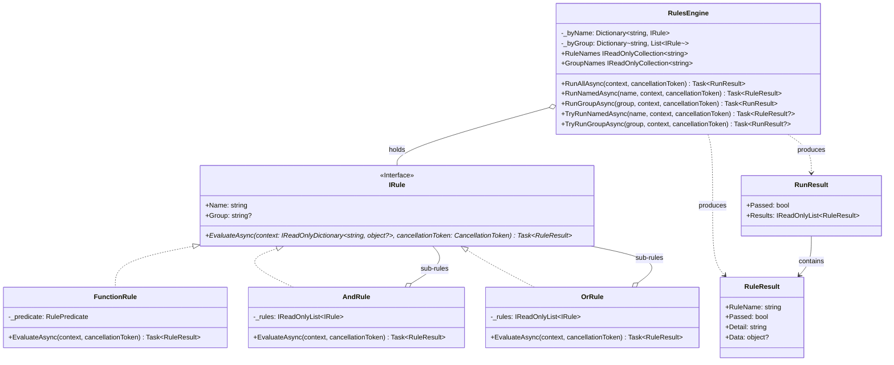

<!-- Title: Verdict Architecture — C# -->
# Verdict architecture — C# SDK

> The concrete C# realization of the shared design in
> [`README.md`](README.md) — read that first. Real type names, real
> method names, the class diagram, and the specific mistakes C#'s own
> idiom makes tempting.

## Design philosophy, in C# terms

Small, focused files, one type each — C#'s own real community
convention (StyleCop's `SA1402`, widely adopted, reflecting Microsoft's
own guidance) is one public type per file, unlike Python/JS/Dart, which
each have their own ecosystem's explicit blessing to group tightly
related classes together:

- **`IRule.cs`** — what a rule *is*: the contract every rule satisfies.
- **`FunctionRule.cs`**, **`AndRule.cs`**, **`OrRule.cs`** — the three
  concrete shapes.
- **`RulesEngine.cs`** — how a set of rules gets *run*.
- **`RuleResult.cs`**, **`RunResult.cs`** — what evaluation *produces*,
  deliberately plain, immutable classes.
- **`RulePredicate.cs`** — the named delegate `FunctionRule`'s predicate
  parameter is spelled as, so a field or stored variable never has to
  repeat the underlying `Func<...>` signature in full.

`IRule` is declared `interface`, not `abstract class` — consumers
**implement** it, and C# interfaces have no state and no fragile-base
risk by construction. What matters here is nominal, not structural:
an object carrying `Name`, `Group`, and `EvaluateAsync` is not thereby
an `IRule` the way Python's `Protocol` or TypeScript's structural
`interface` would accept it — declaring one means saying `: IRule`
explicitly. `FunctionRule` is the escape hatch back to shape-based
rules that C#'s own structural typing *does* reach — for delegates, not
multi-member interfaces — which is why it carries more weight in this
SDK than in Python's or TypeScript's own.

## Type structure, concretely

See [`README.md`](README.md)'s "Type structure" section for why each of
these relationships is shaped the way it is — the reasoning applies
here unchanged; this diagram is just C#'s own type syntax for it.

## Execution model, concretely

`AndRule`/`OrRule` evaluate their sub-rules with a plain `foreach` and
`await`, one at a time — never `Task.WhenAll` or any other concurrent
scheduling. Reaching for `Task.WhenAll` here is the single most
tempting mistake in a C# composite: it still returns the same boolean,
but destroys the short-circuit guarantee described in
[`README.md`](README.md), because every sub-rule's task has already
been started before the first result comes back — `Task.WhenAll`
schedules eagerly, it does not defer.

## Three ways to run rules, concretely

The decision tree for which of these to reach for, and why, is in
[`README.md`](README.md#three-ways-to-run-rules-and-when-each-is-the-right-one)
— the same shape for every language. C#'s own method names:

| Mode | C# method |
| --- | --- |
| A composite's own evaluate | `AndRule`/`OrRule`.`EvaluateAsync()` |
| Run everything the engine holds | `RulesEngine.RunAllAsync()` |
| Look up one rule — strict / non-raising | `RunNamedAsync()` / `TryRunNamedAsync()` |
| Look up one named group — strict / non-raising | `RunGroupAsync()` / `TryRunGroupAsync()` |

## Extensibility, concretely

A custom rule shape must say `: IRule` explicitly — C# has no free
structural typing for a multi-member interface the way Python's
`Protocol` and TypeScript's structural `interface` do. What it has
instead is structural typing for *delegates*: any method or lambda
matching `RulePredicate` (`Func<IReadOnlyDictionary<string, object?>,
CancellationToken, Task<RuleResult>>`) is a rule through `FunctionRule`,
with nothing declared and no type to name — a method group works
directly, as `new FunctionRule("quorum", HasQuorum)`, as long as
`HasQuorum` itself carries both parameters (a defaulted
`CancellationToken cancellationToken = default` is enough; method-group
and lambda conversion to a delegate type require matching arity exactly,
unlike calling an existing delegate value, which can omit a trailing
optional parameter as normal). Most rules should reach for that rather
than declaring a type at all.

## Testing, concretely

`new AndRule("x", [])` passes and `new OrRule("x", [])` fails, being
the identities of the folds they perform. `RunNamedAsync("typo", ctx)`
and `RunGroupAsync("typo", ctx)` both throw `KeyNotFoundException`.
`TryRunNamedAsync`/`TryRunGroupAsync` return `null` instead of
throwing, and `null` always means *absent*, never *vacuously passed*.

## Related docs

- [`README.md`](README.md) — the shared, language-agnostic design this
  page is C#'s own realization of.
- [`../../csharp/src/VerdictRules/docs/quickstart.md`](../../csharp/src/VerdictRules/docs/quickstart.md) —
  core concepts and the one worked example.
- [`../maintenance/`](../maintenance/README.md) — changing this package
  itself.
- [`../extending/`](../extending/README.md) — building on top of this
  package from a consumer's own code, with no changes here.
- [`../testing/csharp.md`](../testing/csharp.md) — how this package's
  own test suite is organized, and current coverage.
