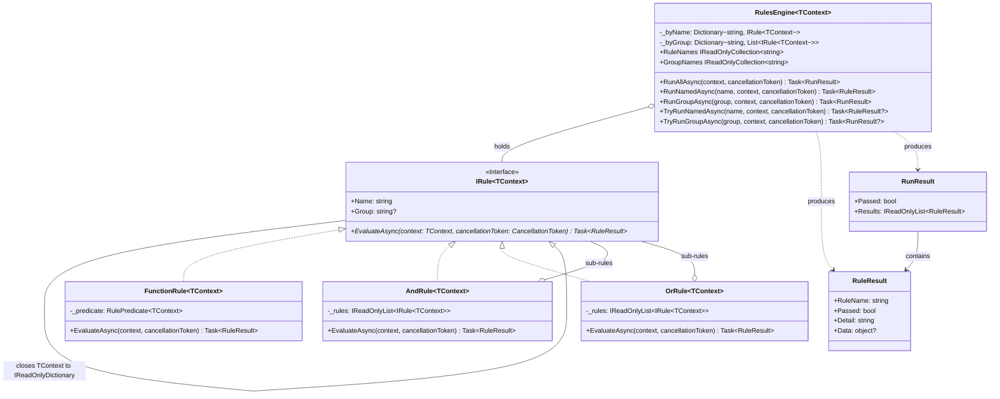

<!-- Title: Verdict Architecture — C# -->
# Verdict architecture — C# SDK

> The concrete C# realization of the shared design in
> [`README.md`](README.md) — read that first. Real type names, real
> method names, the class diagram, and the specific mistakes C#'s own
> idiom makes tempting.

## Design philosophy, in C# terms

Small, focused files, one type each — C#'s own real community
convention (StyleCop's `SA1402`, widely adopted, reflecting Microsoft's
own guidance) is one public type per file, unlike Python/JS/Dart, which
each have their own ecosystem's explicit blessing to group tightly
related classes together:

- **`IRule.cs`** — what a rule *is*: the contract every rule satisfies.
- **`FunctionRule.cs`**, **`AndRule.cs`**, **`OrRule.cs`** — the three
  concrete shapes.
- **`RulesEngine.cs`** — how a set of rules gets *run*.
- **`RuleResult.cs`**, **`RunResult.cs`** — what evaluation *produces*,
  deliberately plain, immutable classes.
- **`RulePredicate.cs`** — the named delegate `FunctionRule`'s predicate
  parameter is spelled as, so a field or stored variable never has to
  repeat the underlying `Func<...>` signature in full.

`IRule` is declared `interface`, not `abstract class` — consumers
**implement** it, and C# interfaces have no state and no fragile-base
risk by construction. What matters here is nominal, not structural:
an object carrying `Name`, `Group`, and `EvaluateAsync` is not thereby
an `IRule` the way Python's `Protocol` or TypeScript's structural
`interface` would accept it — declaring one means saying `: IRule`
explicitly. `FunctionRule` is the escape hatch back to shape-based
rules that C#'s own structural typing *does* reach — for delegates, not
multi-member interfaces — which is why it carries more weight in this
SDK than in Python's or TypeScript's own.

## Type structure, concretely



See [`README.md`](README.md)'s "Type structure" section for why each of
these relationships is shaped the way it is — the reasoning applies
here unchanged; this diagram is just C#'s own type syntax for it. Every
non-generic type here (`IRule`, `FunctionRule`, `AndRule`, `OrRule`,
`RulesEngine`) has an independent generic sibling at a different arity
— see "Generic context, concretely" below for why that's the correct
relationship rather than one inheriting the other in the opposite
direction.

## Generic context, concretely

`IRule<TContext>` — and `FunctionRule<TContext>`, `AndRule<TContext>`,
`OrRule<TContext>`, `RulesEngine<TContext>` alongside it — is a
genuinely **new, independent type at a different generic arity**, not a
generic version of the existing non-generic type. `IRule` is the closed
specialization: `public interface IRule : IRule<IReadOnlyDictionary<string, object?>> { }`.

```csharp
public interface IRule<TContext>
{
    string Name { get; }
    string? Group { get; }
    Task<RuleResult> EvaluateAsync(TContext context, CancellationToken cancellationToken = default);
}

// Fully additive -- every existing ": IRule" implementation already
// satisfies IRule<IReadOnlyDictionary<string, object?>> unchanged.
public interface IRule : IRule<IReadOnlyDictionary<string, object?>> { }
```

**Why this direction, and not `IRule<TContext> : IRule`.** That
direction was considered and rejected: it would force every typed rule
to also implement an unimplementable dict-shaped `EvaluateAsync`
overload, since a base interface's members are a floor every derived
interface inherits. Closing the generic to a concrete type has no such
problem — `IRule` requires exactly one method, because `TContext` is
already fixed. This mirrors `IComparer<T>`'s real relationship to the
non-generic `IComparer` in .NET's own BCL (verified against the actual
source: `IComparer<in T>` has no base interface at all), not
`IEnumerable<T> : IEnumerable`'s direction, which only works because
that interface's type parameter sits in covariant/output position —
`TContext` here is an input parameter, so that escape hatch isn't
available.

```csharp
using System.Text.Json;

public sealed record OrderContext(decimal Total, bool IsMember);

Task<RuleResult> OrderTotalMet(OrderContext ctx, CancellationToken ct = default) =>
    Task.FromResult(new RuleResult("order_total_met", ctx.Total >= 50m));

// TContext is inferred from OrderTotalMet's own parameter type -- no
// explicit type argument needed at the constructor call site.
var rule = new FunctionRule<OrderContext>("order_total_met", OrderTotalMet);

// A cohesive family of rules sharing one context can now say so:
var engine = new RulesEngine<OrderContext>([rule]);
```

**Dict-context stays first-class, permanently — not an "escape hatch."**
`IRule`/`FunctionRule`/`AndRule`/`OrRule`/`RulesEngine` (the non-generic
forms) are exactly as valid as their generic siblings, with zero
breaking changes to any of them. A rule meant to be reused across
genuinely different aggregate shapes — an `IsVerifiedUser` check wanted
inside both a checkout flow and an onboarding flow, where the fact
lives at a different nesting path in each — is naturally served by
dict-context; a strictly-typed rule would need an explicit projecting
adapter at every reuse site (see
[`../extending/reusing-a-rule-across-contexts/`](../extending/reusing-a-rule-across-contexts/README.md)).

**`AndRule<TContext>`/`OrRule<TContext>` require every sub-rule to
implement `IRule<TContext>` for the exact same `TContext`** — the
compiler rejects mixing `IRule<OrderContext>` and
`IRule<SignupContext>` inside one `AndRule<OrderContext>`. This is the
real guarantee a typed composite buys over dict-context: today, two
rules secretly expecting different shapes of dictionary can be combined
under a dict-context `AndRule` and only fail at runtime on a missing
key; once `TContext` is a concrete type, that mismatch never compiles.

**Why `RuleResult`/`RunResult` stay non-generic.** Context is input,
read at every predicate call site; `Data` is output, written once and
already documented as opaque — a caller already expects to
runtime-check its shape. A `RuleResult<TData>` was considered and
rejected for a second, C#-specific reason beyond the shared
composite-shape argument (see `README.md`): `out TData` covariance,
the mechanism that would let a `RuleResult<Cat>` substitute for a
`RuleResult<Animal>`, only works for reference types — a
`RuleResult<int>` can never covary the way `RuleResult<string>` could,
creating an asymmetry between value-typed and reference-typed payloads
that a consumer would hit without warning.

**The generic form is the implementation; the non-generic one is a
specialization of it, by composition.** `FunctionRule`, `AndRule`,
`OrRule` and `RulesEngine` each hold an instance of their own generic
sibling closed over `IReadOnlyDictionary<string, object?>` and forward
to it. Nothing is reimplemented, so every evaluation guarantee —
sequential sub-rule evaluation, short-circuit polarity, vacuous truth,
name/group indexing, lookup strictness, and the cancellation contract
below — is defined exactly once and cannot drift between the two
arities.

Composition rather than inheritance, deliberately: `IRule` already
*is* `IRule<IReadOnlyDictionary<string, object?>>` at the interface
level, so the specialization needs no base class to be substitutable,
and each non-generic type stays `sealed` with its own constructor
signature (`IReadOnlyList<IRule>`, `RulePredicate`) rather than
inheriting a generic one that would leak `TContext` into its public
surface. `IReadOnlyList<T>` covariance is what lets
`IReadOnlyList<IRule>` be handed to the generic constructor unchanged;
`RulePredicate` is the one exception, being a nominal delegate type
rather than a closure of `RulePredicate<TContext>`, so `FunctionRule`
rewraps it — the single place the two delegate types meet.

Both arities are still tested directly rather than assumed, but for the
opposite reason to before: the tests now pin that the delegation is
actually in place, rather than checking two separate implementations
agree.

## Execution model, concretely

`AndRule`/`OrRule` evaluate their sub-rules with a plain `foreach` and
`await`, one at a time — never `Task.WhenAll` or any other concurrent
scheduling. Reaching for `Task.WhenAll` here is the single most
tempting mistake in a C# composite: it still returns the same boolean,
but destroys the short-circuit guarantee described in
[`README.md`](README.md), because every sub-rule's task has already
been started before the first result comes back — `Task.WhenAll`
schedules eagerly, it does not defer.

## Three ways to run rules, concretely

The decision tree for which of these to reach for, and why, is in
[`README.md`](README.md#three-ways-to-run-rules-and-when-each-is-the-right-one)
— the same shape for every language. C#'s own method names:

| Mode | C# method |
| --- | --- |
| A composite's own evaluate | `AndRule`/`OrRule`.`EvaluateAsync()` |
| Run everything the engine holds | `RulesEngine.RunAllAsync()` |
| Look up one rule — strict / non-raising | `RunNamedAsync()` / `TryRunNamedAsync()` |
| Look up one named group — strict / non-raising | `RunGroupAsync()` / `TryRunGroupAsync()` |

## Extensibility, concretely

A custom rule shape must say `: IRule` explicitly — C# has no free
structural typing for a multi-member interface the way Python's
`Protocol` and TypeScript's structural `interface` do. What it has
instead is structural typing for *delegates*: any method or lambda
matching `RulePredicate` (`Func<IReadOnlyDictionary<string, object?>,
CancellationToken, Task<RuleResult>>`) is a rule through `FunctionRule`,
with nothing declared and no type to name — a method group works
directly, as `new FunctionRule("quorum", HasQuorum)`, as long as
`HasQuorum` itself carries both parameters (a defaulted
`CancellationToken cancellationToken = default` is enough; method-group
and lambda conversion to a delegate type require matching arity exactly,
unlike calling an existing delegate value, which can omit a trailing
optional parameter as normal). Most rules should reach for that rather
than declaring a type at all.

## Testing, concretely

`new AndRule("x", [])` passes and `new OrRule("x", [])` fails, being
the identities of the folds they perform. `RunNamedAsync("typo", ctx)`
and `RunGroupAsync("typo", ctx)` both throw `KeyNotFoundException`.
`TryRunNamedAsync`/`TryRunGroupAsync` return `null` instead of
throwing, and `null` always means *absent*, never *vacuously passed*.

## Related docs

- [`README.md`](README.md) — the shared, language-agnostic design this
  page is C#'s own realization of.
- [`../../csharp/src/VerdictRules/docs/quickstart.md`](../../csharp/src/VerdictRules/docs/quickstart.md) —
  core concepts and the one worked example.
- [`../maintenance/`](../maintenance/README.md) — changing this package
  itself.
- [`../extending/`](../extending/README.md) — building on top of this
  package from a consumer's own code, with no changes here.
- [`../testing/csharp.md`](../testing/csharp.md) — how this package's
  own test suite is organized, and current coverage.
