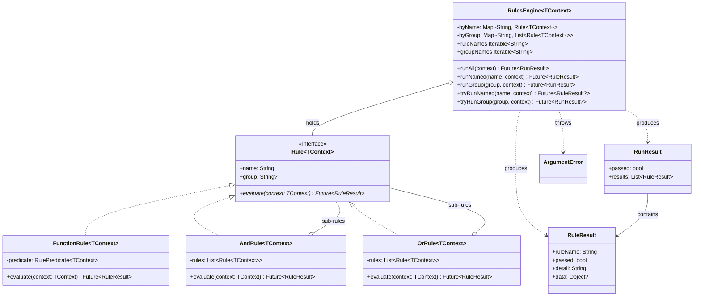

<!-- Title: Verdict Architecture — Dart -->
# Verdict architecture — Dart

> The concrete Dart realization of the shared design in
> [`README.md`](README.md) — read that first. Real type names, real
> method names, the class diagram, and the specific mistakes Dart's
> own idiom makes tempting.

## Design philosophy, in Dart

Three small files, each with exactly one job:

- **`rule.dart`** — what a rule *is*: the `Rule` interface, and three
  concrete shapes (`FunctionRule`, `AndRule`, `OrRule`).
- **`engine.dart`** — how a set of rules gets *run*: `RulesEngine` and
  its five lookup/run modes.
- **`result.dart`** — what evaluation *produces*: `RuleResult`/`RunResult`,
  deliberately plain, immutable classes.

`Rule` is declared `abstract interface class` rather than
`abstract class` deliberately: consumers **implement** it, never
**extend** it. Forbidding extension means an instance method calling
another method on `this` always reaches a known implementation, never
landing in a consumer's override — the fragile-base-class problem this
design closes off by construction rather than by convention. This is a
real, nominal-typing requirement, not just syntax: an object carrying
`name`, `group`, and `evaluate` is not thereby a `Rule` the way Python's
`Protocol` or TypeScript's structural `interface` would accept it —
declaring one means saying `implements Rule` explicitly. `FunctionRule`
is the escape hatch back to shape-based rules that Dart's own structural
typing *does* give for free: any function matching `RulePredicate` is a
rule through it, with nothing declared and no type to name.

## Type structure, concretely



See [`README.md`](README.md)'s "Type structure" section for why each of
these relationships is shaped the way it is — the reasoning applies
here unchanged; this diagram is just Dart's own type syntax for it. One
real difference from Python and JS/TS: `RuleResult.detail` is a
non-nullable `String` defaulting to `''`, not an optional field —
checking it against `null` is always true and proves nothing; the
check that means something is `.isEmpty`. `Context` (a `typedef` for
`Map<String, Object?>`) is the dict-context spelling of `TContext` —
see "Generic context, concretely" below.

## Generic context, concretely

`Rule<TContext>` — and `FunctionRule<TContext>`, `AndRule<TContext>`,
`OrRule<TContext>`, `RulesEngine<TContext>` alongside it — is generic
over the context it reads from. This is this package's **one real
breaking migration** from its pre-generic form: an existing
`implements Rule` declaration must become `implements Rule<Context>`
(dict-context) or `implements Rule<SomeTypedContext>` explicitly —
there is no default type parameter to fall back on.

```dart
typedef Context = Map<String, Object?>;

class OrderContext {
  final double total;
  const OrderContext({required this.total});
}

Future<RuleResult> orderTotalMet(OrderContext ctx) async =>
    RuleResult(ruleName: 'order_total_met', passed: ctx.total >= 50);

// TContext is inferred as OrderContext from orderTotalMet's own
// parameter type -- no explicit type argument needed at the
// constructor call site.
final rule = FunctionRule('order_total_met', orderTotalMet);

// A cohesive family of rules sharing one context can now say so:
final engine = RulesEngine<OrderContext>([rule]);
```

**How narrow the break actually is.** Constructor call sites —
`FunctionRule(...)`, `AndRule(...)`, `OrRule(...)`, `RulesEngine(...)`
— are unaffected: `TContext` is inferred there via ordinary Dart type
inference, the same as before generics existed. The break lands
specifically on an explicit `implements Rule` declaration, which this
package's own `agent-notes.md` already documented as the rarer,
discouraged pattern — most rules should use `FunctionRule` instead,
precisely because Dart lacks structural typing for multi-member
interfaces (see "Design philosophy," above).

**Dict-context stays first-class, permanently — not an "escape hatch."**
`Rule<Context>`/`FunctionRule<Context>`/`RulesEngine<Context>` are
exactly as valid as any typed `TContext`. A rule meant to be reused
across genuinely different aggregate shapes — an `isVerifiedUser` check
wanted inside both a checkout flow and an onboarding flow, where the
fact lives at a different nesting path in each — is naturally served by
dict-context; a strictly-typed rule would need an explicit projecting
adapter at every reuse site (see
[`../extending/reusing-a-rule-across-contexts/`](../extending/reusing-a-rule-across-contexts/README.md)).

**`AndRule<TContext>`/`OrRule<TContext>` require every sub-rule to be a
`Rule` of the exact same `TContext`** — the analyzer rejects mixing
`Rule<OrderContext>` and `Rule<SignupContext>` inside one
`AndRule<OrderContext>` once a type argument is named. This is the real
guarantee a typed composite buys over dict-context: today, two rules
secretly expecting different shapes of a map can be combined under a
dict-context `AndRule` and only fail at runtime on a missing key; once
`TContext` is a concrete type, that mismatch is a compile-time error
instead.

**Why `RuleResult`/`RunResult` stay non-generic.** Context is input,
read at every predicate call site; `data` is output, written once and
already documented as opaque — a caller already expects to
runtime-check its shape. Genericizing `data` would force every rule
that might ever compose under one `AndRule` to share one `TData`, which
a composite's own `data` (a `List<RuleResult>` of sub-results, each
possibly carrying an unrelated domain object in its own `data`) already
contradicts.

## Execution model, concretely

`AndRule`/`OrRule` evaluate their sub-rules with a plain `for` loop and
`await`, one at a time — never `Future.wait` or any other concurrent
scheduling. Reaching for `Future.wait` here is the single most tempting
mistake in a Dart composite: it still returns the same boolean, but
destroys the short-circuit guarantee described in
[`README.md`](README.md), because every sub-rule's future has already
been created — and its own work already started — before the first
result comes back.

## Three ways to run rules, concretely

The decision tree for which of these to reach for, and why, is in
[`README.md`](README.md#three-ways-to-run-rules-and-when-each-is-the-right-one)
— the same shape for every language. This SDK's own method names:

| Mode | Dart method |
| --- | --- |
| A composite's own evaluate | `AndRule`/`OrRule`.`evaluate()` |
| Run everything the engine holds | `RulesEngine.runAll()` |
| Look up one rule — strict / non-throwing | `runNamed()` / `tryRunNamed()` |
| Look up one named group — strict / non-throwing | `runGroup()` / `tryRunGroup()` |

## Extensibility, concretely

A custom rule shape must say `implements Rule` explicitly — Dart has no
free structural typing for a multi-member interface the way Python's
`Protocol` and TypeScript's structural `interface` do. What it has
instead is structural typing for *function types*: any function
matching `RulePredicate` (`Future<RuleResult> Function(Map<String,
Object?>)`) is a rule through `FunctionRule`, with nothing declared and
no type to name — a tear-off works directly, as
`FunctionRule('quorum', hasQuorum)`. Most rules should reach for that
rather than declaring a type at all.

Unlike JS/TS, this package needs **no custom error type**: unknown
lookups throw Dart's own `ArgumentError` from `dart:core`, the same
type Dart's standard library already uses for invalid-argument
failures generally — no `UnknownLookupError` equivalent to export, and
no gap in the standard library the way JavaScript's genuinely lacks a
comparable built-in lookup-error type. The tradeoff is precision:
catching `ArgumentError` here is far less specific than JS's
`instanceof UnknownLookupError` or Python's `except KeyError`, since
`ArgumentError` is also what countless unrelated argument-validation
failures throw elsewhere. Checking `engine.ruleNames.contains(name)`
(or `groupNames`) before calling is clearer than catching, and is
exactly what those two getters exist for.

## Testing, concretely

`AndRule('x', []).evaluate({})` passes and `OrRule('x', []).evaluate({})`
fails, being the identities of the folds they perform. `runNamed('typo',
{})` and `runGroup('typo', {})` both throw `ArgumentError`.
`tryRunNamed`/`tryRunGroup` return `null` instead of throwing, and
`null` always means *absent*, never *vacuously passed*.

## Related docs

- [`README.md`](README.md) — the shared, language-agnostic design this
  page is Dart's own realization of.
- [`../maintenance/`](../maintenance/README.md) — changing this package
  itself.
- [`../extending/`](../extending/README.md) — building on top of this
  package from a consumer's own code, with no changes here.
- [`../testing/dart.md`](../testing/dart.md) — how this package's own
  test suite is organized, and current coverage.
