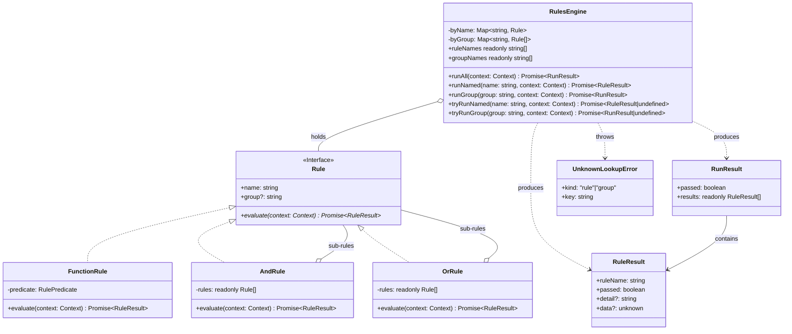

<!-- Title: Verdict Architecture — JS/TS -->
# Verdict architecture — JS/TS

> The concrete JavaScript/TypeScript realization of the shared design
> in [`README.md`](README.md) — read that first. Real type names, real
> method names, the class diagram, and the specific mistakes JS/TS's
> own idiom makes tempting.

## Design philosophy, in JS/TS

Four small modules, each with exactly one job:

- **`rule.ts`** — what a rule *is*: the `Rule` structural interface,
  and three concrete shapes (`FunctionRule`, `AndRule`, `OrRule`).
- **`engine.ts`** — how a set of rules gets *run*: `RulesEngine` and
  its three execution modes.
- **`result.ts`** — what evaluation *produces*: `RuleResult`/`RunResult`,
  deliberately plain, readonly interfaces.
- **`errors.ts`** — `UnknownLookupError`, the one concrete type this
  SDK needs that the others get from their own standard library. See
  "Extensibility, concretely" below for why.

`Rule` is a plain TypeScript `interface`, not an abstract class — a
custom rule implementation never needs to import from this package or
extend anything; it just needs a `name`, an optional `group`, and an
`evaluate(context)` method returning `Promise<RuleResult>`. Structural
typing over nominal typing is the whole reason `FunctionRule` can exist
at all: it's not a special case the engine recognizes, it's an ordinary
`Rule` that happens to delegate to a plain async function.

## Type structure, concretely

See [`README.md`](README.md)'s "Type structure" section for why each of
these relationships is shaped the way it is — the reasoning applies
here unchanged; this diagram is just TypeScript's own type syntax for
it. One real difference from every other SDK: `Rule` here is an
`interface`, not a class or a `Protocol`-style runtime-checkable type —
TypeScript's structural typing is purely a compile-time property, so
there is no `isinstance(x, Rule)` equivalent to reach for at runtime.
If code genuinely needs to confirm an unknown value is rule-shaped at
runtime, that's a plain duck-typed check
(`typeof x.evaluate === "function"`), not a language feature this
package can hand over.

## Execution model, concretely

`AndRule`/`OrRule` evaluate their sub-rules with a plain `for…of` loop
and `await`, one at a time — never `Promise.all` or any other
concurrent scheduling. Reaching for `Promise.all` here is the single
most tempting mistake in a JS/TS composite: it still returns the same
boolean, but destroys the short-circuit guarantee described in
[`README.md`](README.md), because every sub-rule's promise has already
been created — and its executor already running — before the first
result comes back.

## Three ways to run rules, concretely

The decision tree for which of these to reach for, and why, is in
[`README.md`](README.md#three-ways-to-run-rules-and-when-each-is-the-right-one)
— the same shape for every language. This SDK's own method names:

| Mode | JS/TS method |
| --- | --- |
| A composite's own evaluate | `AndRule`/`OrRule`.`evaluate()` |
| Run everything the engine holds | `RulesEngine.runAll()` |
| Look up one rule — strict / non-throwing | `runNamed()` / `tryRunNamed()` |
| Look up one named group — strict / non-throwing | `runGroup()` / `tryRunGroup()` |

## Extensibility, concretely

Any object with a `name`, an optional `group`, and an
`evaluate(context): Promise<RuleResult>` method already satisfies
`Rule` structurally — TypeScript's structural typing is the closest
available analogue to Python's `Protocol`. Languages with nominal type
systems instead require an explicit `implements` clause, which is a
real difference in the extension story rather than only its syntax.

`UnknownLookupError` exists because JavaScript has no built-in
lookup-error type the way Python has `KeyError`, C# has
`KeyNotFoundException`, and Dart has `ArgumentError`. A bare `Error`
would leave a caller matching on message text, which breaks the moment
a message is reworded — so this package exports a real type instead:
`instanceof UnknownLookupError` is stable, and its `kind` and `key`
fields say what was missing without parsing prose.

## Testing, concretely

`new AndRule("x", []).evaluate()` passes and `new OrRule("x", []).evaluate()`
fails, being the identities of the folds they perform — the same
answers `Array.prototype.every`/`.some` give on an empty array.
`runNamed("typo")` and `runGroup("typo")` both throw
`UnknownLookupError`. `tryRunNamed`/`tryRunGroup` return `undefined`
instead of throwing, and `undefined` always means *absent*, never
*vacuously passed*.

## Related docs

- [`README.md`](README.md) — the shared, language-agnostic design this
  page is JS/TS's own realization of.
- [`../maintenance/`](../maintenance/README.md) — changing this package
  itself.
- [`../extending/`](../extending/README.md) — building on top of this
  package from a consumer's own code, with no changes here.
- [`../testing/js.md`](../testing/js.md) — how this package's own test
  suite is organized, and current coverage.
