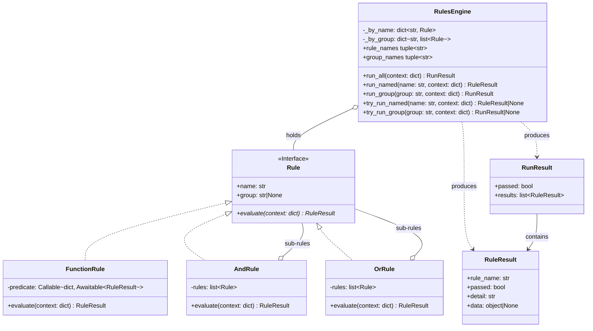

<!-- Title: Verdict Architecture — Python -->
# Verdict architecture — Python

> The concrete Python realization of the shared design in
> [`README.md`](README.md) — read that first. Real type names, real
> method names, the class diagram, and the specific mistakes Python's
> own standard library makes tempting.

## Design philosophy, in Python

Three small modules, each with exactly one job:

- **`rule.py`** — what a rule *is*: the `Rule` structural interface, and
  four concrete shapes (`FunctionRule`, `AndRule`, `OrRule`).
- **`engine.py`** — how a set of rules gets *run*: `RulesEngine` and its
  three execution modes.
- **`result.py`** — what evaluation *produces*: `RuleResult`/`RunResult`,
  deliberately plain and immutable.

`Rule` is a `Protocol`, not an `ABC` — a custom rule implementation
never needs to import from this package or inherit from anything; it
just needs a `name`, a `group`, and an `evaluate(context)` coroutine.
Structural typing over nominal typing is the whole reason `FunctionRule`
can exist at all: it's not a special case the engine recognizes, it's an
ordinary `Rule` that happens to delegate to a plain function.

## Type structure, concretely

See [`README.md`](README.md)'s "Type structure" section for why each of
these relationships is shaped the way it is — the reasoning applies
here unchanged; this diagram is just Python's own type syntax for it.

## Execution model, concretely

`AndRule`/`OrRule` evaluate their sub-rules with a plain `for` loop and
`await`, one at a time — never `asyncio.gather` or any other concurrent
scheduling. Reaching for `asyncio.gather` here is the single most
tempting mistake in a Python composite: it still returns the same
boolean, but destroys the short-circuit guarantee described in
[`README.md`](README.md), because every sub-rule's coroutine has
already been scheduled before the first result comes back.

## Three ways to run rules, concretely

The decision tree for which of these to reach for, and why, is in
[`README.md`](README.md#three-ways-to-run-rules-and-when-each-is-the-right-one)
— the same shape for every language. Python's own method names:

| Mode | Python method |
| --- | --- |
| A composite's own evaluate | `AndRule`/`OrRule`.`evaluate()` |
| Run everything the engine holds | `RulesEngine.run_all()` |
| Look up one rule — strict / non-raising | `run_named()` / `try_run_named()` |
| Look up one named group — strict / non-raising | `run_group()` / `try_run_group()` |

## Extensibility, concretely

Any object with `name`, `group`, and an `evaluate(context) -> RuleResult`
coroutine already satisfies `Rule` structurally (`@runtime_checkable`, so
`isinstance(x, Rule)` genuinely works, not just static type-checking).

## Testing, concretely

`AndRule([])` passes and `OrRule([])` fails, being the identities of the
folds they perform — the same answers Python's own `all([])` and
`any([])` give. `run_named("typo")` and `run_group("typo")` both raise
`KeyError`. `try_run_named`/`try_run_group` return `None` instead of
raising, and `None` always means *absent*, never *vacuously passed*.

## Related docs

- [`README.md`](README.md) — the shared, language-agnostic design this
  page is Python's own realization of.
- [`../../python/packages/verdict-rules/docs/quickstart.md`](../../python/packages/verdict-rules/docs/quickstart.md) —
  core concepts and the one worked example.
- [`../maintenance/`](../maintenance/README.md) — changing this package
  itself.
- [`../extending/`](../extending/README.md) — building on top of this
  package from a consumer's own code, with no changes here.
- [`../testing.md`](../testing.md) — how this package's own test suite
  is organized, what a change needs to prove, and current coverage.
