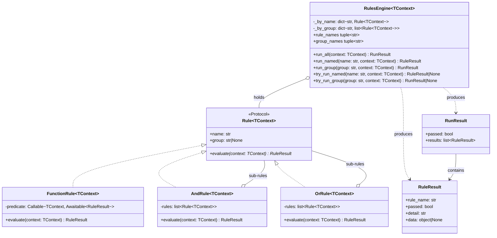

<!-- Title: Verdict Architecture — Python -->
# Verdict architecture — Python

> The concrete Python realization of the shared design in
> [`README.md`](README.md) — read that first. Real type names, real
> method names, the class diagram, and the specific mistakes Python's
> own standard library makes tempting.

## Design philosophy, in Python

Three small modules, each with exactly one job:

- **`rule.py`** — what a rule *is*: the `Rule` structural interface, and
  four concrete shapes (`FunctionRule`, `AndRule`, `OrRule`).
- **`engine.py`** — how a set of rules gets *run*: `RulesEngine` and its
  three execution modes.
- **`result.py`** — what evaluation *produces*: `RuleResult`/`RunResult`,
  deliberately plain and immutable.

`Rule` is a `Protocol`, not an `ABC` — a custom rule implementation
never needs to import from this package or inherit from anything; it
just needs a `name`, a `group`, and an `evaluate(context)` coroutine.
Structural typing over nominal typing is the whole reason `FunctionRule`
can exist at all: it's not a special case the engine recognizes, it's an
ordinary `Rule` that happens to delegate to a plain function.

## Type structure, concretely



See [`README.md`](README.md)'s "Type structure" section for why each of
these relationships is shaped the way it is — the reasoning applies
here unchanged; this diagram is just Python's own type syntax for it.
`RuleResult`/`RunResult` are deliberately not generic — see "Generic
context, concretely" below for why `Data`/`data` stays opaque rather
than following `TContext`.

## Generic context, concretely

`Rule` is generic over the context it reads from (`TContext`), declared
as `Protocol[TContext]`. This is purely a typing-level addition —
Python erases generics at runtime, so nothing about how a rule executes
changes, and every existing structural rule keeps satisfying `Rule`
unconditionally whether or not it names a type argument:

```python
from dataclasses import dataclass
from verdict import AndRule, FunctionRule, Rule, RuleResult, RulesEngine

@dataclass(frozen=True)
class OrderContext:
    total: float
    is_member: bool

async def order_total_met(context: OrderContext) -> RuleResult:
    return RuleResult(rule_name="order_total_met", passed=context.total >= 50.0)

# TContext is inferred from order_total_met's own annotation -- no
# explicit type argument needed at the call site.
rule: FunctionRule[OrderContext] = FunctionRule("order_total_met", order_total_met)

# A cohesive family of rules sharing one context can now say so:
engine: RulesEngine[OrderContext] = RulesEngine([rule])
```

**Dict-context stays first-class, permanently — not an "escape hatch."**
`Rule[dict[str, Any]]` is exactly as valid a type argument as any
dataclass, and an untyped `Rule`/`FunctionRule`/`RulesEngine` (erasing to
`Rule[Any]`) works exactly as it always has. A rule meant to be reused
across genuinely different aggregate shapes — an `is_verified_user`
check wanted inside both a checkout flow and an onboarding flow, where
the fact lives at a different nesting path in each — is naturally
served by dict-context; a strictly-typed rule would need an explicit
projecting adapter at every reuse site (see
[`../extending/reusing-a-rule-across-contexts/`](../extending/reusing-a-rule-across-contexts/README.md)).

**`AndRule[TContext]`/`OrRule[TContext]` require every sub-rule to share
the exact same `TContext`** — enforced by a type checker (mypy, pyright)
once a caller names a type argument, though Python itself doesn't
enforce it at runtime. This is the same boundary every Python generic
has: naming `Rule[OrderContext]` and then handing `evaluate` an
unrelated object still runs, and fails wherever the predicate's own body
first touches a missing attribute, not with a type-system error. A type
checker is what actually catches the mismatch before that point.

**Why `RuleResult`/`RunResult` stay non-generic.** Context is input,
read at every predicate call site; `Data`/`data` is output, written once
and already documented as opaque — a caller already expects to
runtime-check its shape. Genericizing `Data` would force every rule that
might ever compose under one `AndRule` to share one `TData`, which a
composite's own `data` (a `list[RuleResult]` of sub-results, each
possibly carrying an unrelated domain object in its own `data`) already
contradicts — see
[`domain-adapter-module/python.md`](../extending/domain-adapter-module/python.md)
for the real shipped example this is proven against.

**Recommended for consumers who want the same strictness this gave
before generics existed**: pyright's `reportMissingTypeArgument` or
mypy's `disallow_any_generics`, since `verdict` itself can't force a
caller's own lint configuration to require an explicit type argument.

## Execution model, concretely

`AndRule`/`OrRule` evaluate their sub-rules with a plain `for` loop and
`await`, one at a time — never `asyncio.gather` or any other concurrent
scheduling. Reaching for `asyncio.gather` here is the single most
tempting mistake in a Python composite: it still returns the same
boolean, but destroys the short-circuit guarantee described in
[`README.md`](README.md), because every sub-rule's coroutine has
already been scheduled before the first result comes back.

## Three ways to run rules, concretely

The decision tree for which of these to reach for, and why, is in
[`README.md`](README.md#three-ways-to-run-rules-and-when-each-is-the-right-one)
— the same shape for every language. Python's own method names:

| Mode | Python method |
| --- | --- |
| A composite's own evaluate | `AndRule`/`OrRule`.`evaluate()` |
| Run everything the engine holds | `RulesEngine.run_all()` |
| Look up one rule — strict / non-raising | `run_named()` / `try_run_named()` |
| Look up one named group — strict / non-raising | `run_group()` / `try_run_group()` |

## Extensibility, concretely

Any object with `name`, `group`, and an `evaluate(context) -> RuleResult`
coroutine already satisfies `Rule` structurally (`@runtime_checkable`, so
`isinstance(x, Rule)` genuinely works, not just static type-checking).

## Testing, concretely

`AndRule([])` passes and `OrRule([])` fails, being the identities of the
folds they perform — the same answers Python's own `all([])` and
`any([])` give. `run_named("typo")` and `run_group("typo")` both raise
`KeyError`. `try_run_named`/`try_run_group` return `None` instead of
raising, and `None` always means *absent*, never *vacuously passed*.

## Related docs

- [`README.md`](README.md) — the shared, language-agnostic design this
  page is Python's own realization of.
- [`../../python/packages/verdict-rules/docs/quickstart.md`](../../python/packages/verdict-rules/docs/quickstart.md) —
  core concepts and the one worked example.
- [`../maintenance/`](../maintenance/README.md) — changing this package
  itself.
- [`../extending/`](../extending/README.md) — building on top of this
  package from a consumer's own code, with no changes here.
- [`../testing/python.md`](../testing/python.md) — how this package's
  own test suite is organized, and current coverage.
